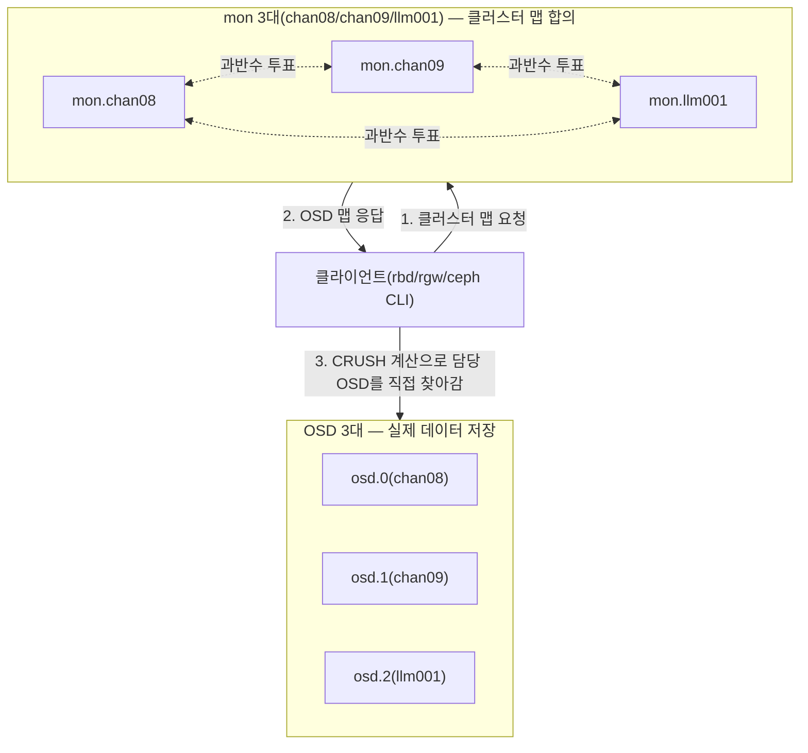

# Ceph 개념 정리

Ceph를 처음부터 배우면서 이 스토리지 계층을 만들었다. 새 개념이 필요해질 때마다 여기 추가한다 — 교과서적 정의보다 "우리 클러스터에서 실제로 이게 왜 필요했는지"를 우선한다. 배포 절차 자체는 [Ceph 스토리지](../lessons/07-1-ceph-storage.md) 참고.

## 전체 구조



클라이언트가 mon에 물어보는 건 "지금 클러스터가 어떻게 생겼는지"뿐이다. 실제 데이터 읽기/쓰기는 그 맵을 들고 CRUSH(아래 참고) 계산으로 담당 OSD를 직접 찾아가서 한다 — mon이 매 요청마다 중계하지 않는다. 이게 Ceph가 mon 3대만으로도 OSD가 수백 대까지 늘어나도 병목 없이 확장되는 이유다.

## 데몬별 역할과 배치

```bash
sudo cephadm shell -- ceph orch ps
```
```
NAME                                HOST    PORTS              STATUS
mon.chan08                         chan08                       running
mon.chan09                         chan09                       running
mon.llm001                         llm001                       running
mgr.chan08.jayvva                  chan08  *:8443,9283,8765     running
mgr.chan09.pthkay                  chan09  *:8443,9283,8765     running
mgr.llm001.edoppy                  llm001  *:8443,9283,8765     running
osd.0                              chan08                       running
osd.1                              chan09                       running
osd.2                              llm001                       running
rgw.starrocks-store.chan08.vfhcen  chan08  *:7480               running
rgw.starrocks-store.chan09.wxcdxe  chan09  *:7480               running
rgw.starrocks-store.llm001.hypomh  llm001  *:7480               running
```

- **mon(모니터)**: 클러스터 맵(어떤 노드/디스크가 살아있는지, 데이터가 어떻게 나뉘어 있는지)을 합의하는 역할. 과반수 투표(paxos류)로 동작해서 반드시 홀수 개를 둔다 — 우리는 물리 노드가 정확히 3대라 mon도 3개, k8s의 etcd 쿼럼과 똑같은 이유다.
- **mgr(매니저)**: 대시보드, 메트릭, `ceph orch`(cephadm 오케스트레이터 명령) 처리. mon마다 붙어서 대기하다가 하나만 active로 뜬다(위 출력에서 chan08만 active, 나머지는 standby).
- **OSD(Object Storage Daemon)**: 디스크(정확히는 우리는 파티션 하나를 LVM으로 감싼 논리 볼륨) 하나당 데몬 하나. 실제 데이터가 여기 저장된다.
- **RGW(RADOS Gateway)**: OSD 위에 S3 호환 오브젝트 API를 얹어주는 게이트웨이. 상태를 안 가져서(stateless) 여러 개를 띄워도 서로 조율할 필요가 없다 — 우리는 3노드 전부에 하나씩 띄웠다.

## 기본 단위

### 클러스터 / 풀(Pool) / PG(Placement Group)
클러스터는 mon+OSD 전체를 묶은 하나의 단위다. 그 안에 풀(Pool)이라는 논리적 구획을 여러 개 만들 수 있다 — 우리는 `rbd-pool`(MySQL/KVM용), `.rgw.root`/`default.rgw.*`(RGW 메타데이터·버킷 데이터용)를 쓴다.

```bash
sudo cephadm shell -- ceph osd pool ls detail
```
```
pool 2 'rbd-pool' replicated size 3 min_size 2 ... pg_num 32 pgp_num 32 ...
pool 8 'default.rgw.buckets.data' replicated size 3 min_size 2 ... pg_num 1 ...
```

풀 하나를 그대로 OSD에 매핑하지 않는다. 풀은 다시 PG(Placement Group, 데이터를 나눠 담는 논리적 단위) 여러 개로 쪼개지고, 그 PG 하나하나가 CRUSH 알고리즘으로 특정 OSD 조합에 배정된다. `pg_num`이 그 조각 개수다 — 너무 적으면 OSD 간 부하가 고르게 안 퍼지고, 너무 많으면 관리 오버헤드가 커진다. `autoscale_mode on`이면 Ceph가 클러스터 크기에 맞춰 알아서 조정해준다(우리는 다 켜뒀다).

### replication(size/min_size)
`size`는 데이터를 몇 벌 복제할지, `min_size`는 그중 몇 벌이 살아있어야 쓰기를 계속 받아줄지다. 우리는 `size=3/min_size=2` — 3벌 복제하고, 그중 2벌만 살아있으면 계속 쓸 수 있다(1벌 죽어도 서비스는 안 끊김). 물리 노드가 정확히 3대라 `size=3`이 노드 장애 하나까지 버티는 가장 자연스러운 값이다.

### erasure coding — replication보다 용량 효율적인 대안

풀을 만들 때 `replicated` 대신 고를 수 있는 또 다른 방식이다. 데이터를 그대로 복제하는 대신, 조각으로 쪼개고 그 조각들로 "복구용 여분 조각(패리티)"을 계산해서 같이 저장한다 — RAID 5/6와 같은 원리다.

**예: k=2(데이터 조각 2개), m=1(패리티 조각 1개)**
1. 원본을 `A`, `B` 두 조각으로 쪼갠다.
2. 패리티 `P = A XOR B`를 계산한다.
3. `A`, `B`, `P`를 서로 다른 OSD 3개에 각각 저장한다.

어느 조각 하나가 사라져도 남은 두 조각으로 역산해 복구된다(`A`가 사라지면 `A = B XOR P`). 저장 용량은 원본의 `(k+m)/k`배다 — 위 예시는 3/2 = 1.5배(150%)로, 3벌을 그대로 복제하는 replication(300%)보다 훨씬 적게 든다.

**장애 허용 수량은 `m`(패리티 조각 개수)이 결정한다.** `m=1`이면 1개 조각까지, `m=2`면 2개 조각까지 잃어도 복구된다. `k`가 1이면(데이터 조각이 1개뿐) 조각끼리 섞을 상대가 없어서 패리티가 사실상 원본의 복사본이 되어버린다 — `k=1, m=2`는 결국 "3벌 복제"와 완전히 동일해지는 무의미한 경우다. `k`가 커질수록(조각을 잘게 쪼갤수록) 용량 효율은 좋아지지만, 그만큼 조각을 흩어놓을 서로 다른 OSD가 더 많이 필요하다.

**"몇 개까지 쓸 수 있는가"는 OSD 개수가 아니라 장애 도메인(failure domain) 개수로 정해진다.** CRUSH의 기본 장애 도메인은 `host`다(위 CRUSH 항목 참고) — 같은 데이터의 조각들이 같은 노드에 두 개 이상 몰리지 않게 강제한다. 그래서 한 노드에 OSD를 아무리 늘려도, 물리 노드가 3대뿐이면 `k+m`은 3을 못 넘는다. 우리 클러스터가 딱 이 경우다.

**우리 클러스터(호스트 3대)에 대입하면 풀마다 결론이 다르다:**

| 풀 | 요구하는 장애 허용 | OSD 3대로 가능한 EC | 결론 |
|---|---|---|---|
| `rbd-pool`(size=3/min_size=2, 2대 장애 허용) | 2대 | `k=1, m=2`뿐 → 300% (replication과 동일) | EC 이득 없음 |
| `default.rgw.buckets.data`(size=2/min_size=1, 1대 장애 허용) | 1대 | `k=2, m=1` 가능 → 150% (replication 200%보다 절약) | EC로 바꾸면 실이득 |

같은 호스트 3대라도 **얼마나 낮은 장애 허용을 감수할지에 따라 EC가 성립하는지 안 하는지가 갈린다.** `rbd-pool`은 2대 장애를 원해서 `k=1`(무의미)에 막히지만, RGW 풀은 이미 1대 장애만 감수하기로 정해뒀기 때문에(위 "남아있는 리스크" 참고, [`07-1-ceph-storage.md`](../lessons/07-1-ceph-storage.md)) `k=2, m=1`이 실제로 성립한다.

**쓰기 패턴도 중요하다.** EC는 조각 일부만 고쳐 쓸 때 관련 조각을 전부 다시 읽고 패리티를 재계산해야 한다(read-modify-write) — MySQL/KVM처럼 파일 중간을 랜덤하게 자주 고쳐 쓰는 RBD 워크로드엔 불리하다. 반면 StarRocks가 RGW에 쓰는 세그먼트 파일은 한 번 쓰면 그대로 두고, 컴팩션 때도 기존 파일을 고치는 게 아니라 새 파일로 교체한다 — 이런 "쓰면 그대로 두는(immutable)" 패턴은 read-modify-write 페널티가 거의 발동하지 않아 EC와 잘 맞는다. 그래서 실무에서도 RBD(블록)는 replicated, RGW(오브젝트)는 EC로 나눠 쓰는 게 일반적인 패턴이다.

호스트가 5대였다면(가정) `k+m≤5`가 되어 `rbd-pool`이 원하는 2대 장애도 `k=3, m=2`(167%)로 EC가 성립했을 것이다 — 호스트 수가 늘수록 EC가 유리해지는 조합의 폭이 넓어진다.

### CRUSH — "어느 OSD에 저장할지"를 계산으로 정하는 알고리즘
중앙 테이블에 "이 데이터는 어디 있다"를 기록해두는 대신, 클러스터 맵과 데이터 ID를 입력으로 넣으면 항상 같은 OSD 조합이 나오는 해시 기반 계산으로 위치를 정한다. 그래서 클라이언트가 mon에 매번 "이 데이터 어디 있어?"라고 안 물어봐도 스스로 계산해서 바로 찾아간다. `failureDomain: host`로 설정하면 같은 데이터의 복제본들이 같은 노드에 몰리지 않게 강제한다 — 우리 클러스터도 이 설정이라 replica 3벌이 항상 chan08/chan09/llm001에 하나씩 나뉜다.

### BlueStore — OSD가 디스크를 관리하는 방식
OSD는 일반 파일시스템(ext4/xfs) 위에 데이터를 얹지 않는다. BlueStore라는 Ceph 전용 저장 엔진이 디스크(또는 파티션)를 직접 관리한다 — 파일시스템 계층을 건너뛰어서 오버헤드가 적다. 그래서 OSD용 파티션은 `mkfs`를 안 하고 raw 상태 그대로 Ceph에 넘긴다. BlueStore는 디스크 여러 지점(초반부 등)에 자기 레이블을 중복 저장해두는데, 이 디스크를 다른 용도로 재사용하려면 그 레이블들을 확실히 지워야 한다(안 지우면 Ceph가 "기존 OSD"로 오판한다) — 디스크 재분할 절차에서 이 부분이 중요했다.

## RBD vs RGW vs CephFS — Ceph 위의 세 가지 접근 방식

같은 저장 계층(OSD) 위에 서로 다른 세 가지 접근 방식을 얹을 수 있다. 우리는 이 중 RBD와 RGW만 쓴다.

| 방식 | 접근 형태 | 동시 접근 | 우리 용도 |
|---|---|---|---|
| RBD(블록) | 일반 디스크처럼 마운트, 그 위에 파일시스템을 얹음 | 한 클라이언트만 배타적으로(exclusive-lock) | MySQL PVC, KVM VM 디스크 |
| RGW(오브젝트) | HTTP(S3 API)로 파일 하나하나를 읽고 씀 | 여러 클라이언트가 동시에 | StarRocks의 shared-data 스토리지 |
| CephFS(파일) | 여러 클라이언트가 같은 디렉터리를 마운트해 공유 | 여러 클라이언트가 동시에(POSIX 파일시스템처럼) | 안 씀 — MDS(메타데이터 서버) 상시 구동 비용을 정당화할 워크로드가 없음 |

## cephx — Ceph 자체의 인증 시스템

cephx는 "이 클라이언트가 이 클러스터에 접속해도 되는 사용자가 맞는지" 확인하는 Ceph 전용 인증 프로토콜이다. 클라이언트마다(`client.admin`, `client.k8s` 등) 각자의 키(cephx key)를 발급받고, 그 키로 mon에 접속해서 인증표(ticket)를 받는다 — 흔한 아이디/비밀번호 개념과 비슷한데 Ceph 프로토콜 이름이 cephx다.

```bash
sudo cephadm shell -- ceph auth get client.k8s
```
```
[client.k8s]
	key = AQD...
	caps mgr = "profile rbd pool=rbd-pool"
	caps mon = "profile rbd"
	caps osd = "profile rbd pool=rbd-pool"
```

`caps`(capabilities)가 권한 범위다. `client.k8s`는 `rbd-pool`에서 RBD 프로필 권한만 있고, 다른 풀이나 RGW 관리 권한은 없다 — k8s가 이 클러스터에 접속하는 용도로는 그 정도면 충분하고, 사고가 나도 피해 범위가 그 풀로 제한된다(least-privilege).

키에는 타입이 있다. 전통적인 타입(AES-128, 16바이트)과 최근 도입된 더 강한 타입(AES256KRB5, 32바이트) 두 가지가 있는데, 리눅스 커널의 RBD 드라이버(krbd)는 아직 후자를 못 읽는다 — 신규로 만든 클러스터가 기본으로 후자만 허용하도록 잡혀 있어서 실제로 문제가 됐던 부분이다. 자세한 내용은 [Ceph 스토리지의 알려진 이슈](../lessons/07-1-ceph-storage.md#알려진-이슈) 참고.

## cephadm — 데몬을 직접 배포·관리하는 도구

cephadm은 Ceph 공식 배포 도구다. 각 노드에 SSH로 접속해서 컨테이너(우리는 podman)+systemd 유닛으로 mon/mgr/osd/rgw를 직접 띄우고 관리한다. `ceph orch`(orchestrator) 명령이 이 배포를 제어하는 인터페이스다 — "이 서비스를 이 노드들에 이 개수만큼 띄워라"를 선언하면 cephadm이 알아서 만들고 유지한다.

```bash
sudo cephadm shell -- ceph orch apply rgw starrocks-store --placement="chan08,chan09,llm001"
```

이 명령 하나로 3노드에 RGW 데몬이 뜬다. k8s의 Deployment/DaemonSet과 비슷한 선언적 모델이지만, k8s API 서버나 스케줄러와는 완전히 무관하게 동작한다 — Ceph가 k8s 안에 있지 않고 베어메탈에 독립적으로 떠 있어야 하는 이유(스토리지가 k8s 생사에 안 묶여야 함)와 맞닿아 있다.

---

[← 이전: Kubernetes 개념](01-kubernetes.md) · [다음: StarRocks 개념 →](03-starrocks.md)
