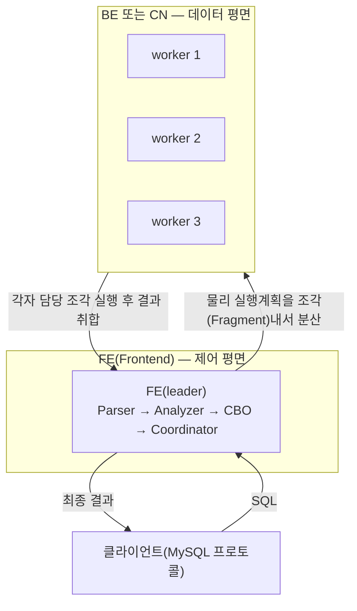
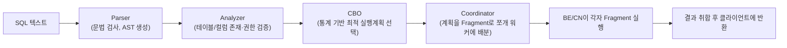

# StarRocks 개념 정리

StarRocks를 처음부터 배우면서 [분석 엔진](../lessons/08-1-starrocks-analytics.md)을 만들었다. 새 개념이 필요해질 때마다 여기 추가한다 — 교과서적 정의보다 "우리 클러스터에서 실제로 이게 왜 필요했는지"를 우선한다. 배포 절차 자체는 [StarRocks 분석 엔진](../lessons/08-1-starrocks-analytics.md) 참고.

## 전체 구조

StarRocks는 두 종류 노드로만 구성된다. Hive/Spark처럼 별도 메타스토어나 리소스 매니저가 필요 없다.



- **FE(Frontend)**: 제어 평면. SQL을 받아서 파싱(Parser) → 검증(Analyzer) → 비용 기반 최적화(CBO, Cost-Based Optimizer) → 실행계획을 여러 조각(Fragment)으로 쪼개 워커들에 분산 스케줄링(Coordinator)까지 담당한다. 카탈로그(DB/테이블/파티션/버킷 정의)도 FE가 메모리에 들고 있다.
- **BE(Backend) 또는 CN(Compute Node)**: 데이터 평면. FE가 나눠준 조각을 실제로 실행(스캔/조인/집계)하고 결과를 FE에 돌려준다. BE는 로컬 디스크에 데이터를 직접 갖고 있고, CN은 데이터가 없다(아래 "shared-nothing vs shared-data" 참고).

## FE 리더 선출과 메타데이터 복제 — BDBJE

FE를 여러 개 띄우면(고가용성 목적) 그중 하나만 리더(leader)가 되어 메타데이터 쓰기를 담당하고, 나머지는 팔로워(follower)로 읽기 전용 복제본을 유지한다. 이 리더 선출과 변경분 복제를 BDBJE(Berkeley DB Java Edition)라는 라이브러리가 담당한다 — Paxos류 합의 프로토콜로 동작한다는 점에서 k8s의 etcd(raft)나 Ceph의 mon(paxos)과 같은 역할이다. 팔로워는 쓰기 요청을 리더로 전달만 하고, 읽기(SELECT)는 직접 처리할 수 있다.

```bash
mysql -h fe.starrocks.svc.cluster.local -P 9030 -u root -e "SHOW FRONTENDS\G"
```
```
*************************** 1. row ***************************
               Id: 2
             Name: fe-0.fe-hl.starrocks.svc.cluster.local_9010_...
               IP: fe-0.fe-hl.starrocks.svc.cluster.local
      EditLogPort: 9010
        QueryPort: 9030
             Role: LEADER
             Join: true
            Alive: true
ReplayedJournalId: 2734
          Version: 4.1.4-4a9848e
```
`Role: LEADER`가 지금 메타데이터 쓰기 권한을 가진 FE다. `ReplayedJournalId`는 이 FE가 지금까지 반영한 메타데이터 변경 로그 번호 — 팔로워 여러 개를 비교하면 복제 지연 여부를 알 수 있다.

## FE 확장: Follower vs Observer

FE를 늘리는 목적은 둘 중 하나다. ① 리더 장애 시 자동 승격(HA), ② 쿼리 코디네이션(Parser/Analyzer/CBO/Coordinator) 처리량 확대. 이 둘을 같은 방법으로 풀면 안 된다 — FE 역할이 두 가지다.

- **Follower**: BDBJE Paxos 쿼럼에 투표권을 가진 멤버. 메타데이터 쓰기(DDL 등)마다 과반수 확인이 필요해서, Follower를 늘릴수록 그 확인에 걸리는 지연이 늘어난다. 그래서 보통 3(또는 5)개로 작게 유지한다 — k8s의 etcd, Ceph의 mon과 같은 제약이다.
- **Observer**: 메타데이터를 읽기 전용으로 복제만 받고 쿼럼 투표엔 참여하지 않는다. 투표 지연에 영향을 안 주므로, 쓰기 성능 걱정 없이 원하는 만큼 늘릴 수 있다. 쿼리 코디네이션 용량만 늘리고 싶을 때(리더 승격 후보는 필요 없을 때) 쓰는 게 Observer다.

```sql
-- Follower(투표 멤버) 추가 — 신중하게, 적은 개수만
ALTER SYSTEM ADD FOLLOWER "<host>:<edit_log_port>";

-- Observer(읽기 전용, 쿼럼 미참여) 추가 — 필요한 만큼 자유롭게
ALTER SYSTEM ADD OBSERVER "<host>:<edit_log_port>";
```

우리 클러스터에 Observer 하나를 실제로 추가해봤다(`scripts/08-starrocks/17-add-fe-observer.sh`):
```bash
mysql -h fe.starrocks.svc.cluster.local -P 9030 -u root -e "SHOW FRONTENDS\G"
```
```
*************************** 2. row ***************************
             Name: fe-obs1-0.fe-obs1-hl.starrocks.svc.cluster.local_9010_...
             Role: OBSERVER
             Join: true
            Alive: true
ReplayedJournalId: 3544        -- 리더(3546)와 거의 일치, 복제 지연 거의 없음
         IsHelper: false       -- 다른 FE가 join할 때 이 노드를 helper로 못 씀(관례상 Follower만 helper 역할)
```

클라이언트는 리더/팔로워/옵저버 아무 FE에나 붙어서 읽기 쿼리를 넣을 수 있다(쓰기만 리더로 전달됨). 그래서 실무에서는 여러 FE 앞에 로드밸런서(HAProxy/ProxySQL 등)를 두고 커넥션을 분산시킨다.

다만 우리 자체 벤치마크([08-2](../lessons/08-2-starrocks-analytics-bmt.md))에서는 FE를 늘려도 동시성이 개선되지 않았다 — 그 워크로드의 진짜 병목이 FE 코디네이션이 아니라 CN이 매 쿼리마다 오브젝트 스토리지(RGW)로 왕복하는 네트워크 비용이었기 때문이다. FE 확장(Follower든 Observer든)은 "동시 커넥션/쿼리 계획 수립 자체가 병목일 때"만 효과가 있는 레버라는 뜻 — 병목이 어디인지 먼저 확인하지 않고 FE부터 늘리면 헛수고가 될 수 있다.

## shared-nothing vs shared-data — 데이터를 어디에 저장하는가

같은 클러스터가 두 모드 중 하나로만 동작한다(섞어서 못 씀, `run_mode`로 FE를 처음 띄울 때 정해지고 이후 변경 불가).

| | shared-nothing(기본값, BE) | shared-data(CN) |
|---|---|---|
| 데이터 위치 | 각 노드의 로컬 디스크 | 오브젝트 스토리지(S3 호환, 우리는 Ceph RGW) |
| 컴퓨팅/스토리지 결합 | 결합됨 — 노드를 늘리면 컴퓨팅과 저장 용량이 같이 늘어남 | 분리됨 — 컴퓨팅(CN)만 늘리거나 줄일 수 있음 |
| 첫 쿼리 지연 | 없음(로컬 디스크 바로 읽음) | 있음(Data Cache에 없으면 오브젝트 스토리지에서 가져와야 함) |
| 우리 용도 | 성능 비교 기준선(`starrocks-sn` 클러스터) | 실제 운영(`starrocks` 클러스터, RGW 기반) |

CN은 로컬 영구 저장이 없다는 점만 빼면 실행 엔진은 BE와 같다. 쿼리에 필요한 데이터를 오브젝트 스토리지에서 읽어와 Data Cache(로컬 디스크 캐시)에 저장해두고, 다음 쿼리부터는 캐시를 먼저 본다 — 그래서 shared-data는 "첫 쿼리는 느리고 그 이후는 빠르다"는 특성이 있다. 실측 결과는 [shared-nothing vs shared-data 벤치마크](../lessons/08-2-starrocks-analytics-bmt.md) 참고.

```bash
mysql -h fe.starrocks.svc.cluster.local -P 9030 -u root -e "SHOW COMPUTE NODES\G"
```
```
*************************** 1. row ***************************
        ComputeNodeId: 10001
                   IP: cn-0.cn-hl.starrocks.svc.cluster.local
                Alive: true
           StatusCode: OK
             CpuCores: 6
     DataCacheMetrics: Status: Normal, DiskUsage: 28.2MB/30GB, MemUsage: 81.8KB/663.5MB
            TabletNum: 125
```
`DataCacheMetrics`가 이 CN의 로컬 캐시 사용량이다. `TabletNum`은 이 워커가 담당하는 데이터 조각(아래 참고) 개수.

## 데이터가 실제로 저장되는 구조 — Tablet / Rowset / Segment

테이블 하나는 파티션으로, 파티션은 다시 버킷(bucket, 해시 분산 단위)으로 쪼개진다. 이 버킷 하나하나가 Tablet이다 — Ceph의 PG(Placement Group)와 비슷하게, "데이터를 나눠서 워커에 분산 배치하는 단위"라고 보면 된다. Tablet 안에서는 데이터가 append-only로 쌓이는데, 한 번에 적재된 묶음을 Rowset이라 부르고 Rowset은 다시 여러 Segment(실제 컬럼형 파일)로 나뉜다.

적재가 반복되면 작은 Rowset이 계속 쌓인다. Compaction이 이 작은 조각들을 주기적으로 큰 조각으로 병합해서 스캔 효율을 유지한다 — 병합 후 남는 오래된 버전은 Vacuum이 정리한다. shared-data 모드에서는 Compaction 결과가 오브젝트 스토리지에 새로 쓰인다.

## 테이블 타입 — 같은 키를 가진 행이 들어오면 어떻게 할지

| 타입 | 동작 | 우리 용도 |
|---|---|---|
| Duplicate Key | 그냥 다 쌓는다(중복 허용) | 로그성 원본 데이터, 대부분의 벤치마크 테이블 |
| Aggregate Key | 같은 키의 값을 집계 함수로 합친다(SUM 등) | 사전 집계된 지표 테이블 |
| Unique Key | 같은 키가 들어오면 마지막 값으로 덮어쓴다 | 최신 상태만 필요한 테이블 |
| Primary Key | Unique Key + 실시간 UPDATE/DELETE 지원 | MySQL처럼 갱신이 잦은 테이블(CRUD 벤치마크에 사용) |

## SQL 실행 흐름



CBO(Cost-Based Optimizer)가 통계(테이블 크기, 카디널리티 등)를 보고 조인 순서·조인 방식(broadcast vs shuffle) 등을 정한다. 이 선택이 실제 성능에 크게 영향을 준다 — 예를 들어 작은 차원(dimension) 테이블은 broadcast join으로, 큰 테이블끼리는 shuffle join으로 처리하는 식이다. 실측 사례는 [CN 개수 확장 효과](../lessons/08-2-starrocks-analytics-bmt.md#cn-개수-확장-효과-쿼리-무게에-따라-다르다) 참고.

## 로컬에서 가볍게 띄워보기 — Docker Compose

우리 k8s 배포(FE/CN을 각각 Deployment+headless Service로 등록하는 방식)는 운영을 염두에 둔 구성이다. 아키텍처만 확인하거나 SQL을 가볍게 테스트해보고 싶으면 훨씬 간단하게 띄울 수 있다 — FE 컨테이너 하나 + BE 컨테이너 하나를 같은 도커 네트워크에 올리고, FE에 BE를 등록하는 것만으로 최소 구성이 완성된다.

```yaml
# docker-compose.yml — 개념 확인/로컬 테스트 전용, 운영 구성 아님
services:
  fe:
    image: starrocks/fe-ubuntu:latest
    ports: ["8030:8030", "9030:9030"]   # http / mysql 프로토콜
    command: ["/opt/starrocks/fe/bin/start_fe.sh"]
  be:
    image: starrocks/be-ubuntu:latest
    depends_on: [fe]
    command: ["/opt/starrocks/be/bin/start_be.sh"]
```

```bash
docker compose up -d

# FE가 뜬 뒤, BE를 FE에 등록(컨테이너 이름이 도커 네트워크 안에서 그대로 hostname으로 resolve됨)
mysql -h 127.0.0.1 -P 9030 -u root -e 'ALTER SYSTEM ADD BACKEND "be:9050";'
```

k8s 배포에서 headless Service로 고정 hostname을 만들어준 것과 같은 이유로, BE를 등록할 때 컨테이너 이름(`be`)을 그대로 쓴다 — IP로 등록하면 컨테이너가 재시작될 때마다 깨진다는 원칙은 로컬 환경에서도 똑같다. shared-data(RGW/S3)를 테스트하려면 `fe.conf`에 `run_mode=shared_data`와 `aws_s3_*` 설정을 추가해야 한다 — 자세한 설정 항목은 [분석 엔진의 fe.conf.template](../scripts/08-starrocks/fe.conf.template) 참고.
