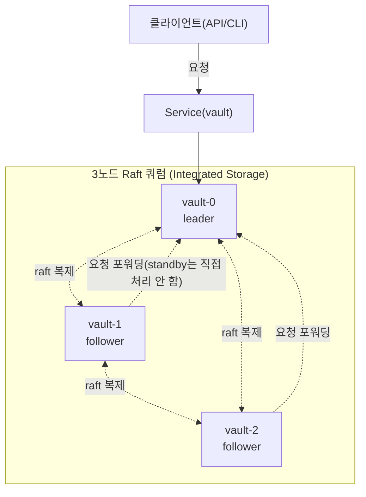
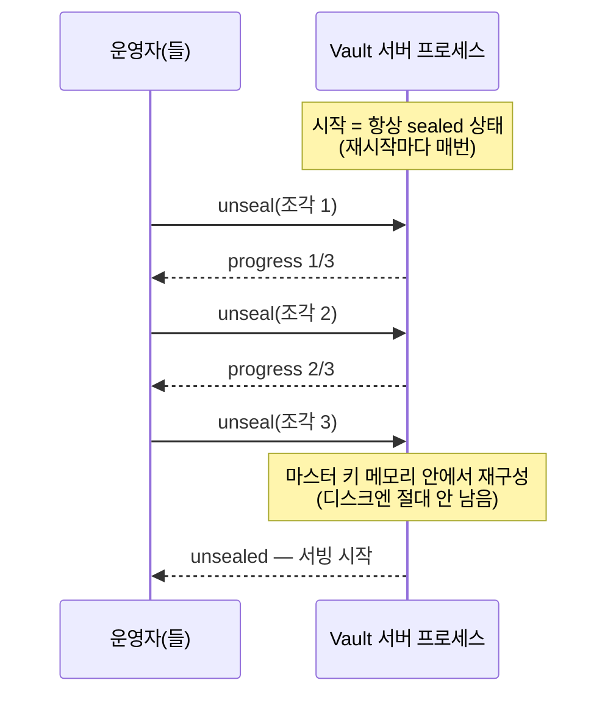

# Vault 개념 정리

AWS Secrets Manager 같은 시크릿 관리 시스템을 자체 호스팅해보면서 배운 개념을 정리한다. 기능은 유사해도(암호화 저장, 세밀한 접근 제어, 로테이션, 감사 로그) 운영 모델은 근본적으로 다르다 — 이게 이 문서의 핵심 주제다. 배포 절차는 [lessons/11-vault.md](../lessons/11-vault.md) 참고.

## 전체 구조 — Raft 쿼럼



mon 쿼럼(Ceph), etcd 쿼럼(k8s)과 원리는 같다 — 과반수 합의로 데이터를 복제하고, 노드 하나가 죽어도 나머지로 서비스가 유지된다. 다른 점은 Vault의 standby 노드(follower)는 자체적으로 요청을 처리하지 않고 leader로 포워딩한다는 것 — etcd/mon처럼 모든 노드가 대등하게 읽기를 처리하는 구조가 아니라, 쓰기든 읽기든 결국 leader 하나가 처리한다(읽기 성능을 늘리려면 `-allow-standby-reads` 같은 별도 옵션이 필요).

Consul 같은 외부 스토리지 백엔드도 쓸 수 있지만, Vault 자체에 내장된 **Raft Integrated Storage**를 쓰면 별도 컴포넌트 없이 Vault 프로세스만으로 쿼럼이 완성된다 — 이 클러스터도 이 방식을 쓴다.

## unseal — Vault만의 독특한 운영 개념

Vault는 저장소를 암호화하는 마스터 키를 평문으로 어디에도 저장하지 않는다. 대신 **Shamir's Secret Sharing**으로 마스터 키를 N개 조각(unseal key)으로 쪼개고, 그중 임계값 T개가 모여야만 복원되게 만든다(우리는 5개 중 3개).



핵심은 **이게 최초 1회가 아니라 서버 프로세스가 재시작될 때마다 반복된다**는 것이다 — 크래시, 재배포, 노드 재부팅 전부 포함. AWS Secrets Manager는 이런 개념 자체가 없다(KMS가 뒤에서 항상 대기, 사용자 시야 밖). Auto-unseal(외부 KMS 연동)로 사람 개입 없이 자동화할 수 있지만, 이 클러스터엔 클라우드 KMS가 없어서(별도 Vault를 하나 더 세워 그 Transit 엔진으로 auto-unseal하는 방법은 있으나, 그 별도 Vault는 또 누가 unseal하냐는 재귀적 문제가 남는다 — 아래 "알려진 이슈" 참고) 지금은 수동 unseal로 운영한다.

**unseal은 노드별로 독립적이다** — 클러스터 전체가 한 번에 unseal되는 게 아니라, 각 서버 프로세스가 각자 sealed/unsealed 상태를 갖는다. 3노드가 다 재시작되면 3번 다 unseal해줘야 한다.

## KV vs 동적 시크릿

| 방식 | 동작 | 예시 |
|---|---|---|
| KV(Key-Value) | 사람이 넣은 값을 그대로 저장·조회 | API 키, 정적 비밀번호 |
| 동적 시크릿(dynamic secrets) | 요청 시점에 짧은 수명 자격증명을 즉석 생성 | DB 계정, 클라우드 자격증명 |

동적 시크릿이 Vault의 핵심 차별점이다. 우리는 MySQL에 대고 실제로 테스트했다:

```bash
vault read database/creds/readonly
# → username=v-root-readonly-xxxx, password=랜덤, TTL 5분
```

이 호출 한 번마다 Vault가 **그 순간에** MySQL에 `CREATE USER` + `GRANT SELECT`를 실제로 실행해서 새 계정을 만들어준다. TTL이 지나거나 명시적으로 lease를 revoke하면 Vault가 그 MySQL 계정을 `DROP USER`로 실제로 지운다 — 우리도 revoke 직후 같은 자격증명으로 재접속을 시도해서 `Access denied`로 막히는 걸 확인했다. 정적 비밀번호를 발급해두고 사람이 나중에 회수를 깜빡하는 문제 자체가 구조적으로 없다.

AWS Secrets Manager의 "로테이션"은 이미 존재하는 자격증명의 값을 주기적으로 바꿔치기하는 방식(RDS 등 특정 리소스용 Lambda 템플릿)에 가깝다 — Vault의 동적 시크릿은 매 요청마다 아예 새 자격증명을 만들고 쓰임이 끝나면 지운다는 점에서 더 근본적으로 다르다.

## 알려진 이슈

### auto-unseal의 재귀 문제
클라우드 KMS 없이 self-hosted로 auto-unseal을 하려면 별도의 작은 Vault(Transit 엔진 전용)를 세워야 하는데, 그 Vault는 또 누가 unseal하냐는 질문이 남는다 — 결국 최상위 어딘가엔 수동 unseal(또는 사람이 관리하는 키)이 남을 수밖에 없다는 게 self-hosted Vault의 구조적 한계다.

### TLS 비활성 상태
지금은 `tls_disable = 1`로 클러스터 내부 평문 통신이다 — 테스트 목적으로 범위를 좁힌 것이고, 실제로 민감한 시크릿을 다루려면 최소 클러스터 내부 트래픽이라도 TLS를 켜야 한다.

---

[← 이전: StarRocks 개념](03-starrocks.md)
