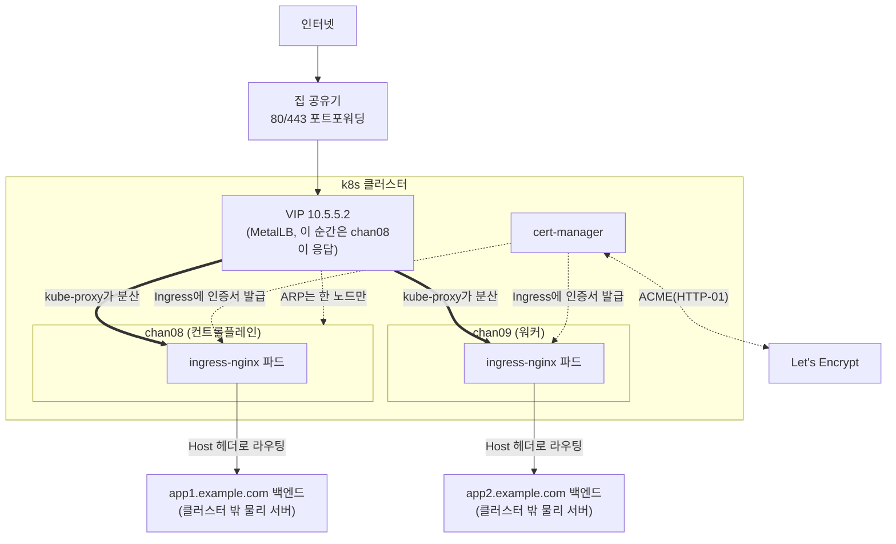

# Ingress + 인증서 자동화 (MetalLB + ingress-nginx + cert-manager)

2노드 클러스터에 외부 도메인을 라우팅하는 Ingress 계층을 올리고, Let's Encrypt 인증서 발급/갱신을 자동화한다. 기존에 별도 서버에서 nginx로 처리하던 도메인 라우팅과 인증서 발급 기능을 이 클러스터로 이전했다.

## 목적

k8s 클러스터 밖(다른 물리 서버들)에서 돌던 서비스들을 도메인 단위로 하나씩 클러스터로 편입시키려면, 외부에서 들어오는 HTTP(S) 트래픽을 도메인별로 올바른 백엔드로 라우팅해줄 진입점이 필요하다. 클라우드였다면 로드밸런서를 그냥 발급받으면 되지만 베어메탈이라 MetalLB로 VIP를 직접 만들고, 그 위에 ingress-nginx로 도메인 기반 라우팅을, cert-manager로 인증서 발급·갱신 자동화를 얹었다.

## 설계 결정

- **MetalLB는 L2 모드.** BGP 모드가 진짜 다중 노드 동시 트래픽 분산이 되지만 홈 라우터가 BGP를 못 한다. L2 모드는 VIP의 ARP 응답을 한 순간엔 한 노드만 하지만, 그 노드에 도착한 뒤엔 kube-proxy가 양쪽 노드의 ingress-nginx 파드로 마저 분산해주고, 리더 노드가 죽으면 자동으로 다른 노드가 넘겨받는다.
- **Service의 `externalTrafficPolicy: Cluster`.** 기본값이자 이 선택의 핵심 — `Local`로 하면 리더 노드가 받은 요청을 자기 노드의 파드로만 보내서 사실상 한 노드만 계속 일하게 된다. `Cluster`는 어느 노드가 받든 양쪽 노드의 파드로 분산하는 대신, 클라이언트 원본 IP가 보존되지 않는다(필요해지면 PROXY protocol 등으로 별도 해결).
- **인증서는 HTTP-01 챌린지.** DNS-01은 홈 라우터에서 DNS 레코드를 스크립트로 자동 조작할 방법이 없어서 제외. HTTP-01은 지금 라우터가 이미 80/443을 포워딩해주는 구조를 그대로 재사용할 수 있다.
- **staging 발급자로 먼저 검증 후 prod로 전환.** Let's Encrypt production은 도메인당 발급 횟수에 rate limit이 있어서, 설정이 맞는지 모르는 상태에서 바로 prod로 시도하면 실수로 limit을 태울 위험이 있다. staging(신뢰 안 되는 인증서)으로 챌린지 경로가 실제로 뚫리는지 먼저 확인하고, 확인되면 Ingress의 발급자 annotation만 바꿔서 같은 도메인으로 재발급한다.
- **도메인은 하나씩 이전.** 라우터의 포트포워딩은 도메인 단위가 아니라 80/443 포트 전체를 한 대상으로 넘기는 구조라, 실제로는 전환 시점에 모든 도메인이 한꺼번에 클러스터로 넘어온다. 다만 각 도메인의 DNS가 이 공인 IP를 가리키는지, 백엔드가 살아있는지는 도메인별로 다르므로 Ingress/인증서는 도메인 단위로 하나씩 만들고 검증한다.

## 토폴로지



## 스크립트 목록 (이름 순)

### MetalLB 설치
- 설명: bare-metal용 LoadBalancer 구현체를 설치한다.
- 스크립트: [`01-install-metallb.sh`](../scripts/05-ingress/01-install-metallb.sh)
```bash
kubectl apply -f https://raw.githubusercontent.com/metallb/metallb/v0.16.1/config/manifests/metallb-native.yaml
```

### VIP 대역 등록
- 설명: MetalLB에 VIP로 쓸 IP를 IPAddressPool + L2Advertisement로 등록한다.
- 스크립트: [`02-configure-metallb-pool.sh`](../scripts/05-ingress/02-configure-metallb-pool.sh)
```yaml
# IPAddressPool: 이 IP를 MetalLB가 나눠줄 수 있는 대역으로 등록
apiVersion: metallb.io/v1beta1
kind: IPAddressPool
metadata:
  name: ingress-pool
  namespace: metallb-system
spec:
  addresses:
  - 10.5.5.2/32

# L2Advertisement: 등록한 대역을 L2(ARP) 모드로 광고
apiVersion: metallb.io/v1beta1
kind: L2Advertisement
metadata:
  name: ingress-l2
  namespace: metallb-system
spec:
  ipAddressPools:
  - ingress-pool
```

### ingress-nginx 설치
- 설명: 도메인 기반 라우팅을 담당하는 ingress-nginx를 설치하고, 2노드 모두 사용하도록 조정한다 (`externalTrafficPolicy: Cluster`, replicas 2, 컨트롤플레인 toleration, 노드당 1개로 강제하는 anti-affinity, 서지 없는 롤링업데이트).
- 스크립트: [`03-install-ingress-nginx.sh`](../scripts/05-ingress/03-install-ingress-nginx.sh)
```bash
kubectl apply -f https://raw.githubusercontent.com/kubernetes/ingress-nginx/controller-v1.15.1/deploy/static/provider/baremetal/deploy.yaml

# Service를 LoadBalancer로 전환 + 트래픽 정책 Cluster
kubectl -n ingress-nginx patch svc ingress-nginx-controller \
  -p '{"spec":{"type":"LoadBalancer","externalTrafficPolicy":"Cluster"}}'

# MetalLB에 VIP 고정 요청
kubectl -n ingress-nginx annotate svc ingress-nginx-controller \
  metallb.io/loadBalancerIPs=10.5.5.2 --overwrite
```

### 컨트롤플레인 파드-호스트 방화벽 수정
- 설명: 컨트롤플레인 노드(chan08)에 파드가 처음 뜨면서 드러난 방화벽 문제를 고친다. 아래 "알려진 이슈" 참고.
- 스크립트: [`04-fix-ufw-pod-hairpin.sh`](../scripts/05-ingress/04-fix-ufw-pod-hairpin.sh)
```bash
sudo ufw allow from 10.244.0.0/16 to any port 6443 proto tcp comment 'pod-to-apiserver same-node hairpin'
```

### cert-manager 설치
- 설명: Let's Encrypt 인증서를 자동으로 발급·갱신하는 컨트롤러를 설치한다.
- 스크립트: [`05-install-cert-manager.sh`](../scripts/05-ingress/05-install-cert-manager.sh)
```bash
kubectl apply -f https://github.com/cert-manager/cert-manager/releases/download/v1.20.2/cert-manager.yaml
```

### ClusterIssuer 생성
- 설명: Let's Encrypt staging/production 발급자를 등록한다. 이메일은 계정 등록·만료 알림용.
- 스크립트: [`06-create-clusterissuers.sh`](../scripts/05-ingress/06-create-clusterissuers.sh)
```yaml
apiVersion: cert-manager.io/v1
kind: ClusterIssuer
metadata:
  name: letsencrypt-staging
spec:
  acme:
    server: https://acme-staging-v02.api.letsencrypt.org/directory
    email: admin@example.com
    privateKeySecretRef:
      name: letsencrypt-staging-account-key
    solvers:
    - http01:
        ingress:
          ingressClassName: nginx
```
production은 `server`만 `https://acme-v02.api.letsencrypt.org/directory`로 바꾼 동일한 구조.

### 도메인 추가
- 설명: 도메인 하나를 클러스터 밖 백엔드로 라우팅하는 Service+EndpointSlice+Ingress를 만든다. 처음엔 staging으로 만들고, HTTP-01 챌린지가 성공하는 걸 확인한 뒤 아래 명령으로 production으로 전환한다.
- 스크립트: [`07-add-domain.sh`](../scripts/05-ingress/07-add-domain.sh)
```bash
# 예시: app1.example.com -> 10.5.5.7:4200, staging으로 시작
./07-add-domain.sh app1.example.com 10.5.5.7 4200 staging

# 검증되면 production으로 전환 (같은 이름의 Ingress 재사용)
kubectl annotate ingress app1-example-com \
  cert-manager.io/cluster-issuer=letsencrypt-prod --overwrite
```

## 알려진 이슈

### 컨트롤플레인 파드의 same-node hairpin이 UFW에 막힘
지금까지 UFW 규칙은 전부 "물리 LAN 대역(10.5.5.0/24)에서 오는 트래픽"만 허용해왔다. chan09의 파드가 API 서버(chan08)에 붙을 때는 Flannel VXLAN을 거치면서 kube-proxy가 소스 IP를 노드 IP로 마스커레이드해줘서 이 규칙에 걸려 통과했는데, chan08 자기 자신에 뜬 파드가 같은 노드의 API 서버로 붙을 때는 이 마스커레이드가 일어나지 않아 파드 서브넷 IP(`10.244.0.0/16`)가 그대로 노출된다. UFW 로그에 `IN=cni0 SRC=10.244.0.x DST=10.5.5.8 DPT=6443`으로 정확히 찍혔다. 지금까지 컨트롤플레인 노드에 일반 파드가 뜬 적이 없어서(ingress-nginx가 최초) 드러나지 않았던 문제. `04-fix-ufw-pod-hairpin.sh`로 파드 서브넷을 6443에 허용해서 해결 — 앞으로 컨트롤플레인에 파드를 스케줄하는 다른 컴포넌트를 추가할 때도 같은 클래스의 문제가 재발할 수 있다.

### 2노드 + hard anti-affinity에서 롤링업데이트가 멈춤
replicas=2에 "노드당 1개"를 강제하는 `requiredDuringScheduling` anti-affinity를 걸면, 기본 롤링업데이트 전략(maxSurge 25%)이 임시로 3번째 파드를 띄우려다 배치할 노드가 없어 `Pending`으로 멈춘다. `maxSurge: 0, maxUnavailable: 1`로 바꿔서 "기존 파드를 하나 내리고 나서 새 파드를 올리는" 방식으로 전환해 해결.

### 도메인 DNS가 없으면 챌린지가 그냥 멈춘 채 대기
Ingress/Certificate를 만들어도 해당 도메인의 DNS A 레코드가 없으면 cert-manager의 self-check(`dial tcp: lookup ... no such host`)에서 계속 `pending`으로 멈춘다. 에러가 아니라 무한 대기라 상태만 보면 "안 되는 이유"를 알기 어렵다 — `kubectl describe challenge`로 Reason을 봐야 원인이 DNS 미설정인지 우리 쪽 설정 문제인지 구분된다.
