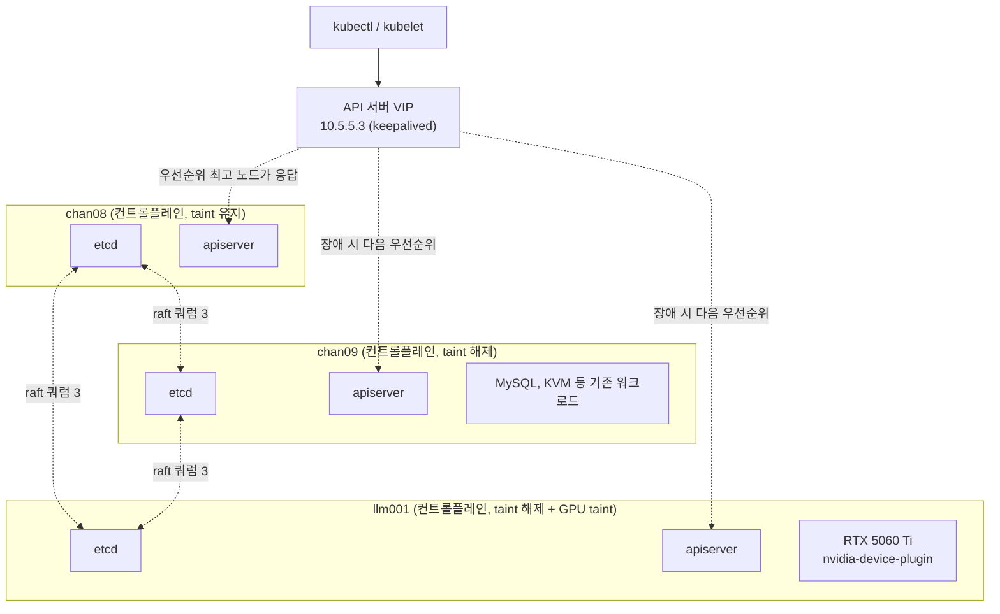

# LLM GPU 노드 추가 (2노드 → 3노드, 컨트롤플레인 HA)

기존에 별도 용도로 쓰던 GPU 머신을 k8s 클러스터에 컨트롤플레인 겸 워커로 편입시켰다. 물리 노드가 2대에서 3대가 되면서, 그동안 단일 장애점이었던 etcd/컨트롤플레인도 이 참에 실제 쿼럼(3)을 갖춘 구성으로 바꿨다.

## 목적

GPU 리소스(`nvidia.com/gpu`)를 k8s가 직접 스케줄링 대상으로 관리하게 만들어서, LLM 추론/배치 작업을 다른 워크로드와 동일한 방식(Deployment/Job, 재시작, 헬스체크, 향후 노드 추가 시 자동 확장)으로 다룰 수 있게 한다. 동시에 물리 노드가 3대로 늘어난 김에 etcd를 진짜 홀수 쿼럼으로 구성해서 컨트롤플레인 단일 장애점을 없앤다.

## 설계 결정

- **드라이버는 완전 제거 후 재설치.** 기존 드라이버가 동작은 하고 있었지만 `ubuntu-drivers devices`가 추천하는 최신 브랜치가 아니었다. 부분 업그레이드보다 관련 패키지를 다 지우고 추천 버전을 새로 까는 쪽이 상태가 더 명확하다.
- **containerd 기본 런타임을 nvidia로 직접 지정.** 이 노드는 GPU 전용으로 taint를 걸 것이므로 RuntimeClass로 일반/GPU 파드를 구분할 필요가 없다. 기본 런타임 자체를 nvidia로 바꾸는 게 더 단순하다.
- **GPU taint + 와일드카드 toleration.** `nvidia.com/gpu` taint로 GPU 미요청 파드를 막는다. device-plugin 자체의 toleration은 특정 taint 하나만 지정하지 않고 `operator: Exists`(모든 taint 허용)로 뒀다 — 이 노드가 나중에 컨트롤플레인으로 승격되는 등 taint 구성이 바뀔 때마다 매번 toleration을 맞춰줄 필요 없게.
- **컨트롤플레인 확장은 3대 전부를 스택 etcd로.** etcd는 과반수(quorum) 투표로 동작해서 짝수 대수는 오히려 손해다(2대는 1대 죽으면 과반 자체가 불가능해져서 1대짜리보다 나을 게 없음). 물리 노드가 정확히 3대뿐이라 "컨트롤플레인 전용 노드"를 따로 뺄 여유가 없어서, 3대 모두를 컨트롤플레인 겸 워커로 쓰는 kubeadm의 stacked etcd 토폴로지를 그대로 채택했다.
- **컨트롤플레인 taint는 원래 있던 chan08에만 남김.** chan09/llm001까지 컨트롤플레인 taint가 붙으면 3대 전부가 "허가 없이는 못 들어오는" 노드가 되어버려서, toleration 없는 일반 워크로드(cert-manager, metallb-controller 등)가 클러스터 어디에도 못 뜨는 상태가 됐다. chan09/llm001의 컨트롤플레인 taint는 제거해서 기존처럼 일반 워크로드를 받게 하고, chan08만 원래 설계대로 보호 상태를 유지한다.
- **API 서버 VIP는 keepalived로, 기존 MySQL VIP와 같은 방식.** 별도 로드밸런서 없이 MetalLB(L2 ARP)와 원리가 다른, 호스트 native VRRP 방식을 그대로 재사용했다. VIP를 들고 있는 노드는 자기 자신의 apiserver(0.0.0.0:6443 바인딩)가 그대로 응답하므로 별도 프록시(haproxy 등)가 필요 없다 — 노드 하나가 죽으면 다음 우선순위 노드로 VIP가 넘어가고, 그 노드의 로컬 apiserver가 바로 이어받는다.
- **VM으로 etcd를 옮기지 않음.** etcd 데이터 디렉터리는 이미 nvme(OS 루트)에 있고 MySQL/KVM 데이터는 별도 물리 디스크(`/data`)에 있어서, 디스크 I/O 경합은 애초에 거의 없다. VM 이전은 CPU/메모리 격리는 얻지만 디스크 격리는 별도 디스크를 새로 안 주는 한 얻는 게 없고, 브리지 네트워킹 구성부터 다시 해야 해서 비용 대비 실익이 낮다고 판단했다.

## 아키텍처



**장점**: GPU를 `nvidia.com/gpu` 리소스로 선언하면 k8s 스케줄러가 알아서 GPU 있는 노드에만 파드를 배치해준다 — 배치 작업(Job)이든 상시 추론 서버(Deployment)든 다른 워크로드와 완전히 같은 방식(재시작 정책, 리소스 상한, 롤아웃)으로 관리된다. 나중에 GPU 노드가 늘어나도 라벨/taint만 똑같이 걸어주면 자동으로 스케줄링 대상에 포함된다.

**실사용 예**: `resources.limits: {nvidia.com/gpu: 1}`을 선언한 파드는 자동으로 llm001에만 배치된다 (`internal/gpu-node/gpu-test-pod.yaml` 참고 — 컨테이너 안에서 `nvidia-smi`로 GPU 인식 확인). 추론 서버를 Deployment로 올리면 컨테이너가 죽어도 k8s가 재시작해주고, 향후 서빙 스택(vLLM 등)을 Job/Deployment 매니페스트만 바꿔서 교체할 수 있다.

## 스크립트 목록 (이름 순)

### 방화벽 포트 추가
- 설명: 기존에 다른 용도로 쓰던 UFW 호스트에 k8s 컨트롤플레인+워커 포트를 추가한다 (`01-provision`을 거치지 않고 편입되는 서버용).
- 스크립트: [`00-open-k8s-firewall-ports.sh`](../scripts/06-llm-gpu-node/00-open-k8s-firewall-ports.sh)
```bash
SUBNET="10.5.5.0/24"

# kubelet API
sudo ufw allow from "$SUBNET" to any port 10250 proto tcp comment 'kubelet API'

# NodePort
sudo ufw allow from "$SUBNET" to any port 30000:32767 proto tcp comment 'NodePort'

# Flannel VXLAN
sudo ufw allow from "$SUBNET" to any port 8472 proto udp comment 'Flannel VXLAN'

# k8s API server
sudo ufw allow from "$SUBNET" to any port 6443 proto tcp comment 'k8s API server'

# etcd
sudo ufw allow from "$SUBNET" to any port 2379:2380 proto tcp comment 'etcd'

# kube-controller-manager / kube-scheduler
sudo ufw allow from "$SUBNET" to any port 10257 proto tcp comment 'kube-controller-manager'
sudo ufw allow from "$SUBNET" to any port 10259 proto tcp comment 'kube-scheduler'

# keepalived VRRP (컨트롤플레인 API VIP)
sudo ufw allow from "$SUBNET" proto vrrp

sudo ufw reload
```

### NVIDIA 드라이버 재설치
- 설명: 기존 드라이버를 완전히 제거하고 `ubuntu-drivers devices`가 추천하는 버전으로 재설치한다.
- 스크립트: [`01-reinstall-nvidia-driver.sh`](../scripts/06-llm-gpu-node/01-reinstall-nvidia-driver.sh)
```bash
# 추천 드라이버 확인
ubuntu-drivers devices

# 기존 드라이버 hold 해제
sudo apt-mark showhold | grep '^nvidia-driver-' | xargs -r sudo apt-mark unhold

# 드라이버 관련 패키지만 제거 (cuda/cudnn, nvidia-container-toolkit은 유지)
sudo apt-get purge -y --allow-change-held-packages \
  'nvidia-driver-*' 'nvidia-dkms-*' 'nvidia-utils-*' 'xserver-xorg-video-nvidia-*' \
  'libnvidia-cfg1-*' 'libnvidia-common-*' 'libnvidia-compute-*' 'libnvidia-decode-*' \
  'libnvidia-encode-*' 'libnvidia-extra-*' 'libnvidia-fbc1-*' 'libnvidia-gl-*' \
  'nvidia-compute-utils-*'

sudo apt-get autoremove -y

# 신규 드라이버 설치 (예: nvidia-driver-595-open)
sudo apt-get update -y
sudo apt-get install -y nvidia-driver-595-open
sudo apt-mark hold nvidia-driver-595-open
```
설치 후 재부팅, `nvidia-smi`로 확인.

### containerd nvidia 런타임 설정
- 설명: containerd의 기본 런타임을 nvidia로 지정한다 (이 노드는 GPU 전용이라 RuntimeClass 없이 바로 기본값으로).
- 스크립트: [`02-configure-nvidia-containerd-runtime.sh`](../scripts/06-llm-gpu-node/02-configure-nvidia-containerd-runtime.sh)
```bash
sudo nvidia-ctk runtime configure --runtime=containerd --set-as-default
sudo systemctl restart containerd
```

### 컨트롤플레인 공유 진입점 추가
- 설명: 단일 컨트롤플레인으로 초기화된 클러스터는 kubeadm이 컨트롤플레인 추가 join을 거부한다. 기존 컨트롤플레인(chan08)의 `ClusterConfiguration`에 VIP를 `controlPlaneEndpoint`/apiserver `certSANs`로 추가하고, 이미 떠 있는 apiserver 인증서를 그 SAN을 포함해서 재발급한다. 기존 컨트롤플레인에서 1회만 실행.
- 스크립트: [`03-add-control-plane-endpoint.sh`](../scripts/06-llm-gpu-node/03-add-control-plane-endpoint.sh)
```bash
# 현재 클러스터 설정을 받아서 controlPlaneEndpoint/certSAN 추가 후 반영
kubectl -n kube-system get cm kubeadm-config -o jsonpath='{.data.ClusterConfiguration}' > /tmp/kubeadm-cluster-config.yaml
# (apiServer.certSANs에 VIP 추가, controlPlaneEndpoint: <VIP>:6443 한 줄 추가)
kubectl -n kube-system create cm kubeadm-config \
  --from-file=ClusterConfiguration=/tmp/kubeadm-cluster-config.yaml \
  --dry-run=client -o yaml | kubectl apply -f -

# apiserver 인증서는 파일이 이미 있으면 kubeadm이 재발급을 건너뛰므로, 지우고 다시 생성해야 강제됨
sudo cp /etc/kubernetes/pki/apiserver.crt /etc/kubernetes/pki/apiserver.crt.bak
sudo cp /etc/kubernetes/pki/apiserver.key /etc/kubernetes/pki/apiserver.key.bak
sudo rm /etc/kubernetes/pki/apiserver.crt /etc/kubernetes/pki/apiserver.key
sudo kubeadm init phase certs apiserver --config /tmp/kubeadm-cluster-config.yaml

# 인증서 파일만 바뀌고 떠 있는 apiserver 프로세스는 그대로라, 정적 파드를 강제로 다시 띄워야 새 인증서를 읽음
sudo mv /etc/kubernetes/manifests/kube-apiserver.yaml /tmp/kube-apiserver.yaml.tmp
sleep 5
sudo mv /tmp/kube-apiserver.yaml.tmp /etc/kubernetes/manifests/kube-apiserver.yaml
```

### API 서버 VIP keepalived 구성
- 설명: API 서버 앞단에 keepalived VIP를 추가한다. 기존에 다른 용도(MySQL VIP)로 keepalived를 쓰고 있어도 `virtual_router_id`만 겹치지 않으면 같은 설정 파일에 인스턴스를 추가로 둘 수 있다. 헬스체크는 로컬 apiserver의 `/livez`.
- 스크립트: [`04-setup-apiserver-vip-keepalived.sh`](../scripts/06-llm-gpu-node/04-setup-apiserver-vip-keepalived.sh)
```bash
# 헬스체크 스크립트
cat <<'EOF' | sudo tee /usr/local/bin/chk_k8s_apiserver.sh
#!/bin/bash
curl -sk --max-time 2 -o /dev/null -w '%{http_code}' https://127.0.0.1:6443/livez | grep -q 200
EOF
sudo chmod +x /usr/local/bin/chk_k8s_apiserver.sh

# keepalived.conf에 vrrp_instance 추가 (기존 MySQL용 virtual_router_id 51과 겹치지 않게 52 사용)
cat <<EOF | sudo tee -a /etc/keepalived/keepalived.conf

vrrp_script chk_k8s_apiserver {
    script "/usr/local/bin/chk_k8s_apiserver.sh"
    interval 2
    fall 3
    rise 2
}

vrrp_instance VI_K8S_APISERVER {
    state MASTER
    interface enp1s0
    virtual_router_id 52
    priority 150
    advert_int 1
    authentication {
        auth_type PASS
        auth_pass <비밀번호>
    }
    virtual_ipaddress {
        10.5.5.3/24
    }
    track_script {
        chk_k8s_apiserver
    }
}
EOF

sudo systemctl restart keepalived
```
다른 두 노드는 `state BACKUP`, `priority`를 더 낮게(140, 130) 줘서 같은 인스턴스를 추가한다. 인터페이스 이름은 노드마다 다를 수 있다 (예: llm001은 `br0`).

### 컨트롤플레인으로 join
- 설명: 워커가 아니라 컨트롤플레인(추가 apiserver+etcd 멤버)으로 합류시킨다. 각 파라미터의 의미:
  - `--token` : 노드가 클러스터에 처음 인증할 때 쓰는 1회성 부트스트랩 토큰 (기본 24시간 TTL)
  - `--discovery-token-ca-cert-hash` : 접속하려는 apiserver가 진짜 이 클러스터의 CA로 서명됐는지 검증하는 해시 (중간자 공격 방지)
  - `--control-plane` : 워커가 아니라 컨트롤플레인(추가 apiserver+etcd 멤버)으로 합류하겠다는 플래그
  - `--certificate-key` : 기존 컨트롤플레인들의 인증서를 새 노드로 안전하게 복사해오는 임시 대칭키 (`kubeadm init phase upload-certs`로 발급, 기본 2시간 TTL)
  - `--apiserver-advertise-address` : 이 노드의 apiserver가 자기 자신의 IP로 클러스터에 알리는 주소 (멀티 NIC 환경에서 명시 필요)
- 스크립트: [`05-join-control-plane.sh`](../scripts/06-llm-gpu-node/05-join-control-plane.sh)
```bash
# 기존 컨트롤플레인(chan08)에서 매번 새로 발급 (토큰/cert-key 둘 다 짧은 TTL)
kubeadm token create --print-join-command
sudo kubeadm init phase upload-certs --upload-certs

# 새 노드에서 (이미 워커 등으로 join되어 있었다면 먼저 kubeadm reset -f)
sudo kubeadm join 10.5.5.8:6443 --token <토큰> --discovery-token-ca-cert-hash sha256:<해시> \
  --control-plane --certificate-key <cert-key> --apiserver-advertise-address=<이 노드 IP>

# 기존 컨트롤플레인에서
kubectl uncordon <새 노드>
```
join 후 kubelet/controller-manager/scheduler의 kubeconfig는 kubeadm이 자동으로 **이 노드 자신의 IP**를 가리키게 생성한다 (VIP가 아님) — 로컬 apiserver가 가장 빠르고, 이 노드가 살아있으면 자기 자신의 apiserver도 살아있다고 보기 때문에 의도된 동작이다. `admin.conf`(사람이 kubectl 붙는 용도)만 VIP를 가리키도록 생성된다.

### GPU 노드 라벨/taint
- 설명: GPU를 요청하는 파드만 이 노드에 스케줄되도록 라벨과 taint를 건다.
- 스크립트: [`06-label-and-taint-gpu-node.sh`](../scripts/06-llm-gpu-node/06-label-and-taint-gpu-node.sh)
```bash
kubectl label node llm001 nvidia.com/gpu=true
kubectl taint node llm001 nvidia.com/gpu=present:NoSchedule
```

### nvidia-device-plugin 설치
- 설명: `nvidia.com/gpu` 리소스를 노드에 노출시키는 DaemonSet을 설치한다. GPU 라벨이 붙은 노드에만 스케줄되고, 어떤 taint가 있든 살아남도록 와일드카드 toleration을 쓴다.
- 스크립트: [`07-apply-nvidia-device-plugin.sh`](../scripts/06-llm-gpu-node/07-apply-nvidia-device-plugin.sh)
```yaml
apiVersion: apps/v1
kind: DaemonSet
metadata:
  name: nvidia-device-plugin-daemonset
  namespace: kube-system
spec:
  selector:
    matchLabels:
      name: nvidia-device-plugin-ds
  template:
    metadata:
      labels:
        name: nvidia-device-plugin-ds
    spec:
      nodeSelector:
        nvidia.com/gpu: "true"
      tolerations:
        - operator: Exists
      containers:
        - image: nvcr.io/nvidia/k8s-device-plugin:v0.17.1
          name: nvidia-device-plugin-ctr
          volumeMounts:
            - name: device-plugin
              mountPath: /var/lib/kubelet/device-plugins
      volumes:
        - name: device-plugin
          hostPath:
            path: /var/lib/kubelet/device-plugins
```

## 알려진 이슈

### iptables를 직접 건드리면 UFW가 완전히 뚫림(반대로 잠김)
`kubeadm reset` 후 CNI 정리 과정에서 `sudo iptables -F` 등으로 iptables를 직접 flush했더니 노드가 SSH/ping을 포함해 완전히 네트워크 단절됐다. UFW는 기본 정책을 DROP으로 걸어두고 그 위에 개별 ALLOW 규칙(SSH 등)을 얹는 방식인데, iptables를 직접 flush하면 ALLOW 규칙만 사라지고 DROP 기본 정책은 커널에 그대로 남는다. `/etc/ufw/`의 규칙 파일 자체는 디스크에 남아있어서 재부팅(또는 `sudo ufw reload`/`systemctl restart ufw`)하면 즉시 복구된다. **앞으로 UFW 쓰는 노드에서는 iptables를 직접 조작하지 말고 반드시 `ufw` 명령만 사용한다.**

### 컨트롤플레인 taint가 늘어나면 toleration 없는 워크로드가 전부 갈 곳을 잃음
기존 워커(chan09)와 신규 노드(llm001)를 컨트롤플레인으로 승격시키면 kubeadm이 자동으로 `node-role.kubernetes.io/control-plane:NoSchedule` taint를 붙인다. 클러스터 노드 3대 전부에 이 taint가 붙으면, 이 taint에 대한 toleration이 없는 일반 워크로드(cert-manager, metallb-controller 등 — 원래는 taint 없는 워커에 떠 있었음)가 스케줄될 곳이 완전히 사라져 `Pending`으로 멈춘다. chan08 이외 노드의 컨트롤플레인 taint는 제거해서 해결했다 (위 설계 결정 참고).

### kubeadm은 인증서 파일이 이미 있으면 재발급을 건너뜀
`kubeadm init phase certs apiserver --config ...`를 그냥 실행하면 `[certs] Using existing apiserver certificate and key on disk`만 찍고 아무 것도 안 바꾼다. 새 SAN을 반영하려면 기존 `apiserver.crt`/`apiserver.key`를 먼저 지워야 강제로 재생성된다.

### 인증서만 바꿔서는 떠 있는 apiserver가 새로 못 읽음
정적 파드의 인증서 파일을 갱신해도, 이미 실행 중인 apiserver 프로세스는 시작 시점에 읽은 인증서를 계속 메모리에 들고 있다. `/etc/kubernetes/manifests/kube-apiserver.yaml`을 잠깐 밖으로 옮겼다 되돌리면 kubelet이 정적 파드를 다시 띄우면서 새 인증서를 읽는다.
