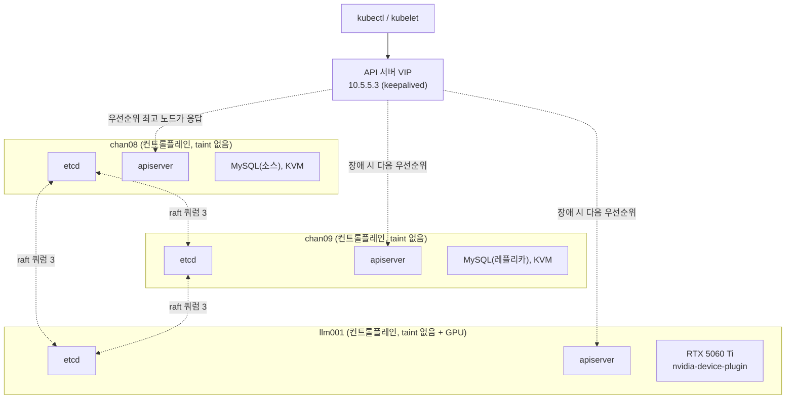

# LLM GPU 노드 추가 (2노드 → 3노드, 컨트롤플레인 HA)

기존에 별도 용도로 쓰던 GPU 머신을 k8s 클러스터에 컨트롤플레인 겸 워커로 편입시켰다. 물리 노드가 2대에서 3대가 되면서, 그동안 단일 장애점이었던 etcd/컨트롤플레인도 이 참에 실제 쿼럼(3)을 갖춘 구성으로 바꿨다.

## 목적

GPU 리소스(`nvidia.com/gpu`)를 k8s가 직접 스케줄링 대상으로 관리하게 만든다. 그러면 LLM 추론/배치 작업을 다른 워크로드와 동일한 방식(Deployment/Job, 재시작, 헬스체크, 향후 노드 추가 시 자동 확장)으로 다룰 수 있다. 동시에 물리 노드가 3대로 늘어난 김에 etcd를 진짜 홀수 쿼럼으로 구성해서 컨트롤플레인 단일 장애점을 없앤다.

## 설계 결정

- **드라이버는 완전 제거 후 재설치.** 기존 드라이버가 동작은 하고 있었지만 `ubuntu-drivers devices`가 추천하는 최신 브랜치가 아니었다. 부분 업그레이드보다 관련 패키지를 다 지우고 추천 버전을 새로 까는 쪽이 상태가 더 명확하다.
- **containerd 기본 런타임을 nvidia로 직접 지정.** nvidia-container-runtime은 GPU를 요청하지 않는 일반 컨테이너에는 runc와 동일하게 동작하므로, 이 노드에 일반 파드가 같이 떠도 문제없다. RuntimeClass로 일반/GPU를 구분할 필요 없이 기본값 자체를 nvidia로 바꾸는 쪽이 더 단순하다.
- **GPU 배타성은 taint가 아니라 리소스 요청으로 확보.** 처음엔 `nvidia.com/gpu` taint로 이 노드를 GPU 전용으로 막아뒀는데, 그러면 일반 워크로드가 이 노드를 아예 못 쓰게 되어 자원이 노는 문제가 있었다. 실제로는 `nvidia.com/gpu` 리소스를 실제로 가진 노드가 이 노드뿐이다. 그래서 GPU를 요청하는 파드는 taint 없이도 스케줄러가 자동으로 여기로만 보낸다. taint를 완전히 제거하고 라벨(`nvidia.com/gpu=true`, device-plugin의 nodeSelector용)만 남겼다. device-plugin의 toleration은 `operator: Exists`(모든 taint 허용)로 남겨뒀는데, 이 노드가 다시 컨트롤플레인 taint 같은 걸 받게 되더라도 매번 맞춰줄 필요 없게 하기 위함.
- **컨트롤플레인 확장은 3대 전부를 스택 etcd로.** etcd는 과반수(quorum) 투표로 동작해서 짝수 대수는 오히려 손해다(2대는 1대 죽으면 과반 자체가 불가능해져서 1대짜리보다 나을 게 없음). 물리 노드가 정확히 3대뿐이라 "컨트롤플레인 전용 노드"를 따로 뺄 여유가 없어서, 3대 모두를 컨트롤플레인 겸 워커로 쓰는 kubeadm의 stacked etcd 토폴로지를 그대로 채택했다.
- **컨트롤플레인 taint는 3대 전부 제거.** chan09/llm001까지 컨트롤플레인 taint가 붙으면 3대 전부가 "허가 없이는 못 들어오는" 노드가 되어버려서, toleration 없는 일반 워크로드(cert-manager, metallb-controller 등)가 클러스터 어디에도 못 뜨는 상태가 됐다. 처음엔 chan08만(원래 유일한 컨트롤플레인이었던 이력 + MySQL 소스를 겸하는 노드라는 이유로) taint를 남겨뒀다. 하지만 3대가 이제 구조적으로 완전히 동일한 역할(컨트롤플레인+워커)이라 굳이 하나만 다르게 취급할 근거가 약했다. 그래서 chan08의 taint도 마저 제거해 3대를 완전히 대칭으로 통일했다. llm001의 `nvidia.com/gpu` taint도 이후 제거했다 — GPU 배타성은 taint가 아니라 리소스 요청만으로 충분해서, taint를 남겨두는 건 일반 워크로드가 이 노드를 못 쓰게 막는 손해만 있었다 (위 설계 결정 참고). 결과적으로 3대 전부 taint가 없다. kubeadm이 컨트롤플레인 승격 시 taint 말고 `node.kubernetes.io/exclude-from-external-load-balancers` 라벨도 같이 붙이는데, 이건 뒤늦게(MetalLB VIP가 통째로 죽인 뒤에야) 발견해서 별도로 제거했다 — 자세한 내용은 아래 "알려진 이슈" 참고.
- **API 서버 VIP는 keepalived로, 기존 MySQL VIP와 같은 방식.** 별도 로드밸런서 없이 MetalLB(L2 ARP)와 원리가 다른, 호스트 native VRRP 방식을 그대로 재사용했다. VIP를 들고 있는 노드는 자기 자신의 apiserver(0.0.0.0:6443 바인딩)가 그대로 응답하므로 별도 프록시(haproxy 등)가 필요 없다 — 노드 하나가 죽으면 다음 우선순위 노드로 VIP가 넘어가고, 그 노드의 로컬 apiserver가 바로 이어받는다. 이 VIP는 애초에 [`02-k8s-cluster.md`](02-k8s-cluster.md)에서 컨트롤플레인을 처음 만들 때부터 `controlPlaneEndpoint`로 잡아뒀기 때문에, 이번에 컨트롤플레인을 늘릴 때는 인증서를 재발급하거나 클러스터 설정을 손댈 필요 없이 새 노드에 BACKUP 인스턴스만 추가하면 됐다.
- **VM으로 etcd를 옮기지 않음.** etcd 데이터 디렉터리는 이미 nvme(OS 루트)에 있고 MySQL/KVM 데이터는 별도 물리 디스크(`/data`)에 있어서, 디스크 I/O 경합은 애초에 거의 없다. VM 이전은 CPU/메모리 격리는 얻지만 디스크 격리는 별도 디스크를 새로 안 주는 한 얻는 게 없고, 브리지 네트워킹 구성부터 다시 해야 해서 비용 대비 실익이 낮다고 판단했다.

## 아키텍처



**장점**: GPU를 `nvidia.com/gpu` 리소스로 선언하면 k8s 스케줄러가 알아서 GPU 있는 노드에만 파드를 배치해준다. 배치 작업(Job)이든 상시 추론 서버(Deployment)든 다른 워크로드와 완전히 같은 방식(재시작 정책, 리소스 상한, 롤아웃)으로 관리된다. 나중에 GPU 노드가 늘어나도 라벨만 똑같이 걸어주면 자동으로 스케줄링 대상에 포함된다. GPU 배타성은 taint가 아니라 리소스 요청 자체로 확보되므로 taint는 불필요하다.

**실사용 예**: `resources.limits: {nvidia.com/gpu: 1}`을 선언한 파드는 자동으로 llm001에만 배치된다. 컨테이너 안에서 `nvidia-smi`를 실행해보면 GPU가 그대로 인식된다. 추론 서버를 Deployment로 올리면 컨테이너가 죽어도 k8s가 재시작해준다. 향후 서빙 스택(vLLM 등)을 Job/Deployment 매니페스트만 바꿔서 교체할 수 있다.

## 스크립트 목록 (이름 순)

### 방화벽 포트 추가
- 설명: 기존에 다른 용도로 쓰던 UFW 호스트에 k8s 컨트롤플레인+워커 포트를 추가한다 (`01-provision`을 거치지 않고 편입되는 서버용).
- 스크립트: [`00-open-k8s-firewall-ports.sh`](../scripts/06-llm-gpu-node/00-open-k8s-firewall-ports.sh)
```bash
# kubelet API
sudo ufw allow from 10.5.5.0/24 to any port 10250 proto tcp comment 'kubelet API'

# NodePort
sudo ufw allow from 10.5.5.0/24 to any port 30000:32767 proto tcp comment 'NodePort'

# Flannel VXLAN
sudo ufw allow from 10.5.5.0/24 to any port 8472 proto udp comment 'Flannel VXLAN'

# k8s API server
sudo ufw allow from 10.5.5.0/24 to any port 6443 proto tcp comment 'k8s API server'

# etcd
sudo ufw allow from 10.5.5.0/24 to any port 2379:2380 proto tcp comment 'etcd'

# kube-controller-manager / kube-scheduler
sudo ufw allow from 10.5.5.0/24 to any port 10257 proto tcp comment 'kube-controller-manager'
sudo ufw allow from 10.5.5.0/24 to any port 10259 proto tcp comment 'kube-scheduler'

# keepalived VRRP (컨트롤플레인 API VIP)
sudo ufw allow from 10.5.5.0/24 proto vrrp comment 'keepalived VRRP (컨트롤플레인 API VIP)'

# MetalLB memberlist (speaker 간 리더 선출용 가십 프로토콜)
sudo ufw allow from 10.5.5.0/24 to any port 7946 proto tcp comment 'MetalLB memberlist'
sudo ufw allow from 10.5.5.0/24 to any port 7946 proto udp comment 'MetalLB memberlist'

sudo ufw reload
```
이 스크립트가 열어주는 건 k8s 관련 포트뿐이다. `sudo ufw status`로 llm001을 보면 이 목록에 없는 `11434/tcp`(ollama), `4200/tcp`(box.abcyon.com 백엔드)도 같이 보이는데, 이 둘은 llm001이 k8s에 편입되기 전부터 돌리던 이 노드 자체 서비스용 포트라 이 저장소의 어떤 스크립트도 열지 않는다 (SSH 22/tcp도 마찬가지 — 편입 전부터 이미 열려 있었음).

### NVIDIA 드라이버 재설치
- 설명: 기존 드라이버를 완전히 제거하고 `ubuntu-drivers devices`가 추천하는 버전으로 재설치한다.
- 스크립트: [`01-reinstall-nvidia-driver.sh`](../scripts/06-llm-gpu-node/01-reinstall-nvidia-driver.sh)
```bash
# 추천 드라이버 확인
ubuntu-drivers devices

# 기존 드라이버 hold 해제
sudo apt-mark showhold | grep '^nvidia-driver-' | xargs -r sudo apt-mark unhold

# 드라이버 관련 패키지만 제거 (cuda/cudnn, nvidia-container-toolkit은 유지)
sudo apt-get purge -y --allow-change-held-packages \
  'nvidia-driver-*' 'nvidia-dkms-*' 'nvidia-utils-*' 'xserver-xorg-video-nvidia-*' \
  'libnvidia-cfg1-*' 'libnvidia-common-*' 'libnvidia-compute-*' 'libnvidia-decode-*' \
  'libnvidia-encode-*' 'libnvidia-extra-*' 'libnvidia-fbc1-*' 'libnvidia-gl-*' \
  'nvidia-compute-utils-*'

sudo apt-get autoremove -y

# 신규 드라이버 설치 (예: nvidia-driver-595-open)
sudo apt-get update -y
sudo apt-get install -y nvidia-driver-595-open
sudo apt-mark hold nvidia-driver-595-open
```
설치 후 재부팅, `nvidia-smi`로 확인.

### containerd nvidia 런타임 설정
- 설명: containerd의 기본 런타임을 nvidia로 지정한다 (일반 컨테이너에는 runc와 동일하게 동작하므로 RuntimeClass 없이 바로 기본값으로 지정).
- 스크립트: [`02-configure-nvidia-containerd-runtime.sh`](../scripts/06-llm-gpu-node/02-configure-nvidia-containerd-runtime.sh)
```bash
sudo nvidia-ctk runtime configure --runtime=containerd --set-as-default
sudo systemctl restart containerd
```

### 컨트롤플레인으로 join
- 설명: 워커가 아니라 컨트롤플레인(추가 apiserver+etcd 멤버)으로 합류시킨다. 각 파라미터의 의미:
  - `--token` : 노드가 클러스터에 처음 인증할 때 쓰는 1회성 부트스트랩 토큰 (기본 24시간 TTL). 기존 컨트롤플레인에서 `kubeadm token create`로 매번 새로 발급하며, 클러스터의 etcd에 Secret으로 저장된다.
  - `--discovery-token-ca-cert-hash` : 접속하려는 apiserver가 진짜 이 클러스터의 CA로 서명됐는지 검증하는 해시 (중간자 공격 방지). 새로 만드는 값이 아니라 클러스터의 루트 CA 인증서(`/etc/kubernetes/pki/ca.crt`)에서 그대로 계산되는 고정값이라, CA를 재발급하지 않는 한 토큰을 몇 번을 새로 받아도 이 해시는 항상 같다 (실제로 chan09/llm001 join 때 토큰은 매번 달랐지만 해시는 `sha256:22a8bc3a...`로 동일했다).
  - `--control-plane` : 워커가 아니라 컨트롤플레인(추가 apiserver+etcd 멤버)으로 합류하겠다는 플래그
  - `--certificate-key` : 기존 컨트롤플레인들의 인증서를 새 노드로 안전하게 복사해오는 임시 대칭키 (`kubeadm init phase upload-certs`로 발급, 기본 2시간 TTL)
  - `--apiserver-advertise-address` : 이 노드의 apiserver가 자기 자신의 IP로 클러스터에 알리는 주소 (멀티 NIC 환경에서 명시 필요)

  컨트롤플레인이 처음부터 VIP(10.5.5.3)를 `controlPlaneEndpoint`로 잡고 시작했으므로([`02-k8s-cluster.md`](02-k8s-cluster.md) 참고), `kubeadm token create --print-join-command`가 출력하는 join 명령도 이미 이 VIP를 가리킨다 — 고정 IP를 쓰던 시절처럼 클러스터 설정이나 인증서를 따로 손볼 필요가 없다.
- 스크립트: [`03-join-control-plane.sh`](../scripts/06-llm-gpu-node/03-join-control-plane.sh)
```bash
# 기존 컨트롤플레인(chan08)에서 매번 새로 발급 (토큰/cert-key 둘 다 짧은 TTL)
kubeadm token create --print-join-command
sudo kubeadm init phase upload-certs --upload-certs

# 새 노드에서 (이미 워커 등으로 join되어 있었다면 먼저 kubeadm reset -f)
sudo kubeadm join 10.5.5.3:6443 --token <토큰> --discovery-token-ca-cert-hash sha256:<해시> \
  --control-plane --certificate-key <cert-key> --apiserver-advertise-address=<이 노드 IP>

# 기존 컨트롤플레인에서
kubectl uncordon <새 노드>
```
join 후 kubelet/controller-manager/scheduler의 kubeconfig는 kubeadm이 자동으로 **이 노드 자신의 IP**를 가리키게 생성한다 (VIP가 아님) — 로컬 apiserver가 가장 빠르고, 이 노드가 살아있으면 자기 자신의 apiserver도 살아있다고 보기 때문에 의도된 동작이다. `admin.conf`(사람이 kubectl 붙는 용도)만 VIP를 가리키도록 생성된다.

join이 끝나 이 노드의 로컬 apiserver가 살아나면, VIP도 이 노드와 나눠 갖게 한다 — 새 스크립트가 아니라 [`02-k8s-cluster.md`의 keepalived 스크립트](02-k8s-cluster.md#api-서버-vip-keepalived-구성)를 이 노드에서 BACKUP으로 재실행하는 것으로 충분하다:
```bash
# chan09: priority 140, llm001: priority 130 (기존 chan08=150보다 낮게)
sudo ../02-k8s-cluster/05-setup-apiserver-vip-keepalived.sh 10.5.5.3 <이 노드 인터페이스> BACKUP <우선순위> <VRRP 인증암호>
```
인터페이스 이름은 노드마다 다를 수 있다 (예: llm001은 `br0`). `<VRRP 인증암호>`는 chan08에서 처음 정한 값과 반드시 동일해야 한다.

### GPU 노드 라벨
- 설명: device-plugin의 `nodeSelector`가 찾을 수 있도록 라벨을 건다. (처음엔 taint도 같이 걸어 이 노드를 GPU 전용으로 막았으나, GPU 요청 파드는 리소스 제약만으로도 이 노드로만 스케줄되고 taint는 일반 워크로드를 못 쓰게 막는 손해만 있어서 이후 제거했다 — 위 설계 결정 참고)
- 스크립트: [`04-label-gpu-node.sh`](../scripts/06-llm-gpu-node/04-label-gpu-node.sh)
```bash
kubectl label node llm001 nvidia.com/gpu=true
```

### nvidia-device-plugin 설치
- 설명: `nvidia.com/gpu` 리소스를 노드에 노출시키는 DaemonSet을 설치한다. GPU 라벨이 붙은 노드에만 스케줄되고, 어떤 taint가 있든 살아남도록 와일드카드 toleration을 쓴다.
- 스크립트: [`05-apply-nvidia-device-plugin.sh`](../scripts/06-llm-gpu-node/05-apply-nvidia-device-plugin.sh)
```yaml
apiVersion: apps/v1
kind: DaemonSet
metadata:
  name: nvidia-device-plugin-daemonset
  namespace: kube-system
spec:
  selector:
    matchLabels:
      name: nvidia-device-plugin-ds
  template:
    metadata:
      labels:
        name: nvidia-device-plugin-ds
    spec:
      nodeSelector:
        nvidia.com/gpu: "true"
      tolerations:
        - operator: Exists
      containers:
        - image: nvcr.io/nvidia/k8s-device-plugin:v0.17.1
          name: nvidia-device-plugin-ctr
          volumeMounts:
            - name: device-plugin
              mountPath: /var/lib/kubelet/device-plugins
      volumes:
        - name: device-plugin
          hostPath:
            path: /var/lib/kubelet/device-plugins
```

## 알려진 이슈

### llm001 방화벽에 MetalLB memberlist 포트가 빠지면 speaker 간 통신이 불안정해짐
`00-open-k8s-firewall-ports.sh`에 원래 7946/tcp·udp(MetalLB speaker의 memberlist 가십 포트)가 빠져 있었다. chan08/chan09는 이 포트가 `01-provision`의 `05-firewall-stage1.sh`로 이미 열려 있었지만, `01-provision`을 안 거치고 편입된 llm001은 이 포트가 막힌 채로 합류해서 다른 두 speaker가 llm001과 계속 `memberlist: Push/Pull with llm001 failed: dial tcp 10.5.5.10:7946: i/o timeout` 오류를 냈다. 이 자체가 VIP를 못 뜨게 만드는 직접 원인은 아니었지만(진짜 원인은 아래 exclude-from-external-load-balancers 라벨), memberlist가 불안정한 상태로 두면 리더 선출이 흔들릴 여지가 있어 위 스크립트에 포트를 추가했다.

### iptables를 직접 건드리면 UFW가 완전히 뚫림(반대로 잠김)
`kubeadm reset` 후 CNI 정리 과정에서 `sudo iptables -F` 등으로 iptables를 직접 flush했더니 노드가 SSH/ping을 포함해 완전히 네트워크 단절됐다. UFW는 기본 정책을 DROP으로 걸어두고 그 위에 개별 ALLOW 규칙(SSH 등)을 얹는 방식인데, iptables를 직접 flush하면 ALLOW 규칙만 사라지고 DROP 기본 정책은 커널에 그대로 남는다. `/etc/ufw/`의 규칙 파일 자체는 디스크에 남아있어서 재부팅(또는 `sudo ufw reload`/`systemctl restart ufw`)하면 즉시 복구된다. **앞으로 UFW 쓰는 노드에서는 iptables를 직접 조작하지 말고 반드시 `ufw` 명령만 사용한다.**

### 컨트롤플레인 taint가 늘어나면 toleration 없는 워크로드가 전부 갈 곳을 잃음
기존 워커(chan09)와 신규 노드(llm001)를 컨트롤플레인으로 승격시키면 kubeadm이 자동으로 `node-role.kubernetes.io/control-plane:NoSchedule` taint를 붙인다. 클러스터 노드 3대 전부에 이 taint가 붙으면, 이 taint에 대한 toleration이 없는 일반 워크로드(cert-manager, metallb-controller 등 — 원래는 taint 없는 워커에 떠 있었음)가 스케줄될 곳이 완전히 사라져 `Pending`으로 멈춘다. 3대 전부의 컨트롤플레인 taint를 제거해서 해결했다 (위 설계 결정 참고).

### 컨트롤플레인 승격 시 붙는 exclude-from-external-load-balancers 라벨이 MetalLB VIP를 통째로 죽임
kubeadm은 노드를 컨트롤플레인으로 승격시킬 때(`kubeadm init phase mark-control-plane`) taint 말고 라벨도 하나 더 붙인다 — `node.kubernetes.io/exclude-from-external-load-balancers`. "컨트롤플레인은 외부 로드밸런서 대상에서 빼라"는 표준 관례용 라벨인데, MetalLB가 이 라벨이 붙은 노드를 L2 공지(announce) 후보에서 아예 제외한다. chan09/llm001이 컨트롤플레인으로 승격되면서 이 라벨도 같이 따라붙었고, 물리 노드가 3대뿐이라 전부 컨트롤플레인인 이 클러스터에서는 **3대 전부가 후보에서 빠져버려 ingress VIP(10.5.5.2)를 아무도 공지하지 못하는 상태**가 됐다 — MetalLB 설정(IPAddressPool/L2Advertisement)도, 노드 상태(Ready)도, 방화벽도 전부 멀쩡한데 `kubectl -n metallb-system get servicel2status`에 아무 것도 안 뜨고 도메인 전체가 응답하지 않는 증상으로 나타났다. taint와 마찬가지로 3대 전부의 라벨을 제거해서 해결했다:
```bash
kubectl label node chan08 chan09 llm001 node.kubernetes.io/exclude-from-external-load-balancers-
```
컨트롤플레인 taint를 제거할 때 이 라벨은 별개라 같이 지워지지 않는다는 점이 함정이다 — 컨트롤플레인 승격 후 스케줄링(taint)만 확인하고 LoadBalancer 공지 대상(라벨)은 놓치기 쉽다.

### 컨트롤플레인을 고정 IP로 시작했다면 이 문서의 join 절차만으로는 부족함
이 문서의 join 절차는 컨트롤플레인이 처음부터 VIP로 시작했다고 가정한다(현재 [`02-k8s-cluster.md`](02-k8s-cluster.md) 기준). 고정 IP로 초기화한 클러스터에 뒤늦게 VIP를 끼워 넣으려면 인증서 재발급 등 훨씬 번거로운 절차가 추가로 필요한데, 그 내용과 실제로 이 문제를 겪었던 이력은 [`02-k8s-cluster.md`의 "알려진 이슈: 고정 IP로 시작하면 나중에 힘들다"](02-k8s-cluster.md#알려진-이슈-고정-ip로-시작하면-나중에-힘들다)에 정리해뒀다.
