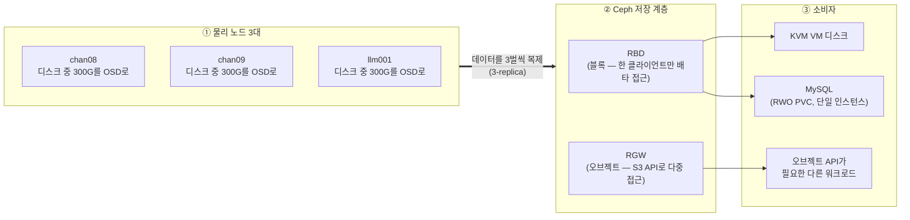

# Ceph 스토리지 (RBD/RGW)

3노드(chan08/chan09/llm001) 전체를 Ceph(여러 서버의 디스크를 묶어서 네트워크로 복제되는 하나의 스토리지 풀로 만들어주는 분산 스토리지 시스템)로 재구성한 공용 스토리지 계층. 배포·운영은 Rook(Ceph를 k8s CRD로 선언적으로 설치·관리하게 해주는 오퍼레이터 — Ceph 데몬을 손으로 하나씩 설정하는 대신 YAML로 원하는 상태를 적어두면 대신 만들어준다, v1.20.6)이 대신한다. RBD(블록)는 MySQL/KVM이, RGW(오브젝트, S3 API)는 오브젝트 API가 필요한 다른 워크로드가 쓴다. 새 장비 없이 기존 노드를 재구성하는 것만으로 진행했다.

## 목적

그동안 각 노드 로컬 디스크에 흩어져 있던 MySQL 데이터와 KVM VM 디스크를, 네트워크로 복제되는 공용 스토리지 계층으로 옮겨서 "노드 장애 = 데이터 손실"이 되지 않게 분리하는 것이 목표였다. 동시에 S3 호환 오브젝트 API(RGW)도 함께 마련해서, 로컬 디스크가 아니라 오브젝트 스토리지를 필요로 하는 워크로드도 같은 클러스터로 받을 수 있게 했다.

## 설계 결정

- **새 장비 없이 기존 3노드 재구성.** Ceph는 데이터를 3벌 복제해서 저장하는 게(3-replica) 기본값인데 마침 물리 노드가 정확히 3대라 딱 맞는다.
- **RBD(블록)와 RGW(오브젝트)의 역할을 분리했다.** 블록 스토리지는 일반 디스크처럼 운영체제에 통째로 마운트해 파일시스템을 얹는 방식이고, 오브젝트 스토리지는 파일 하나하나를 HTTP API(S3)로 읽고 쓰는 방식이다. 실제 접근 패턴이 갈린다 — KVM VM 디스크와 MySQL 데이터는 항상 한 프로세스만 배타적으로 쓰는 블록 데이터(RBD), 반면 오브젝트 API로 접근하는 워크로드는 RGW. Ceph 안에서 서로 다른 컴포넌트가 서빙한다.
- **CephFS(MDS)는 배제.** CephFS는 Ceph 위에 파일시스템을 얹어 여러 클라이언트가 동시에 같은 디렉터리를 공유하게 해주는 세 번째 방식이고, MDS(메타데이터 서버)라는 별도 데몬이 필요하다. 여러 파드가 동시에 같은 파일을 읽고 써야 하는 워크로드(k8s에서는 RWX, ReadWriteMany라 부름)가 지금은 없어서, MDS 상시 구동 비용을 32G/노드 예산에서 정당화할 근거가 없다. RWX가 필요해지면 NAS(NFS)로 커버.
- **NAS를 OSD(디스크 하나당 데이터를 저장하는 Ceph 데몬 — 아래 "각 컴포넌트가 뭘 하는지" 참고) 백엔드로 쓰지 않는다.** 네트워크 스토리지 위에 또 네트워크 스토리지를 얹으면 지연/장애 시나리오가 한 겹 더 지저분해진다. NAS는 백업 타깃 + 향후 NFS StorageClass 용도로만 좁혔다.
- **MySQL은 semi-sync 복제(비동기와 완전동기의 중간 — [MySQL HA](03-mysql-ha.md) 참고) 대신 "shared-disk failover cluster" 패턴.** 단일 mysqld가 k8s Deployment(Recreate) + RBD PVC(RWO, ReadWriteOnce — 한 번에 파드 하나만 마운트 가능) 위에서 돌고, 데이터 내구성은 애플리케이션 레벨 복제가 아니라 Ceph 3-replica가 담당한다. 노드가 죽으면 k8s가 다른 노드로 파드를 재스케줄하고 RBD PVC가 그대로 따라간다. RBD의 exclusive-lock(한 순간에 한 클라이언트만 쓰기 가능하게 강제하는 잠금)이 핵심 안전장치 — 두 노드가 동시에 같은 datadir을 잡으려 해도 락에 막혀 안전하게 실패한다(split-brain, 두 곳이 동시에 자신이 주인이라 믿고 쓰다 데이터가 어긋나는 사고 — 를 방지).
- **KVM도 RBD 위에.** libvirt(KVM을 관리하는 가상화 툴킷)가 RBD를 네이티브 스토리지 풀로 지원한다. 단 libvirt 도메인 XML(VM 정의 파일)을 노드 간 자동 동기화해주는 장치는 없어서 수동 절차다.
- **hostNetwork 필수.** k8s는 기본적으로 파드마다 별도 가상 네트워크(pod network, `10.244.x.x` 같은 전용 IP 대역)를 주는데, hostNetwork로 배포하면 그 파드가 자기가 뜬 노드의 실제 IP를 그대로 쓴다. libvirt/QEMU는 pod network 밖(호스트)에서 도는 프로세스라, Ceph mon/OSD가 pod IP에만 붙어 있으면 접근할 수 없어서 이 설정이 필요하다.
- **기존 MySQL VIP(`10.5.5.4`, 가상 IP — 실제 서버가 아니라 여러 노드 중 하나가 그때그때 응답하는 대표 주소)를 재사용.** 새 k8s Service를 MetalLB(k8s용 로드밸런서)로 같은 IP에 노출해서 애플리케이션이 접속 주소를 안 바꿔도 되게 했다.

## 아키텍처

3개 층으로 나눠서 보면 이해하기 쉽다 — **① 물리 노드**(디스크를 실제로 들고 있음) → **② Ceph 저장 계층**(그 디스크들을 묶어서 블록/오브젝트로 재포장) → **③ 소비자**(그 저장소를 실제로 쓰는 워크로드).



각 노드는 디스크 전체를 Ceph에 주지 않고 300G만 OSD로 떼어주고, 나머지는 별도 파일시스템(XFS)으로 남겨 다른 용도로 쓴다 — 이 문서는 Ceph만 다루므로 그 용도는 다루지 않는다(디스크를 어떻게 나눴는지 절차는 아래 "디스크 재분할" 참고).

| 컴포넌트 | 역할 |
|---|---|
| mon | 클러스터 맵(OSD 생사, 데이터 위치) 합의 관리. 과반수 필요 — 3개(홀수) 배포 |
| mgr | 대시보드, 메트릭, 관리 API |
| OSD | 디스크 하나당 하나, BlueStore 포맷으로 직접 디스크 관리(파일시스템 안 거침) |
| RBD | OSD 위 블록 디바이스 계층 — 단일 클라이언트 배타 사용(exclusive-lock) |
| RGW | OSD 위 S3/Swift 호환 오브젝트 API 계층 — 다중 클라이언트 동시 접근 |

## 스크립트 목록 (이름 순)

### 방화벽 개방
- 설명: hostNetwork로 뜨는 mon/mgr/osd/RGW 포트를 3노드 모두에 연다. same-node hairpin(같은 노드의 pod network 파드가 이 노드의 hostNetwork Ceph 데몬에 접근할 때 소스 IP가 pod CIDR로 보임)용 규칙도 같이 연다 — 누락하면 `rados`/`radosgw-admin`이 에러 없이 그냥 멈춘다.
- 스크립트: [`00-open-ceph-firewall-ports.sh`](../scripts/07-ceph-storage/00-open-ceph-firewall-ports.sh)
```bash
SUBNET="10.5.5.0/24"
POD_CIDR="10.244.0.0/16"

# mon (msgr v1/v2) — 물리망 + same-node hairpin(pod CIDR) 둘 다
ufw allow from "$SUBNET" to any port 6789 proto tcp comment 'Ceph mon msgr v1'
ufw allow from "$SUBNET" to any port 3300 proto tcp comment 'Ceph mon msgr v2'
ufw allow from "$POD_CIDR" to any port 6789 proto tcp comment 'Ceph mon msgr v1 same-node hairpin'
ufw allow from "$POD_CIDR" to any port 3300 proto tcp comment 'Ceph mon msgr v2 same-node hairpin'

# osd/mgr/mds 포트 범위
ufw allow from "$SUBNET" to any port 6800:7300 proto tcp comment 'Ceph osd/mgr/mds'
ufw allow from "$POD_CIDR" to any port 6800:7300 proto tcp comment 'Ceph osd/mgr/mds same-node hairpin'

# mgr 대시보드(ssl)
ufw allow from "$SUBNET" to any port 8443 proto tcp comment 'Ceph mgr dashboard'
ufw allow from "$POD_CIDR" to any port 8443 proto tcp comment 'Ceph mgr dashboard same-node hairpin'

# RGW(S3, 오브젝트 API용)
ufw allow from "$SUBNET" to any port 7480 proto tcp comment 'Ceph RGW S3'
ufw allow from "$POD_CIDR" to any port 7480 proto tcp comment 'Ceph RGW S3 same-node hairpin'

ufw reload
```

### Rook operator 설치
- 설명: CRD(Custom Resource Definition — k8s API에 `CephCluster` 같은 Ceph 전용 리소스 타입을 새로 등록하는 것) + 공통 리소스 + operator(CRD가 실제로 만들어지면 그걸 보고 Ceph 데몬들을 대신 배포/관리해주는 컨트롤러)를 설치한다. Rook 1.20부터 CSI(Container Storage Interface — k8s가 여러 스토리지 시스템을 표준 방식으로 붙이게 해주는 규격) 드라이버 관리가 별도 오퍼레이터로 분리돼 `csi-operator.yaml`을 먼저 적용해야 한다 — 빠뜨리면 `operator.yaml` 적용 시 "no matches for kind" 에러.
- 스크립트: [`01-install-rook-operator.sh`](../scripts/07-ceph-storage/01-install-rook-operator.sh)
```bash
ROOK_VERSION="v1.20.6"
BASE="https://raw.githubusercontent.com/rook/rook/${ROOK_VERSION}/deploy/examples"

kubectl apply -f "${BASE}/crds.yaml"
kubectl apply -f "${BASE}/common.yaml"

# v1.20부터 CSI 드라이버가 별도 ceph-csi-operator로 분리됨 — 이 CRD가 없으면 operator.yaml 적용 시 에러
kubectl apply -f "${BASE}/csi-operator.yaml"
kubectl apply -f "${BASE}/operator.yaml"
```

### CephCluster 생성
- 설명: mon 3 + mgr 1 + OSD 3(노드별 디바이스 명시)을 hostNetwork로 만든다. `kubectl wait`는 매칭 리소스가 하나도 없으면 즉시 에러를 내므로, 파드가 생기는 것부터 폴링한 뒤에 걸어야 한다.
- 스크립트: [`02-apply-cluster.sh`](../scripts/07-ceph-storage/02-apply-cluster.sh) + [`02-cluster.yaml`](../scripts/07-ceph-storage/02-cluster.yaml)
```yaml
apiVersion: ceph.rook.io/v1
kind: CephCluster
metadata:
  name: rook-ceph
  namespace: rook-ceph
spec:
  cephVersion:
    image: quay.io/ceph/ceph:v20.2.4
  dataDirHostPath: /var/lib/rook
  mon:
    count: 3
  mgr:
    count: 1   # standby mgr(count 2) 생략 — 노드당 32G 예산이 빠듯하고 mgr는 stateless라 죽어도 재기동되면 그만
  network:
    provider: host   # libvirt/QEMU가 pod network 밖(호스트)에서 mon/OSD에 직접 접근해야 해서 필수
  storage:
    useAllNodes: false
    useAllDevices: false   # OS 디스크(파티션/LVM 사용 중)를 실수로 건드리지 않기 위해 노드별 디바이스를 명시
    nodes:
      - name: "chan08"
        devices: [{name: "sda1"}]
      - name: "chan09"
        devices: [{name: "sda1"}]
      - name: "llm001"
        devices: [{name: "nvme0n1p3"}]
```
```bash
kubectl apply -f 02-cluster.yaml

# mon/osd 파드가 생기는 것부터 폴링 후 Ready 대기(생성 전에 wait를 걸면 즉시 에러)
until [ -n "$(kubectl -n rook-ceph get pod -l app=rook-ceph-mon --no-headers 2>/dev/null)" ]; do sleep 10; done
kubectl -n rook-ceph wait --for=condition=Ready pod -l app=rook-ceph-mon --timeout=600s

# toolbox(ceph 명령 실행용 파드) 설치
kubectl apply -f "https://raw.githubusercontent.com/rook/rook/v1.20.6/deploy/examples/toolbox.yaml"
```

### 블록 스토리지(RBD) 생성
- 설명: RBD 풀(3-replica) + exclusive-lock + StorageClass를 만든다. KVM VM 디스크와 MySQL PVC(RWO)가 여기서 나온다.
- 스크립트: [`03-apply-storageclass.sh`](../scripts/07-ceph-storage/03-apply-storageclass.sh) + [`03-storageclass.yaml`](../scripts/07-ceph-storage/03-storageclass.yaml)
```yaml
apiVersion: ceph.rook.io/v1
kind: CephBlockPool
metadata:
  name: rbd-pool
  namespace: rook-ceph
spec:
  failureDomain: host
  replicated:
    size: 3
---
apiVersion: storage.k8s.io/v1
kind: StorageClass
metadata:
  name: rook-ceph-block
provisioner: rook-ceph.rbd.csi.ceph.com
parameters:
  pool: rbd-pool
  # exclusive-lock: 노드 장애 후 재스케줄 시 이중 마운트(split-brain)를 막는 안전장치
  imageFeatures: layering,fast-diff,object-map,deep-flatten,exclusive-lock
  # xfs는 하이퍼컨버지드(OSD와 마운트가 같은 노드) 구성에서 데드락 위험이 있어 ext4 사용
  csi.storage.k8s.io/fstype: ext4
allowVolumeExpansion: true
```

### 오브젝트 스토리지(RGW) 생성
- 설명: RGW를 만들고 MetalLB로 S3 엔드포인트 VIP를 노출한다. `gateway.instances`는 노드당 1개씩 3개로 뒀다(RGW 파드가 여러 개면 요청을 분산 처리할 수 있음).
- 스크립트: [`04-apply-objectstore.sh`](../scripts/07-ceph-storage/04-apply-objectstore.sh) + [`04-objectstore.yaml`](../scripts/07-ceph-storage/04-objectstore.yaml)
```yaml
apiVersion: ceph.rook.io/v1
kind: CephObjectStore
metadata:
  name: starrocks-store
  namespace: rook-ceph
spec:
  metadataPool:
    failureDomain: host
    replicated: {size: 3}
  dataPool:
    # 연구/테스트용 데이터라 손실을 감수하고 용량 확보를 위해 2-replica로 낮춤(min_size은 자동 1)
    failureDomain: host
    replicated: {size: 2, requireSafeReplicaSize: false}
  gateway:
    port: 7480   # 80/443은 ingress-nginx가 쓰므로 충돌 방지
    instances: 3
```
```bash
kubectl apply -f 04-objectstore.yaml

# RGW 파드 Ready 대기 후 VIP 등록(IPAddressPool/L2Advertisement, ingress와 같은 패턴)
kubectl -n rook-ceph wait --for=condition=Ready pod -l app=rook-ceph-rgw --timeout=180s
```
Rook이 소유한 `rook-ceph-rgw-*` Service는 `type`을 patch해도 operator가 reconcile(컨트롤러가 "정의된 설정 vs 실제 상태"를 주기적으로 비교해서 실제 상태를 정의된 대로 되돌리는 동작)할 때마다 ClusterIP로 되돌린다(CephObjectStore CRD의 `gateway.service`는 annotations/labels만 지원). 같은 파드 라벨을 셀렉터로 쓰는 별도 Service를 만들어 그것만 LoadBalancer로 노출한다:
```yaml
apiVersion: v1
kind: Service
metadata:
  name: rgw-starrocks-store-lb
  namespace: rook-ceph
spec:
  type: LoadBalancer
  selector: {app: rook-ceph-rgw, rgw: starrocks-store, rook_cluster: rook-ceph, rook_object_store: starrocks-store}
  ports: [{name: http, port: 7480, targetPort: 7480}]
```

### MySQL 백업
- 설명: Ceph 마이그레이션을 위해 `/data`를 비우기 전 chan08(source)에서 전체 백업. chan09(replica)는 복제 중지 후 폐기 예정이라 별도 백업 불필요.
- 스크립트: [`05-backup-mysql.sh`](../scripts/07-ceph-storage/05-backup-mysql.sh)
```bash
# --single-transaction: InnoDB 테이블을 잠그지 않고 일관된 스냅샷으로 덤프
mysqldump --all-databases --single-transaction --routines --triggers --events | gzip > all-databases.sql.gz

gzip -t all-databases.sql.gz && echo "gzip 무결성 OK"
```

### MySQL datadir 임시 이전
- 설명: chan08에서 datadir을 `/data`(추후 Ceph OSD로 전환될 디스크)에서 `/home`(nvme, OS 디스크)으로 먼저 옮겨서, Ceph 구축 완료를 기다리지 않고 `/data`를 바로 비울 수 있게 한다(최종적으로는 k8s RBD PVC로 한 번 더 옮김).
- 스크립트: [`06-relocate-mysql-datadir.sh`](../scripts/07-ceph-storage/06-relocate-mysql-datadir.sh)
```bash
SRC="/data/mysql"
DST="/home/mysql"

# AppArmor 로컬 오버라이드에 새 경로 허용 추가(Ubuntu MySQL 패키지가 datadir 경로를 화이트리스트로 제한)
cat >> /etc/apparmor.d/local/usr.sbin.mysqld <<EOF
${DST}/ r,
${DST}/** rwk,
EOF
apparmor_parser -r /etc/apparmor.d/usr.sbin.mysqld

systemctl stop mysql

# rsync -a로 소유권/권한 보존하며 물리 복사(원본 /data/mysql은 삭제하지 않고 남겨둠 — 이후 디스크 wipe 때 같이 없어짐)
rsync -a "${SRC}/" "${DST}/"

sed -i "s|^datadir\s*=.*|datadir = ${DST}|" /etc/mysql/mysql.conf.d/zz-datadir.cnf
systemctl start mysql
```

### 데이터 디스크 wipe
- 설명: `/data`를 Ceph OSD용 raw 상태로 전환한다. 되돌릴 수 없는 작업 — 데이터가 이미 다른 곳으로 이전/백업되어 있어야 한다.
- 스크립트: [`07-wipe-data-disk.sh`](../scripts/07-ceph-storage/07-wipe-data-disk.sh)
```bash
DEV=$(findmnt -n -o SOURCE /data)

umount /data
wipefs -a "$DEV"
sed -i '\|[[:space:]]/data[[:space:]]|d' /etc/fstab
```

### MySQL k8s 리소스(네임스페이스/설정/PVC) 생성
- 설명: RBD PVC(30Gi, `rook-ceph-block`) 기반으로 MySQL을 재배포하기 위한 네임스페이스/ConfigMap/PVC를 만든다.
- 스크립트: [`08-mysql-configmap-pvc.yaml`](../scripts/07-ceph-storage/08-mysql-configmap-pvc.yaml)
```yaml
apiVersion: v1
kind: ConfigMap
metadata: {name: mysql-config, namespace: mysql}
data:
  custom.cnf: |
    [mysqld]
    innodb_buffer_pool_size = 2G
    bind-address = 0.0.0.0
    # 1GbE 위 Ceph RBD라 매 커밋 fsync가 네트워크 왕복을 유발함 — 1초 단위로 묶어 커밋 지연을 줄인다.
    # mysqld 크래시엔 안전, OS 자체가 크래시하면 최근 1초분 유실 가능.
    innodb_flush_log_at_trx_commit = 2
---
apiVersion: v1
kind: PersistentVolumeClaim
metadata: {name: mysql-data, namespace: mysql}
spec:
  accessModes: [ReadWriteOnce]
  storageClassName: rook-ceph-block
  resources: {requests: {storage: 30Gi}}
```

### MySQL 데이터를 RBD PVC로 이전
- 설명: 기존 호스트(`/home/mysql`)의 데이터를 RBD PVC로 옮긴다. mysqld를 정지시키므로 이 시점부터 새 파드 기동까지가 다운타임 구간.
- 스크립트: [`09-mysql-migrate-data.sh`](../scripts/07-ceph-storage/09-mysql-migrate-data.sh)
```bash
# PVC만 마운트하는 임시 loader 파드로 tar 스트림 복사
kubectl -n mysql wait --for=condition=Ready pod/mysql-data-loader --timeout=120s

sudo systemctl stop mysql

tar -C /home/mysql -cf - . | kubectl exec -i -n mysql mysql-data-loader -- tar -C /var/lib/mysql -xf -

# 공식 mysql 이미지 규격(999:999)으로 소유권 설정
kubectl -n mysql exec mysql-data-loader -- chown -R 999:999 /var/lib/mysql
kubectl -n mysql delete pod mysql-data-loader --wait=true
```

### MySQL Deployment 배포
- 설명: 단일 인스턴스라 StatefulSet 대신 Deployment(replicas=1) + Recreate 전략 + 명시적 PVC로 구성. Recreate가 RWO PVC 핸드오프(파드가 완전히 종료된 뒤에만 새 파드가 뜸)에 필요하다.
- 스크립트: [`10-mysql-deploy.yaml`](../scripts/07-ceph-storage/10-mysql-deploy.yaml)
```yaml
apiVersion: apps/v1
kind: Deployment
metadata: {name: mysql, namespace: mysql}
spec:
  replicas: 1
  strategy: {type: Recreate}
  selector: {matchLabels: {app: mysql}}
  template:
    metadata: {labels: {app: mysql}}
    spec:
      containers:
        - name: mysql
          image: mysql:8.0.46
          volumeMounts:
            - {name: data, mountPath: /var/lib/mysql}
            - {name: config, mountPath: /etc/mysql/conf.d}
      volumes:
        - {name: data, persistentVolumeClaim: {claimName: mysql-data}}
        - {name: config, configMap: {name: mysql-config}}
```

### MySQL VIP를 MetalLB로 컷오버
- 설명: 기존 keepalived VIP(`10.5.5.4`)를 k8s Service(MetalLB)로 이관한다. 파드 정상 기동/데이터 확인이 끝난 뒤에 실행.
- 스크립트: [`11-mysql-vip-cutover.sh`](../scripts/07-ceph-storage/11-mysql-vip-cutover.sh)
```bash
# 양쪽 노드에서 keepalived 중지(VIP 회수)
ssh 10.5.5.8 'sudo systemctl stop keepalived'
ssh 10.5.5.9 'sudo systemctl stop keepalived'

# IPAddressPool/L2Advertisement로 같은 VIP(10.5.5.4)를 MetalLB에 등록(ingress와 같은 패턴)

# externalTrafficPolicy: Local 필수 — Cluster(기본값)면 트래픽 받은 노드와 파드 노드가 다를 때
# kube-proxy SNAT으로 클라이언트 IP가 바뀌어서 host@'10.5.5.%' 기반 grant가 깨진다
# (단일 replica라 Local로 바꿔도 가용성엔 영향 없음)
kubectl -n mysql patch svc mysql -p '{"spec":{"type":"LoadBalancer","externalTrafficPolicy":"Local"}}'
```

### 디스크 재분할 — Ceph 고정 300G + XFS
- 설명: 디스크 전체를 OSD에 주지 않고, 다른 용도로 쓸 로컬 스토리지를 같은 디스크에서 떼어 남겨두려고 OSD 전용 디스크를 "Ceph 고정 300G + 나머지 XFS"로 재분할한다. 대상 OSD를 `ceph osd out` → `purge`로 먼저 뺀 뒤 실행. llm001은 OS와 디스크(GPT)를 공유해서 이 스크립트 대신 대상 파티션만 `parted rm`으로 지우고 같은 시작 오프셋에서 수동으로 재생성했다.
- 스크립트: [`12-resplit-osd-disk.sh`](../scripts/07-ceph-storage/12-resplit-osd-disk.sh) (전용 데이터 디스크 노드용, 예: `./12-resplit-osd-disk.sh /dev/sda 300GB /mnt/starrocks-be`)
```bash
DEVICE="/dev/sda"; CEPH_SIZE="300GB"; MOUNT_PATH="/mnt/starrocks-be"

wipefs -a "${DEVICE}1"; wipefs -a "$DEVICE"

# p1=Ceph용, p2=나머지(XFS)
parted -s "$DEVICE" mklabel msdos
parted -s "$DEVICE" mkpart primary 1MiB "$CEPH_SIZE"
parted -s "$DEVICE" mkpart primary "$CEPH_SIZE" 100%
partprobe "$DEVICE"

# BlueStore는 원본 디스크 크기 기준 1GB/10GB/107GB 지점에 레이블을 중복 저장한다.
# 앞부분 일부만 지우면 이 레이블이 남아 Rook이 "기존 OSD 확장"으로 오판해 계속 크래시한다 —
# 110GiB(112640MB)는 이 세 지점을 전부 덮기 위한 여유값(ceph-bluestore-tool show-label로 실제 위치 확인 가능)
dd if=/dev/zero of="${DEVICE}1" bs=1M count=112640

mkfs.xfs -f "${DEVICE}2"
mkdir -p "$MOUNT_PATH"
mount "${DEVICE}2" "$MOUNT_PATH"

# 디바이스 이름이 아니라 UUID로 등록 — 재부팅 시 디바이스 순서가 바뀌어도 안전
UUID=$(blkid -s UUID -o value "${DEVICE}2")
echo "UUID=${UUID} ${MOUNT_PATH} xfs defaults 0 2" | tee -a /etc/fstab
```
결과: 3노드 전부 OSD 300G로 균등화(`ceph osd df` VAR 1.00/1.00, STDDEV 0.01), 나머지는 `/mnt/starrocks-be`.

### 애플리케이션에서 RGW 쓰기(boto3 S3 API)
- 설명: RGW는 애플리케이션이 보통 S3 API로 직접 접근한다(RBD는 k8s CSI/libvirt가 대신 처리해서 애플리케이션 코드가 직접 안 다룸). 버킷 생성은 `radosgw-admin`으로는 안 되고 S3 API로만 가능 — 유저를 먼저 만든 뒤 boto3로 접근한다.
- 스크립트: [`app-sample.py`](../scripts/07-ceph-storage/app-sample.py)
```bash
# 전용 유저 생성(버킷 생성은 이 명령으로 안 됨 — 아래 S3 API로)
kubectl -n rook-ceph exec deploy/rook-ceph-tools -- \
  radosgw-admin user create --uid=demo-app --display-name="Demo App" --rgw-realm=starrocks-store
```
```python
s3 = boto3.client("s3", endpoint_url="http://10.5.5.6:7480",
                   aws_access_key_id=ACCESS_KEY, aws_secret_access_key=SECRET_KEY,
                   region_name="default")   # boto3가 SigV4에 region을 요구 — RGW는 안 봐도 빈 값은 안 됨

s3.create_bucket(Bucket="demo-app-bucket")
s3.put_object(Bucket="demo-app-bucket", Key="reports/2026-08-28.json", Body=b'{"status": "ok"}')
```
RGW VIP는 MetalLB LoadBalancer로 노출되어 클러스터 안팎 어디서든 접근 가능하다(k8s 내부 전용 아님). 버킷 생성은 몇 번을 반복해도 결과가 같은 동작(idempotent)이 아니다 — 이미 있는 버킷에 재호출하면 `BucketAlreadyExists`(소유자 다름) 또는 `BucketAlreadyOwnedByYou`(같음) 에러.

## 알려진 이슈

### CephObjectStore의 gateway.service는 Service `type`을 지정할 수 없다
annotations/labels만 지원해서, Rook 소유 `rook-ceph-rgw-*` Service를 `kubectl patch`로 LoadBalancer로 바꿔도 operator가 reconcile할 때마다 ClusterIP로 되돌린다. Rook 소유 Service는 그대로 두고, 같은 파드 라벨을 셀렉터로 쓰는 별도 Service를 만들어 그것만 LoadBalancer로 노출해서 해결.

### operator reconcile이 에러 없이 조용히 멈춘다
CephCluster CR을 두 번 apply했을 때(리소스 버전 충돌 이후 mon-a만 뜨고 멈춤), CephBlockPool 생성 때도(로그엔 "successfully configured"까지 찍히는데 실제 풀은 안 생김) 같은 패턴이 나왔다. `kubectl rollout restart deployment/rook-ceph-operator`로 reconcile을 처음부터 다시 돌리면 정상 진행됐다 — 진행이 몇 분 이상 안 보이면 우선 operator 재시작부터 시도.

### RGW가 계속 멈춘 진짜 원인은 방화벽의 same-node hairpin 누락
같은 노드(llm001) 안에서 pod network 파드가 hostNetwork Ceph 데몬에 접근할 때 소스 IP가 물리 LAN 대역이 아니라 pod CIDR(`10.244.0.0/16`)이라 방화벽에 안 걸려 TCP 연결 자체가 막혔다 — `rados`/`radosgw-admin` 명령이 에러 없이 그냥 멈춰서(수 분씩 대기) Rook 버그로 오인하기 쉽다. `ceph tell osd.<N> version`으로 개별 데몬 응답성을 하나씩 확인해서 특정 OSD 하나만 무응답인 걸로 좁혀야 찾을 수 있다. 방화벽에 pod CIDR 소스 예외 규칙을 추가해서 해결(3노드 모두 필요).

### CephObjectStore 삭제가 자기 자신을 참조하는 순환으로 멈춘다
방화벽 문제로 실패했던 시도가 `.rgw.root`에 realm/zonegroup/zone(RGW의 다중 사이트 구성 단위 — 여기선 실질적으로 이름표 역할)은 있지만 period가 없는 반쪽 상태를 남기면, 이 CR을 지울 때 finalizer(리소스가 실제로 삭제되기 전에 강제로 거쳐야 하는 정리 훅)가 "버킷이 있는지" 확인하려고 RGW 자신의 HTTP API를 호출한다 — 근데 그 RGW는 뜬 적이 없으니 연결 거부로 finalizer가 영원히 안 끝난다. 버킷이 존재한 적 없음을 확인한 뒤 finalizer를 강제로 비우고, 남은 rados(Ceph의 raw 오브젝트 저장 계층) 오브젝트/풀을 직접 정리한 뒤 재생성.

### MySQL 물리 이전 시 datadir을 옮겨도 binlog/AppArmor는 안 따라온다
별도 튜닝 설정에 `log_bin`이 절대경로로 하드코딩돼 있으면 datadir을 바꿔도 계속 옛 경로에 쓴다 — datadir과 별개인 절대경로 항목(`log_bin`, `innodb_undo_directory` 등)을 따로 확인할 것. 마찬가지로 Ubuntu MySQL 패키지의 AppArmor 로컬 오버라이드(`/etc/apparmor.d/local/usr.sbin.mysqld`)도 새 경로를 추가해야 한다 — 안 하면 mysqld가 파일 접근을 거부당하며 죽는다.

## 검증 명령

```bash
# toolbox 파드 안에서 실행
kubectl -n rook-ceph exec deploy/rook-ceph-tools -- ceph -s        # 전체 상태(HEALTH_OK/WARN)
kubectl -n rook-ceph exec deploy/rook-ceph-tools -- ceph osd df    # OSD별 사용률/PG(Placement Group, 데이터를 나눠 OSD에 분산 배치하는 단위) 분산 균형도
kubectl -n rook-ceph exec deploy/rook-ceph-tools -- ceph osd perf  # OSD별 commit/apply 지연(디스크 병목 확인용)

# CRD 상태
kubectl -n rook-ceph get cephcluster cephblockpool cephobjectstore
```
