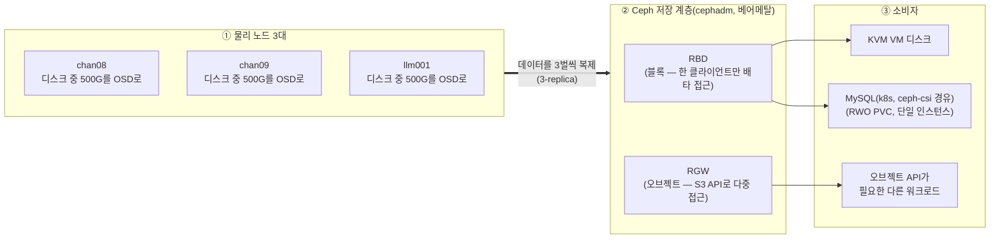

# Ceph 스토리지 (RBD/RGW)

3노드(chan08/chan09/llm001) 전체를 재구성해서 만든 공용 스토리지 계층이다. Ceph는 여러 서버의 디스크를 묶어서 네트워크로 복제되는 하나의 스토리지 풀로 만들어주는 분산 스토리지 시스템이다. 배포·운영은 cephadm이 맡는다. cephadm은 Ceph 공식 배포 도구로, 각 노드에 컨테이너(podman)+systemd 유닛으로 데몬을 직접 띄운다 — k8s API/스케줄러와 무관하게 동작한다. RBD(블록)는 MySQL/KVM이 쓴다. RGW(오브젝트, S3 API)는 오브젝트 API가 필요한 다른 워크로드가 쓴다. 새 장비 없이 기존 노드를 재구성하는 것만으로 진행했다.

## 목적

그동안 MySQL 데이터와 KVM VM 디스크는 각 노드 로컬 디스크에 흩어져 있었다. 이걸 네트워크로 복제되는 공용 스토리지 계층으로 옮겼다. 목표는 "노드 장애 = 데이터 손실"이 되지 않게 분리하는 것이었다. 동시에 S3 호환 오브젝트 API(RGW)도 마련했다. 로컬 디스크가 아니라 오브젝트 스토리지가 필요한 워크로드도 같은 클러스터로 받을 수 있게 됐다.

Ceph 자체는 k8s 워크로드가 아니라 다른 서비스가 의존하는 핵심 인프라다. k8s를 밀고 다시 세우는 작업이 스토리지까지 같이 죽여선 안 된다. 그래서 k8s 안이 아니라 베어메탈에 직접 cephadm으로 배포한다 — CoreDNS, k8s API 서버 VIP와 같은 층에 있는 인프라로 취급한다.

## 대상 노드

| 노드 | IP | OSD 파티션 | 크기 |
|---|---|---|---|
| chan08 | 10.5.5.8 | `/dev/sda1` | 500G |
| chan09 | 10.5.5.9 | `/dev/sda1` | 500G |
| llm001 | 10.5.5.10 | `/dev/nvme0n1p3` | 500G |

각 파티션은 LVM 논리 볼륨(`ceph-osd-vg/osd-data`)으로 한 겹 감싸서 OSD로 등록한다 — 이유는 아래 "설계 결정" 참고. 나머지 디스크 공간은 XFS로 별도 마운트(`/mnt/local-data`, 로컬 저장이 필요한 다른 용도와 공용 — StarRocks shared-nothing 로컬 테스트, KVM VM 디스크가 지금 여기 같이 있다) — 파티션을 어떻게 나눴는지는 아래 "디스크 재분할" 참고.

## 설계 결정

- **새 장비 없이 기존 3노드 재구성.** Ceph는 기본값으로 데이터를 3벌 복제한다(3-replica). 마침 물리 노드가 정확히 3대라 딱 맞는다.
- **RBD(블록)와 RGW(오브젝트)의 역할을 분리했다.** 블록 스토리지는 일반 디스크처럼 운영체제에 통째로 마운트해 파일시스템을 얹는 방식이다. 오브젝트 스토리지는 파일 하나하나를 HTTP API(S3)로 읽고 쓰는 방식이다. 접근 패턴이 다르다 — KVM VM 디스크와 MySQL 데이터는 항상 한 프로세스만 배타적으로 쓰는 블록 데이터라 RBD를 쓴다. 오브젝트 API로 접근하는 워크로드는 RGW를 쓴다.
- **CephFS(MDS)는 배제했다.** CephFS는 Ceph 위에 파일시스템을 얹어주는 세 번째 방식이다. 여러 클라이언트가 동시에 같은 디렉터리를 공유할 수 있다. MDS(메타데이터 서버)라는 별도 데몬이 필요하다. 지금은 여러 파드가 동시에 같은 파일을 읽고 써야 하는 워크로드(k8s에서는 RWX, ReadWriteMany라 부름)가 없다. MDS를 상시 구동할 비용을 32G/노드 예산에서 정당화할 근거가 없었다. RWX가 필요해지면 NAS(NFS)로 커버할 계획이다.
- **NAS를 OSD 백엔드로 쓰지 않는다.** OSD는 디스크 하나당 데이터를 저장하는 Ceph 데몬이다(아래 "각 컴포넌트가 뭘 하는지" 참고). 네트워크 스토리지 위에 또 네트워크 스토리지를 얹으면 지연/장애 시나리오가 한 겹 더 지저분해진다. NAS는 백업 타깃과 향후 NFS StorageClass 용도로만 쓰기로 좁혔다.
- **KVM도 RBD 위에 올린다.** libvirt(KVM을 관리하는 가상화 툴킷)가 RBD를 네이티브 스토리지 풀로 지원한다. 다만 libvirt 도메인 XML(VM 정의 파일)을 노드 간 자동 동기화해주는 장치는 없다. 수동 절차로 남아있다.
- **cephadm으로 베어메탈에 직접 배포한다.** k8s CRD로 선언적으로 관리하는 방식(Rook 같은 오퍼레이터)도 있지만, 그러면 Ceph의 생사가 k8s 컨트롤플레인에 묶인다. cephadm은 각 노드에 SSH로 접속해 컨테이너+systemd로 데몬을 직접 배포·관리한다. k8s가 죽어도, 심지어 k8s를 통째로 밀고 다시 세워도 Ceph는 영향받지 않는다.
- **OSD 파티션은 LVM 논리 볼륨으로 감싸서 등록한다.** cephadm의 표준 OSD 생성 경로(`ceph orch daemon add osd`)는 raw 파티션을 직접 못 받는다 — LVM(pvcreate/vgcreate/lvcreate)으로 한 겹 감싸야 받아준다.
- **RGW VIP는 keepalived로, 인프라 대역에 둔다.** RGW가 k8s Service가 아니라서 MetalLB(k8s LoadBalancer용)를 못 쓴다. MySQL Stage 1/k8s API 서버 VIP와 같은 host-native VRRP 패턴(keepalived)을 재사용한다. VIP는 인프라 대역(`.20` 이하) — Ceph는 다른 서비스가 의존하는 핵심 인프라라 애플리케이션 VIP 대역(`.50~.99`)과 구분한다.
- **k8s에서 RBD를 쓰려면 독립 ceph-csi를 붙인다.** MySQL 같은 k8s 워크로드는 여전히 PVC로 스토리지를 쓰고 싶어한다. Rook 대신 ceph-csi(RBD 플러그인)만 독립적으로 배포한다. k8s는 이 외부 클러스터의 "소비자" 역할만 하고, 클러스터 자체의 생애주기는 전혀 관리하지 않는다.
- **cephadm의 SSH 접속 계정은 root가 아니라 chan(NOPASSWD sudo)으로 전환했다.** cephadm 기본값은 root SSH다. `ceph cephadm set-user chan`으로 바꾸면 sudo를 거쳐 같은 권한으로 동작하면서, root의 `authorized_keys`에는 아무 키도 안 남는다 — 권한 범위 자체는 NOPASSWD sudo 계정이라 root와 동등하지만(키가 털렸을 때 피해는 같음), 인증 로그에 "root"가 아니라 실제 계정명이 남아 감사성이 좋아진다.

MySQL이 이 RBD 위에서 실제로 어떻게 재배포됐는지는 [MySQL을 Ceph RBD로 재배포](03-2-mysql-ceph-migration.md) 참고.

## 아키텍처

3개 층으로 나눠서 보면 이해하기 쉽다. **① 물리 노드**는 디스크를 실제로 들고 있다. **② Ceph 저장 계층**은 그 디스크들을 묶어서 블록/오브젝트로 재포장한다. **③ 소비자**는 그 저장소를 실제로 쓰는 워크로드다.



각 노드는 디스크 전체를 Ceph에 주지 않는다. 500G만 OSD로 떼어주고, 나머지는 별도 파일시스템(XFS)으로 남겨 다른 용도로 쓴다. 이 문서는 Ceph만 다루므로 그 용도는 다루지 않는다. 디스크를 어떻게 나눴는지 절차는 아래 "디스크 재분할" 참고.

| 컴포넌트 | 역할 |
|---|---|
| mon | 클러스터 맵(OSD 생사, 데이터 위치) 합의 관리. 과반수 필요 — 3개(홀수) 배포 |
| mgr | 대시보드, 메트릭, 관리 API |
| OSD | 디스크 하나당 하나, BlueStore 포맷으로 직접 디스크 관리(파일시스템 안 거침) |
| RBD | OSD 위 블록 디바이스 계층 — 단일 클라이언트 배타 사용(exclusive-lock) |
| RGW | OSD 위 S3/Swift 호환 오브젝트 API 계층 — 다중 클라이언트 동시 접근 |

## 스크립트 목록 (이름 순)

### 방화벽 개방
- 설명: mon/osd/mgr/RGW 포트를 3노드 모두에 연다. 물리 LAN(`10.5.5.0/24`)에서만 허용한다.
- 스크립트: [`00-open-ceph-firewall-ports.sh`](../scripts/07-ceph-storage/00-open-ceph-firewall-ports.sh)
```bash
# mon msgr v1/v2
sudo ufw allow from 10.5.5.0/24 to any port 6789 proto tcp comment 'Ceph mon msgr v1'
sudo ufw allow from 10.5.5.0/24 to any port 3300 proto tcp comment 'Ceph mon msgr v2'

# osd/mgr/mds 포트 범위
sudo ufw allow from 10.5.5.0/24 to any port 6800:7300 proto tcp comment 'Ceph osd/mgr/mds'

# mgr 대시보드(ssl)
sudo ufw allow from 10.5.5.0/24 to any port 8443 proto tcp comment 'Ceph mgr dashboard'

# RGW(S3)
sudo ufw allow from 10.5.5.0/24 to any port 7480 proto tcp comment 'Ceph RGW S3'

sudo ufw reload
```
3노드(chan08/chan09/llm001) 모두에서 동일하게 실행한다.

### 클러스터 부트스트랩(mon+mgr)
- 설명: cephadm 설치 후 클러스터를 만든다. `--mon-ip`는 첫 mon 하나를 어디서 띄울지 정하는 값이라, 이 시점엔 mon이 chan08 하나뿐이다 — 다음 "클러스터에 호스트 추가" 단계에서 자동으로 3-way로 확장된다. `--mon-ip`는 도메인이 아니라 실제 IP만 받는다 — mon끼리 주고받는 monmap 항목 자체가 항상 IP:포트 리터럴이고(`ceph mon dump`로 확인 가능), DNS가 mon 간 통신의 전제조건이 되는 순환 의존을 피하기 위해서다(k8s Node의 InternalIP가 도메인이 아니라 IP만 받는 것과 같은 이유). 부트스트랩 직후 레거시 cephx 키(krbd 호환)를 허용하도록 설정한다 — 이유는 아래 "알려진 이슈" 참고. chan08(관리 노드) 1회만 실행한다.
- 스크립트: [`14-cephadm-bootstrap.sh`](../scripts/07-ceph-storage/14-cephadm-bootstrap.sh)
```bash
# cephadm 설치 스크립트 다운로드(Squid 릴리스)
curl --silent --remote-name --location https://download.ceph.com/rpm-squid/el9/noarch/cephadm
chmod +x cephadm

# 호스트 사전 점검
./cephadm check-host

# 클러스터 부트스트랩(mon+mgr)
./cephadm bootstrap \
  --mon-ip 10.5.5.8 \
  --cluster-network 10.5.5.0/24 \
  --allow-fqdn-hostname \
  --initial-dashboard-user admin \
  --initial-dashboard-password <생성 시 랜덤 문자열, 실행할 때마다 새로 만들어짐> \
  --dashboard-password-noupdate

# cephadm을 시스템 PATH에 설치
cp ./cephadm /usr/local/bin/cephadm
chmod +x /usr/local/bin/cephadm

# 레거시 cephx 키(krbd 호환) 허용
cephadm shell -- ceph mon set auth_allowed_ciphers "aes, aes256k"
cephadm shell -- ceph mon set auth_preferred_cipher aes

# cephadm SSH 대상 계정을 root 대신 chan(NOPASSWD sudo)으로 전환
CEPHPUB=$(cat /etc/ceph/ceph.pub)
echo "$CEPHPUB" >> ~/.ssh/authorized_keys
cephadm shell -- ceph cephadm set-user chan
```

### 컨테이너 런타임 설치
- 설명: cephadm이 Ceph 데몬을 담을 컨테이너 런타임(podman)을 3노드 전부에 설치한다.
- 스크립트: [`13-install-podman.sh`](../scripts/07-ceph-storage/13-install-podman.sh)
```bash
sudo apt-get update -y
sudo apt-get install -y podman
```

### 클러스터에 호스트 추가
- 설명: 나머지 노드를 클러스터에 추가한다. cephadm은 SSH로 각 호스트에 데몬을 배포하는데, root가 아니라 chan(NOPASSWD sudo)으로 접속하도록 위 부트스트랩 단계에서 이미 전환해뒀다 — 그래서 클러스터 SSH 공개키도 chan의 `authorized_keys`에 등록한다. chan09, llm001 각각 실행한다. 호스트를 추가하면 cephadm 기본 mon 배치 정책에 따라 mon도 자동으로 그 호스트에 같이 떠서, 별도 명령 없이도 mon이 3-way(chan08/chan09/llm001)로 확장되고 `/etc/ceph/ceph.conf`의 `mon_host`도 자동으로 갱신된다 — 부트스트랩 시점의 chan08 단일 mon 의존은 이 단계로 해소된다. k8s가 VIP 없이 고정 IP로 시작하면 나중에 인증서 재발급까지 필요한 것과 달리([`02-k8s-cluster.md`의 관련 알려진 이슈](02-k8s-cluster.md#알려진-이슈-고정-ip로-시작하면-나중에-힘들다)), Ceph는 호스트만 추가하면 저절로 해결된다.
- 스크립트: [`15-cephadm-add-host.sh`](../scripts/07-ceph-storage/15-cephadm-add-host.sh)
```bash
# 클러스터 SSH 공개키를 대상 호스트 chan 계정에 등록
PUBKEY=$(cat /etc/ceph/ceph.pub)
ssh chan@10.5.5.9 "echo '${PUBKEY}' >> ~/.ssh/authorized_keys"

# 클러스터에 호스트 추가
cephadm shell -- ceph orch host add chan09 10.5.5.9
```

### OSD 등록
- 설명: 노드의 Ceph 전용 파티션을 LVM 논리 볼륨으로 감싼 뒤 OSD로 등록한다. 3노드 각각 실행한다.
- 스크립트: [`16-cephadm-add-osd.sh`](../scripts/07-ceph-storage/16-cephadm-add-osd.sh)
```bash
# 파티션을 LVM 논리 볼륨으로 감싸기(대상 노드에서)
sudo pvcreate /dev/sda1
sudo vgcreate ceph-osd-vg /dev/sda1
sudo lvcreate -l 100%FREE -n osd-data ceph-osd-vg

# OSD로 등록(chan08에서)
cephadm shell -- ceph orch daemon add osd "chan08:/dev/ceph-osd-vg/osd-data"
```

### RBD(블록) 풀 생성
- 설명: MySQL/KVM이 쓸 RBD 풀을 만든다(3-replica).
- 스크립트: [`17-cephadm-rbd-pool.sh`](../scripts/07-ceph-storage/17-cephadm-rbd-pool.sh)
```bash
# 32 PG로 풀 생성
cephadm shell -- ceph osd pool create rbd-pool 32 32 replicated

# 3-replica 설정
cephadm shell -- ceph osd pool set rbd-pool size 3
cephadm shell -- ceph osd pool set rbd-pool min_size 2

# RBD 용도로 초기화
cephadm shell -- rbd pool init rbd-pool
cephadm shell -- ceph osd pool application enable rbd-pool rbd
```

### RGW(오브젝트) 데몬 배치
- 설명: RGW 데몬을 3노드 전부에 배치한다. RGW는 상태 없는(stateless) 데몬이라 더 넓게 분산할수록 유리하다. 데이터 풀은 `ceph orch apply rgw`가 클러스터 기본값(3노드라 size=3)으로 자동 생성하므로, 아래 "남아있는 리스크"에 적은 size=2 결정을 명시적으로 다시 적용해야 한다 — 안 하면 조용히 3-replica로 남는다.
- 스크립트: [`18-cephadm-rgw.sh`](../scripts/07-ceph-storage/18-cephadm-rgw.sh)
```bash
cephadm shell -- ceph orch apply rgw starrocks-store --placement="chan08,chan09,llm001" --port=7480

# 데이터 풀이 생성될 때까지 대기 후, 복제본 수를 의도한 값으로 낮춤
cephadm shell -- ceph osd pool set default.rgw.buckets.data size 2
cephadm shell -- ceph osd pool set default.rgw.buckets.data min_size 1
```

### erasure coding(EC) 풀 만들기 — 참고용, 지금은 안 씀
- 설명: replicated 대신 EC로 풀을 만드는 방법. 개념은 [concepts/02-ceph.md](../concepts/02-ceph.md#erasure-coding--replication보다-용량-효율적인-대안), 실측은 [07-2-ceph-storage-bmt.md](07-2-ceph-storage-bmt.md#erasure-coding-vs-replication--실측-2026-08-31) 참고. 지금 운영 중인 `rbd-pool`/`default.rgw.buckets.data`는 둘 다 replicated 그대로다 — RBD(rbd-pool)는 실측상 EC가 전혀 안 맞고(랜덤 쓰기 18배 느림), RGW(buckets.data) 전환은 검토 중이라 아직 적용 안 했다.
- 스크립트: [`21-cephadm-ec-pool-example.sh`](../scripts/07-ceph-storage/21-cephadm-ec-pool-example.sh)
```bash
sudo ./21-cephadm-ec-pool-example.sh test-ec-rbd 2 1
```
핵심 부분:
```bash
# EC 프로필 생성 (장애 도메인은 host — OSD 개수가 아니라 노드 개수가 k+m의 상한)
cephadm shell -- ceph osd erasure-code-profile set test-ec-rbd-ec-profile \
  k=2 m=1 crush-failure-domain=host

# EC 풀 생성
cephadm shell -- ceph osd pool create test-ec-rbd erasure test-ec-rbd-ec-profile
cephadm shell -- ceph osd pool application enable test-ec-rbd rbd
```
RBD로 쓰려면 EC 풀만으로는 안 된다 — EC는 부분 덮어쓰기를 기본 지원하지 않아서, 이미지 헤더/스냅샷 등 랜덤 소규모 쓰기가 필요한 메타데이터는 별도 replicated 풀에 두고 EC 풀은 실제 데이터(`--data-pool`)로만 쓴다:
```bash
# 부분 덮어쓰기 허용 (BlueStore에서만 가능)
cephadm shell -- ceph osd pool set test-ec-rbd allow_ec_overwrites true

# 이미지 메타데이터용 소규모 replicated 풀
cephadm shell -- ceph osd pool create test-ec-rbd-meta 1 1 replicated
cephadm shell -- rbd pool init test-ec-rbd-meta

# 실제 데이터는 EC 풀에, 이미지 자체(헤더)는 메타데이터 풀에
cephadm shell -- rbd create --size 10G \
  --data-pool test-ec-rbd test-ec-rbd-meta/bench
```
RGW(`buckets.data`)는 이 메타데이터 풀 단계가 필요 없다 — RGW 자체가 오브젝트를 통째로 쓰고 그대로 두는 방식이라 부분 덮어쓰기 지원이 애초에 필요 없기 때문이다.

### RGW VIP(keepalived)
- 설명: RGW 앞단에 keepalived VIP(`10.5.5.4`, `ceph.home`)를 구성한다. 3노드 각각 실행한다 — 상태/우선순위만 다르게 준다.
- 스크립트: [`19-cephadm-rgw-keepalived.sh`](../scripts/07-ceph-storage/19-cephadm-rgw-keepalived.sh)
```bash
# RGW 헬스체크 스크립트
cat > /usr/local/bin/chk_rgw.sh <<'EOF'
#!/bin/bash
curl -sf -o /dev/null http://127.0.0.1:7480/
EOF
chmod +x /usr/local/bin/chk_rgw.sh

# vrrp_instance VI_RGW 블록을 keepalived.conf에 추가(virtual_router_id=53 — 51=MySQL 폐기, 52=k8s API와 안 겹치게)
# chan08: state MASTER priority 150 / chan09: BACKUP 140 / llm001: BACKUP 130, 공통 virtual_ipaddress 10.5.5.4/24

sudo systemctl enable --now keepalived
sudo systemctl restart keepalived
```

### k8s 쪽 ceph-csi 배포
- 설명: k8s가 RBD를 PVC로 쓸 수 있게 독립 ceph-csi(Rook 아님)를 배포한다. 전용 cephx 유저(`client.k8s`, least-privilege)로 인증한다.
- 스크립트: [`20-deploy-ceph-csi.sh`](../scripts/07-ceph-storage/20-deploy-ceph-csi.sh)
```bash
# 전용 cephx 유저 생성
cephadm shell -- ceph auth get-or-create client.k8s \
  mon 'profile rbd' \
  osd 'profile rbd pool=rbd-pool' \
  mgr 'profile rbd pool=rbd-pool'

# ceph-csi 공식 매니페스트(v3.17.1) 다운로드 + namespace를 ceph-csi로 치환
curl -s -o csi-rbdplugin.yaml https://raw.githubusercontent.com/ceph/ceph-csi/v3.17.1/deploy/rbd/kubernetes/csi-rbdplugin.yaml
sed -i "s/namespace: default/namespace: ceph-csi/g" csi-rbdplugin.yaml

# StorageClass(krbd 기본 마운터, mounter 파라미터 지정 안 함)
kubectl apply -f - <<'EOF'
apiVersion: storage.k8s.io/v1
kind: StorageClass
metadata:
  name: ceph-csi-rbd
provisioner: rbd.csi.ceph.com
parameters:
  pool: rbd-pool
  imageFeatures: layering
reclaimPolicy: Delete
allowVolumeExpansion: true
EOF
```

### 디스크 재분할 — Ceph 고정 500G + XFS
- 설명: 디스크 전체를 OSD에 주지 않는다. 다른 용도로 쓸 로컬 스토리지를 같은 디스크에서 떼어 남겨두려고, OSD 전용 디스크를 "Ceph 고정 500G + 나머지 XFS"로 재분할한다. llm001은 OS와 디스크(GPT)를 공유해서 이 스크립트 대신 대상 파티션만 `parted rm`으로 지우고 같은 시작 오프셋에서 수동으로 재생성했다.
- 스크립트: [`12-resplit-osd-disk.sh`](../scripts/07-ceph-storage/12-resplit-osd-disk.sh) — 디바이스/Ceph 파티션 크기/마운트 경로를 인자로 받는다. chan08/chan09 둘 다 아래 값 그대로 실행했다: `sudo ./12-resplit-osd-disk.sh /dev/sda 500GB /mnt/local-data`
```bash
# 기존 시그니처 정리(파티션 + 디스크 전체)
sudo wipefs -a /dev/sda1
sudo wipefs -a /dev/sda

# p1=Ceph용 500GB
sudo parted -s /dev/sda mklabel msdos
sudo parted -s /dev/sda mkpart primary 1MiB 500GB

# p2=나머지(XFS)
sudo parted -s /dev/sda mkpart primary 500GB 100%
sudo partprobe /dev/sda

# 나머지 파티션을 XFS로 포맷
sudo mkfs.xfs -f /dev/sda2

# 마운트 경로 생성 + 마운트
sudo mkdir -p /mnt/local-data
sudo mount /dev/sda2 /mnt/local-data

# 재부팅해도 안 바뀌는 UUID 확인
sudo blkid -s UUID -o value /dev/sda2

# 디바이스 이름이 아니라 UUID로 fstab에 등록 — 재부팅 시 디바이스 순서가 바뀌어도 안전
# (예: UUID=2e346eca-8a4d-4d59-8897-4b5d84aefdc3  /mnt/local-data  xfs  defaults  0  2)
```
결과: 3노드 전부 OSD 500G로 균등화됐다. 나머지는 `/mnt/local-data`에 마운트(chan08/09 457G, llm001 260G — OS와 디스크를 공유해서 더 작음).

### 애플리케이션에서 RGW 쓰기(boto3 S3 API)
- 설명: RGW는 애플리케이션이 보통 S3 API로 직접 접근한다. RBD는 k8s CSI/libvirt가 대신 처리해서 애플리케이션 코드가 직접 다루지 않는다. 버킷 생성은 `radosgw-admin`으로는 안 된다. S3 API로만 가능하다. 유저를 먼저 만든 뒤 boto3로 접근한다.
- 스크립트: [`app-sample.py`](../scripts/07-ceph-storage/app-sample.py)
```bash
# 전용 유저 생성(버킷 생성은 이 명령으로 안 됨 — 아래 S3 API로)
cephadm shell -- radosgw-admin user create --uid=demo-app --display-name="Demo App"
```
```python
s3 = boto3.client("s3", endpoint_url="http://ceph.home:7480",
                   aws_access_key_id=ACCESS_KEY, aws_secret_access_key=SECRET_KEY,
                   region_name="default")   # boto3가 SigV4에 region을 요구 — RGW는 안 봐도 빈 값은 안 됨

s3.create_bucket(Bucket="demo-app-bucket")
s3.put_object(Bucket="demo-app-bucket", Key="reports/2026-08-30.json", Body=b'{"status": "ok"}')
```
RGW VIP(`ceph.home`, `10.5.5.4`)는 keepalived로 노출된다. 클러스터 안팎 어디서든 접근 가능하다(k8s 내부 전용 아님). 버킷 생성은 몇 번을 반복해도 결과가 같은 동작(idempotent)이 아니다. 이미 있는 버킷에 재호출하면 `BucketAlreadyExists`(소유자 다름) 또는 `BucketAlreadyOwnedByYou`(같음) 에러가 난다.

## 알려진 이슈

### 신규 클러스터의 기본 인증키가 커널 krbd와 안 맞았다
krbd(커널 RBD) 매핑이 `secret too big` 에러로 실패하는 문제가 있었다. Ceph 클러스터가 처음 생성될 때 잡는 기본 인증 방식이 원인이었다 — `ceph mon set auth_allowed_ciphers "aes, aes256k"`로 호환 모드를 열어 해결했다(부트스트랩 스크립트에 포함됨).

### `ceph orch daemon add osd`는 raw 파티션을 못 받는다
LVM 논리 볼륨으로 한 겹 감싼 뒤(`pvcreate`/`vgcreate`/`lvcreate`) 그 LV 경로를 넘기면 된다.

### 우분투 24.04(noble)엔 Ceph 공식 apt 저장소가 없다
호스트에 `ceph`/`rbd` CLI를 직접 깔면 버전이 안 맞아 keyring 파싱 에러가 난다. `cephadm shell -- ceph ...`(데몬과 항상 버전이 일치하는 컨테이너 안에서 실행)를 표준 경로로 쓴다.

### ceph-csi는 공식 매니페스트에 없는 `ceph-config` ConfigMap을 요구한다
빈 내용으로라도 직접 만들어줘야 `csi-rbdplugin` 파드가 뜬다.

### 디스크를 재분할하면 그 위 hostPath 디렉터리도 같이 사라진다
StarRocks shared-nothing BE가 쓰는 `/mnt/local-data/sn-data`는 XFS 파티션 위 디렉터리라서, 파티션을 다시 나누면 같이 없어진다. BE를 다시 배포하기 전에 노드마다 새로 만들어야 한다.

### RGW 데이터 풀의 size=2 결정이 재구축 과정에서 누락되기 쉽다
Rook 시절엔 `default.rgw.buckets.data`를 의도적으로 size=2로 낮춰뒀지만(아래 "남아있는 리스크" 참고), cephadm 재구축 시 이 설정을 놓치면 `ceph orch apply rgw`가 클러스터 기본값(3노드 기준 size=3)으로 풀을 만들어 에러/경고 없이 조용히 3-replica로 굳어진다. `18-cephadm-rgw.sh`에 이 단계를 포함시켜뒀다 — RGW를 새로 배치하거나 realm을 재생성할 때는 이 값을 다시 확인할 것.

## 검증 명령

```bash
# chan08에서 실행
cephadm shell -- ceph -s        # 전체 상태(HEALTH_OK/WARN)
cephadm shell -- ceph osd tree  # OSD별 노드 배치/생존 확인
cephadm shell -- ceph osd df    # OSD별 사용률/PG(데이터를 나눠 OSD에 분산 배치하는 단위) 분산 균형도
cephadm shell -- ceph orch ps   # 데몬(mon/mgr/osd/rgw) 배치 현황
```

## 검증 이력

2026-08-30 전체 스택 검증 완료:
1. `ceph -s` HEALTH_OK, mon/mgr/osd 3개씩 정상, `rbd-pool`(size=3/min_size=2) 생성 확인
2. RGW 3노드 배치 확인, VIP(`10.5.5.4`, `ceph.home`)로 curl 200 응답 확인
3. krbd 매핑 실제 테스트(`/dev/rbd0` 생성) + k8s 파드에서 ceph-csi PVC 마운트·쓰기·읽기 확인
4. MySQL을 새 `ceph-csi-rbd` StorageClass로 재배포, 원본 백업(mysqldump) 전체 복원 후 정확한 행 수로 데이터 무결성 확인
5. StarRocks shared-data(FE+CN, RGW 기반)·shared-nothing(FE+BE3, 로컬 XFS 기반) 양쪽 클러스터 재배포, 테이블 생성/쓰기/조회로 end-to-end 확인(RGW 버킷 오브젝트 수 증가로 실제 저장 확인)

---

[← 이전: KVM 인프라](06-kvm.md) · [다음: Ceph 벤치마크 →](07-2-ceph-storage-bmt.md)
