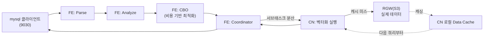

# StarRocks 분석 엔진 (FE/CN, shared-data 기반)

MPP(대규모 병렬 처리) 방식의 컬럼형 OLAP 데이터베이스다. `starrocks` 네임스페이스에 FE(제어 평면) + CN(데이터 평면) 클러스터를 올렸다. 데이터는 로컬 디스크가 아니라 [Ceph RGW](07-1-ceph-storage.md)(오브젝트 스토리지)에 저장한다. 이 방식을 shared-data라 부른다.

## 목적

컴퓨트와 스토리지를 분리한 shared-data 구성을 검증하는 것이 목적이었다. Ceph를 도입한 이유 자체가 이 모드를 쓰기 위해서였다.

## 아키텍처

StarRocks는 두 종류 노드로만 구성된다. Hive/Spark처럼 별도 메타스토어나 리소스 매니저가 필요 없다.

- **FE(Frontend)**: 제어 평면이다. 전체 카탈로그(DB/테이블/파티션/버킷 정의)를 메모리에 들고 있는다. 변경분은 BDBJE(Berkeley DB Java Edition, Paxos류 합의 프로토콜)로 다른 FE에 복제한다. 오직 leader FE만 메타데이터를 쓸 수 있다. follower는 쓰기 요청을 leader로 전달만 한다. 읽기(SELECT)는 follower도 직접 처리할 수 있다. SQL도 FE가 처리한다 — Parser → Analyzer → CBO(비용 기반 최적화) → Coordinator(물리 실행계획을 CN들에 분산 스케줄링) 순서다. 메타데이터는 오브젝트 스토리지가 아니라 FE 자신의 로컬 디스크에 저장된다. 그래서 FE에는 RBD PVC(10Gi)가 필요하다.
- **CN(Compute Node)**: 데이터 평면이다. 로컬 영구 저장이 없다는 점만 빼면 실행 엔진은 BE(shared-nothing 모드의 데이터 평면)와 같다. 쿼리에 필요한 데이터를 오브젝트 스토리지에서 읽어와 Data Cache(로컬 디스크 캐시)에 저장한다. 다음 쿼리부터는 캐시를 먼저 본다. 없으면 원격에서 가져와 캐싱하면서 응답한다. 그래서 첫 쿼리는 느리고 이후는 빠르다. Compaction(작은 데이터 조각들을 큰 조각으로 병합하는 작업)도 CN이 실행한다. 압축 결과는 오브젝트 스토리지에 새로 쓰이고, 오래된 버전은 별도 vacuum 작업으로 나중에 정리된다.



FE가 곧 Coordinator다. 동시 쿼리가 몰리면 CN을 아무리 늘려도 FE 하나가 모든 쿼리의 플래닝/조정을 떠맡는다(동시성 병목 실측은 [BMT](08-2-starrocks-analytics-bmt.md) 참고).

### 데이터가 저장되는 구조

```
Table → Partition → Tablet → Rowset → Segment
```

- **Partition**: 보통 시간 범위(RANGE) 기준이다. 쿼리가 특정 시간대만 스캔하면 나머지 파티션은 안 건드린다(파티션 프루닝).
- **Tablet**: 파티션 내부의 데이터 분산 최소 단위다. `DISTRIBUTED BY HASH(...) BUCKETS n`의 버킷 하나가 tablet 하나에 대응한다.
- **Rowset**: 한 번의 쓰기(로드/커밋)로 생긴 데이터 묶음이다. compaction이 여러 rowset을 더 적은 수의 큰 rowset으로 합친다.
- **Segment**: rowset 내부의 실제 컬럼형 파일이다. Parquet과 비슷한 포맷이고 불변(immutable)이다.
- shared-data 모드에선 이 파일들이 RGW 버킷 안에 `db<ID>/<partition>/<tablet>/...` 경로로 쌓인다.

### 테이블 타입

| 타입 | 특징 | 용도 |
|---|---|---|
| Duplicate Key | 제약 없음, 중복 행 허용 | 로그처럼 그대로 쌓는 원본 데이터 |
| Aggregate | 로드 시점에 미리 집계 | 집계 쿼리가 잦은 경우 |
| Unique Key | 같은 키 재로드 시 마지막 값으로 덮어씀 | 실시간 갱신이 필요한 경우 |
| Primary Key | Unique Key + NOT NULL 제약, 부분 컬럼 업데이트 지원 | 실시간 갱신 + 조회 성능 둘 다 필요한 경우 |

## 설계 결정

- **StatefulSet이 아니라 Deployment + headless Service.** 공식 StarRocks Kubernetes Operator는 StatefulSet 기반이다. 하지만 이 규모(단일/소수 인스턴스)에서는 순번 관리 같은 StatefulSet의 이점이 필요 없다. 실제로 필요한 건 하나뿐이었다 — "클러스터 DNS로 항상 같은 이름으로 자기 자신을 찾을 수 있는 것". headless Service(`clusterIP: None`) + 파드의 `hostname`/`subdomain` 필드 조합만으로 충분했다.
- **RGW 자격증명은 git에 올리지 않는다.** fe.conf는 파일 형태라 k8s Secret을 네이티브로 참조할 수 없다. 배포 스크립트가 Secret에서 값을 읽어 `sed`로 템플릿에 주입한 뒤 ConfigMap으로 적용하는 방식을 택했다.
- **버킷 생성은 radosgw-admin이 아니라 수동 서명한 S3 PUT으로.** radosgw-admin은 유저/정책 관리만 한다. 버킷 자체는 S3 API로만 만들 수 있다. awscli 같은 별도 도구를 설치하는 대신 bash+openssl로 AWS SigV2 서명을 직접 계산했다.
- **shared-nothing 검증용 클러스터는 완전히 별도 네임스페이스(`starrocks-sn`).** `run_mode`(shared-data인지 아닌지)는 FE를 처음 띄울 때 정해지는 클러스터 전역 설정이다. 나중에 못 바꾼다. 그래서 기존 클러스터를 고치지 않고 새 FE를 `run_mode` 지정 없이(기본값) 배포했다. BE 3개는 기존 XFS 파티션의 하위 디렉토리(`/mnt/starrocks-be/sn-data`)를 썼다. shared-data 클러스터의 datacache와는 물리적으로 분리된다.

## 스크립트 목록 (이름 순)

### RGW 유저/버킷 생성
- 설명: StarRocks가 데이터를 저장할 RGW 버킷과 접근 유저를 만든다. 자격증명은 k8s Secret에 저장한다.
- 스크립트: [`00-create-rgw-user-and-bucket.sh`](../scripts/08-starrocks/00-create-rgw-user-and-bucket.sh)

### FE 배포
- 설명: shared-data FE를 배포한다. headless Service + 고정 hostname으로 self-identity FQDN(`fe-0.fe-hl.starrocks.svc.cluster.local`)을 만든다. 이 FQDN이 정상인지 반드시 확인해야 한다.
- 스크립트: [`01-deploy-fe.sh`](../scripts/08-starrocks/01-deploy-fe.sh) + [`fe.conf.template`](../scripts/08-starrocks/fe.conf.template)
```bash
command: ["/opt/starrocks/fe/bin/start_fe.sh"]   # 이미지 기본 CMD로는 기동 안 됨(아래 "알려진 이슈" 참고)
```

### CN 배포
- 설명: CN을 배포하고 FE에 등록한다. `SHOW BACKENDS`/`SHOW COMPUTE NODES`로 Alive 확인. 3노드 전체에 두려면 이름/노드만 바꿔 반복 실행한다.
- 스크립트: [`02-deploy-cn.sh`](../scripts/08-starrocks/02-deploy-cn.sh) + [`cn.conf`](../scripts/08-starrocks/cn.conf)
```sql
ALTER SYSTEM ADD COMPUTE NODE "cn-0.cn-hl.starrocks.svc.cluster.local:9050";
-- IP로 등록하면 파드 재시작마다 깨진다. headless Service FQDN으로 등록해야 안전하다.
```

### end-to-end 검증
- 설명: 테이블 생성 + INSERT + SELECT로 동작을 확인한다. RGW 버킷의 오브젝트 수가 실제로 늘어나는지도 함께 확인한다.
- 스크립트: [`03-verify.sh`](../scripts/08-starrocks/03-verify.sh)

### 진짜 shared-nothing FE 배포
- 설명: `starrocks-sn` 네임스페이스에 `run_mode` 지정 없이(기본값) FE를 배포한다. RGW/S3 설정은 전혀 넣지 않는다.
- 스크립트: [`09-deploy-sn-fe.sh`](../scripts/08-starrocks/09-deploy-sn-fe.sh)

### 진짜 shared-nothing BE 배포
- 설명: 3노드(chan08/chan09/llm001)에 각각 BE를 배포하고 등록한다. `SHOW BACKENDS`로 BackendId가 전부 Alive인지 확인한다. `SHOW CREATE TABLE`에 `storage_volume`이 없고 `"replicated_storage"="true"`만 있으면 성공이다 — cloud-native와 구분되는 표시다. 데이터 로드 후 노드의 로컬 `data/` 디렉토리에 실제로 바이트가 쌓이는지 `du -sh`로 직접 확인해야 한다.
- 스크립트: [`10-deploy-sn-be.sh`](../scripts/08-starrocks/10-deploy-sn-be.sh) (노드별 반복, `<노드> <접미사>`)

### 애플리케이션에서 접속하기(pymysql)
- 설명: StarRocks는 MySQL 프로토콜(9030 포트)을 그대로 쓴다. 기존 MySQL 클라이언트 라이브러리를 그대로 쓸 수 있다.
- 스크립트: [`app-sample.py`](../scripts/08-starrocks/app-sample.py)
```python
conn = pymysql.connect(host="127.0.0.1", port=9030, user="root", password="", autocommit=True)
# autocommit=True가 사실상 필수 — StarRocks는 로드/커밋 단위가 전통 RDBMS와 달라서,
# ORM의 암묵적 트랜잭션 관리에 의존하면 예상과 다르게 동작할 수 있다.
```
클러스터 밖에서 실행하려면 먼저 `kubectl -n starrocks port-forward svc/fe 9030:9030`으로 포트포워딩한다. 클러스터 안이라면 `host`를 `fe.starrocks.svc.cluster.local`로 바꾼다.

수만 건 이상 대량 적재는 INSERT 반복이 아니라 STREAM LOAD(HTTP PUT 벌크 로드)를 쓴다. FE의 8030(HTTP) 포트로 보내면 실제 담당 CN으로 자동 리다이렉트된다.
```bash
curl --location-trusted -u root: \
  -H "label:my_load_$(date +%s)" \
  -H "column_separator:," \
  -T /path/to/data.csv \
  "http://<FE host>:8030/api/<db>/<table>/_stream_load"
```
응답 JSON의 `LoadTimeMs`/`WriteDataTimeMs`/`LoadBytes`로 처리량을 계산한다.

## 알려진 이슈

### 이미지 기본 CMD로는 k8s에서 기동이 안 된다
`docker run`으로는 되는 것 같은 기본 CMD가 k8s Deployment에서는 아무 프로그램도 못 찾는다. tini(컨테이너의 기본 프로세스 관리자)가 usage 메시지만 찍고 종료된다. `command: ["/opt/starrocks/fe/bin/start_fe.sh"]`(BE는 `start_be.sh`, CN은 `start_cn.sh`)를 명시적으로 지정해야 한다.

### FE/CN/BE가 자기 자신을 클러스터 DNS로 못 찾는 이름으로 등록해버린다
`--host_type FQDN`으로 기동해도, headless Service 없이 일반 Deployment로 띄우면 파드가 자기 identity를 무작위 호스트명(예: `fe-8648f9875-7wbh2`)으로 잡는다. 클러스터 DNS에 등록된 이름이 아니라서 서로 통신이 끊긴다(`Could not resolve host for client socket`). headless Service(`clusterIP: None`) + 고정 `hostname`/`subdomain`으로 안정적인 FQDN을 부여해서 해결했다.

### 멈춘 것처럼 보였지만 사실 그냥 느렸다
첫 테이블 생성 시도가 매번 타임아웃났다. CN 로그의 `task_count_in_queue`가 계속 늘어나기만 해서 "CN이 뭔가에 완전히 막혔다"고 오판했다. RGW 자체 로그를 열어보니 실제로는 S3 요청이 낮은 지연(1ms 미만)으로 계속 성공하고 있었다. 콜드 스타트 상태에서 첫 테이블 생성에 필요한 절대적인 단계 수가 많아 오래 걸렸을 뿐이었다. `tablet_create_timeout_second`를 300초로 임시로 늘려서 한 번 통과시키니, 이후 테이블 생성은 3초 내외로 정상화됐다(이후 60초로 축소).

### 검색으로 찾은 fe.conf 키가 실제로는 존재하지 않았다
`aws_s3_enable_path_style_access` 같은 키를 검색으로 찾아 넣었지만, StarRocks 소스(`Config.java`)를 직접 확인하니 이 키 자체가 없었다. 커스텀 엔드포인트를 지정하면 path-style이 자동 적용되는 것으로 보였다(RGW 로그로 실제 요청 형식을 확인).

### FE Follower 등록이 첫 시도에서 조용히 실패했다
`ALTER SYSTEM ADD FOLLOWER` 실행 직후 바로 새 FE 파드를 띄우면 "current node is not added to the group. please add it first"를 반복하며 무한 재시도하는 경우가 있었다. 원인은 불명이다(타이밍 이슈로 추정). `SHOW PROC '/frontends'`로 실제 등록 여부를 확인하고, 안 됐으면 `ALTER SYSTEM ADD FOLLOWER`를 재실행하면 곧바로 성공했다.

### FE Follower conf에 RGW 자격증명을 빠뜨리면 쿼리 조정이 안 된다
follower도 cloud-native 테이블 쿼리를 조정하려면 storage volume을 해석해야 한다. 리더와 동일한 `aws_s3_*` 설정이 필요하다.

## 검증 명령

```bash
SHOW FRONTENDS\G          -- FE 목록, Role(LEADER/FOLLOWER), Alive
SHOW BACKENDS\G           -- BE 목록
SHOW COMPUTE NODES\G      -- CN 목록
SHOW CREATE TABLE t\G     -- storage_volume 있으면 cloud-native, replicated_storage만 있으면 로컬
```
