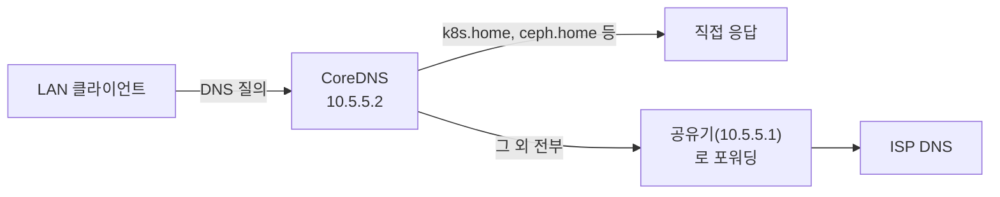

# 내부 도메인 DNS (CoreDNS)

LAN 안에서 서비스 VIP를 IP 대신 `k8s.home` 같은 이름으로 접속할 수 있게 하는 내부 전용 DNS 서버다. `internal-dns` 네임스페이스에 CoreDNS를 띄웠다.

## 목적

MySQL 등 k8s 밖 애플리케이션이 클러스터 서비스에 붙을 때 IP를 직접 하드코딩하고 있었다. VIP가 바뀔 때마다 그 애플리케이션들을 일일이 찾아 고쳐야 했다. 이름으로 접속하게 하면 실제 IP가 바뀌어도 DNS 레코드만 갱신하면 된다.

## 설계 결정

- **공유기(ipTIME) 자체 기능 대신 별도 DNS 서버를 띄웠다.** ipTIME 관리 화면에 내부 도메인 등록 메뉴가 있는 모델도 있지만, 이 공유기 펌웨어에는 없었다(로그인 화면에서 브랜드만 확인, 실제 로그인은 사용자가 직접 함).
- **dnsmasq 대신 CoreDNS를 썼다.** k8s 자체가 이미 내부적으로 CoreDNS를 쓰고 있어서 검증된 이미지고 버전도 그대로 재사용했다(`registry.k8s.io/coredns/coredns:v1.14.2`, 클러스터의 `kube-system` CoreDNS와 동일 버전).
- **모르는 도메인은 전부 공유기로 포워딩한다.** `k8s.home`, `mysql.k8s.home`처럼 등록된 이름만 직접 답하고, 나머지(구글/네이버 등 일반 인터넷 도메인)는 공유기(`10.5.5.1`)로 그대로 넘긴다. 이렇게 해야 LAN 클라이언트가 이 DNS를 주 DNS로 써도 인터넷 접속에 문제가 없다.
- **VIP는 인프라 대역(`.20` 이하)에 둔다.** 처음엔 애플리케이션 VIP 대역(`.50~.99`)에 뒀다가, "DNS는 다른 서비스들이 의존하는 기반 인프라"라는 이유로 인프라 대역으로 재분류했다(아래 "VIP 이력" 참고).
- **k8s 파드용 레코드는 여기 한 곳에만 둔다.** 파드는 기본적으로 `kube-system`의 클러스터 내부 CoreDNS를 쓰기 때문에 `k8s.home`을 그대로는 못 찾는다. 레코드를 `kube-system` CoreDNS에도 복사해 넣는 대신, `kube-system` CoreDNS가 `k8s.home` 도메인만 이 서버로 포워딩(위임)하게 만들었다. 이게 Kubernetes 공식 문서에도 나오는 표준 패턴이다(stub domain). 레코드가 한 곳에만 있으니 VIP가 바뀌어도 여기 하나만 고치면 된다.
- **단일장애점은 레코드 복제가 아니라 replica 수로 없앤다.** `internal-dns`가 죽으면 LAN 클라이언트도, 파드도 같이 못 찾게 되니까, replica를 1→2로 늘려서(서로 다른 노드에 분산) 파드 하나 죽어도 나머지가 계속 응답하게 했다.
- **핵심 인프라 3노드는 `/etc/hosts`에도 같은 이름을 박아둔다.** `internal-dns` 자체가 이 3노드 위에서 도니, DNS가 완전히 죽은 상황에서 그 DNS를 고치려고 SSH로 들어간 노드조차 인프라 도메인을 못 풀면 곤란하다. chan08/chan09/llm001의 `/etc/hosts`에 인프라 도메인을 정적으로 등록해서, CoreDNS가 죽어있어도 이 3노드만큼은 항상 서로를 이름으로 찾을 수 있게 했다. 이건 DHCP로 받는 값이 아니라 노드 최초 세팅 시점에 박아두는 정적 값이라, 실행 스크립트 자체는 여기가 아니라 [초기 프로비저닝](01-provision.md#핵심-인프라-노드-etchosts-등록)에 둔다 — DNS 문서는 "왜"를, 프로비저닝 문서는 "어떻게"를 담당하는 역할 분리.

## 아키텍처



### 등록된 내부 도메인

인프라(노드/제어 VIP)는 `<이름>.home`으로 통일한다. 애플리케이션 VIP는 `mysql.k8s.home`처럼 계층을 둬서 구분한다.

| 도메인 | IP | 용도 |
|---|---|---|
| `dns.home` | `10.5.5.2` | CoreDNS(internal-dns) 자기 자신 |
| `k8s.home` | `10.5.5.3` | k8s API 서버/etcd VIP(keepalived) |
| `ceph.home` | `10.5.5.4` | Ceph RGW VIP(keepalived) |
| `nas.home` | `10.5.5.5` | NAS |
| `chan08.home` | `10.5.5.8` | chan08 물리 노드 |
| `chan09.home` | `10.5.5.9` | chan09 물리 노드 |
| `llm001.home` | `10.5.5.10` | llm001 물리 노드 |
| `mysql.k8s.home` | `10.5.5.51` | MySQL VIP(애플리케이션, MetalLB) — raw TCP라 포트(3306)로 직접 접속 |

새 이름을 추가하려면 `internal-dns-corefile` ConfigMap의 `hosts` 블록에 `<IP> <이름>` 한 줄을 추가하면 된다.

## 스크립트 목록

### CoreDNS 배포
- 설명: 네임스페이스, Corefile(설정) ConfigMap, Deployment, LoadBalancer Service를 한 번에 만든다.
- 스크립트: 별도 파일 없이 인터랙티브로 적용함(재현 시 아래 매니페스트 참고)
```yaml
apiVersion: v1
kind: ConfigMap
metadata:
  name: internal-dns-corefile
  namespace: internal-dns
data:
  Corefile: |
    . {
        hosts /etc/coredns/customhosts {
          10.5.5.2 dns.home
          10.5.5.3 k8s.home
          10.5.5.4 ceph.home
          10.5.5.5 nas.home
          10.5.5.8 chan08.home
          10.5.5.9 chan09.home
          10.5.5.10 llm001.home
          10.5.5.51 mysql.k8s.home
          fallthrough
        }
        forward . 10.5.5.1
        cache 30
        log
        errors
    }
```
```yaml
apiVersion: apps/v1
kind: Deployment
metadata:
  name: internal-dns
  namespace: internal-dns
spec:
  replicas: 2   # 서로 다른 노드에 분산 — 파드 하나 죽어도 나머지가 응답
  selector: {matchLabels: {app: internal-dns}}
  template:
    metadata: {labels: {app: internal-dns}}
    spec:
      containers:
        - name: coredns
          image: registry.k8s.io/coredns/coredns:v1.14.2
          args: ["-conf", "/etc/coredns/Corefile"]
          ports: [{containerPort: 53, protocol: UDP}, {containerPort: 53, protocol: TCP}]
          volumeMounts: [{name: config, mountPath: /etc/coredns}]
      volumes:
        - name: config
          configMap: {name: internal-dns-corefile}
---
apiVersion: v1
kind: Service
metadata: {name: internal-dns, namespace: internal-dns}
spec:
  type: LoadBalancer
  selector: {app: internal-dns}
  ports:
    - {name: dns-udp, port: 53, targetPort: 53, protocol: UDP}
    - {name: dns-tcp, port: 53, targetPort: 53, protocol: TCP}
```

### k8s 파드에서도 찾게 하기(stub domain 포워딩)
- 설명: `kube-system`의 클러스터 내부 CoreDNS에 `home` TLD(최상위 도메인) 전용 서버 블록을 추가해서, `*.home` 전체를 우리 `internal-dns`(`10.5.5.2`)로 포워딩한다. 도메인 하나하나가 아니라 TLD 전체를 위임해서, 나중에 `.home` 이름을 추가할 때마다 이 블록을 다시 안 고쳐도 된다. 나머지 도메인(클러스터 서비스명, 일반 인터넷 도메인)은 기존 경로 그대로다.
- 스크립트: 없음, `kube-system/coredns` ConfigMap에 아래 서버 블록을 기존 `.:53 { ... }` 블록 뒤에 추가
```
    home:53 {
        errors
        cache 30
        forward . 10.5.5.2
    }
```
```bash
# 위 서버 블록을 반영하려면 재시작 필요
kubectl -n kube-system rollout restart deployment coredns

# 롤아웃 완료 대기
kubectl -n kube-system rollout status deployment coredns --timeout=60s
```

### 새 도메인 추가 / 설정 변경 반영
- 설명: ConfigMap을 고친 뒤 파드를 재시작해야 반영된다(마운트된 ConfigMap은 자동 갱신에 최대 수십 초 걸릴 수 있어, 재시작으로 즉시 반영시켰다).
```bash
# 고친 ConfigMap 적용
kubectl apply -f internal-dns-corefile.yaml

# 마운트된 ConfigMap은 자동 갱신이 늦을 수 있어 재시작으로 즉시 반영
kubectl -n internal-dns rollout restart deployment internal-dns

# 롤아웃 완료 대기
kubectl -n internal-dns rollout status deployment internal-dns --timeout=60s
```
새 도메인 하나가 이름을 반드시 두 곳에 등록해야 하는 경우가 있다 — 아래 "신규 노드/인프라 장비 추가 시" 참고.

### 신규 노드/인프라 장비 추가 시
- 설명: 물리 노드나 새 인프라 VIP(`<이름>.home`, `.20` 이하 대역)를 하나 추가할 때 빠뜨리기 쉬운 체크리스트. **애플리케이션 VIP**(`.50~.99`, 예: `foo.k8s.home`)는 아래 1번만 하면 된다 — `/etc/hosts` 안전망은 "DNS 자체를 서비스하는 인프라"에만 필요하기 때문이다(위 "설계 결정" 참고).

1. **CoreDNS에 등록** — `internal-dns-corefile` ConfigMap의 `hosts` 블록에 `<IP> <이름>` 한 줄 추가, 위 "새 도메인 추가" 절차로 반영.
2. **(인프라 도메인이면 추가로) 3노드 `/etc/hosts`에도 등록** — [`06-hosts-static-entries.sh`](../scripts/01-provision/06-hosts-static-entries.sh)의 heredoc 안에 같은 줄을 추가한 뒤, chan08/chan09/llm001 3대 각각에서 스크립트를 재실행한다. 이 스크립트는 목록이 파일 안에 하드코딩돼 있어서 CoreDNS ConfigMap처럼 "값만 넘기면 자동 반영"되지 않는다 — **1번만 하고 2번을 빠뜨리면**, DNS가 정상일 땐 아무 문제가 없다가 CoreDNS 자체가 죽는 순간 이 3노드조차 새 이름을 못 풀게 되는, 당장은 안 드러나는 결함이 생긴다.
   ```bash
   # 새 도메인을 스크립트에 추가한 뒤, 3노드 각각에서
   sudo ./06-hosts-static-entries.sh
   ```
3. **검증** — 아래 "검증 명령"의 `dig`(CoreDNS 응답)와 `getent hosts`(3노드 `/etc/hosts` 반영)를 새 도메인으로 각각 실행.

노드가 아니라 사람이 쓰는 워크스테이션(예: 이 Mac)은 이 체크리스트와 무관하다 — DNS를 못 서비스하는 쪽이라 `/etc/hosts` 안전망이 필요 없고, 공유기 DHCP 주 DNS(`10.5.5.2`) 설정만 따른다.

## 알려진 이슈

### k8s 파드 안에서는 기본적으로 이 도메인을 못 찾는다
파드는 `kube-system`의 클러스터 내부 CoreDNS(`10.96.0.10`)를 쓴다. 이 CoreDNS는 모르는 도메인을 노드 자신의 `/etc/resolv.conf`로 포워딩한다. 노드의 OS DNS는 우리 `internal-dns`를 모른다. 그래서 `nslookup mysql.k8s.home`이 `NXDOMAIN`으로 실패했다. 노드의 OS DNS 자체를 바꾸는 건 위험이 크다(패키지 설치·이미지 pull 등 노드의 모든 DNS가 걸려있음). 대신 `kube-system` CoreDNS에 `home` TLD 전용 stub domain 포워딩만 추가해서 해결했다(위 "k8s 파드에서도 찾게 하기" 참고). 필요한 도메인만 정확히 위임하는 표준 방식이다.

### TLS 서비스는 도메인 등록만으론 안 되고 인증서에도 그 이름이 있어야 한다
`ceph.home`처럼 평문 HTTP(RGW)는 DNS에 이름만 등록하면 바로 쓸 수 있다. 반대로 k8s API 서버 같은 TLS 서비스는 인증서의 SAN(Subject Alternative Name) 목록에 그 이름이 없으면 클라이언트가 "이 인증서는 이 이름용이 아니다"라며 접속을 거부한다. `k8s.home`을 실제 kubeconfig에서 쓰려면 DNS 등록과 별개로 `kubeadm init phase certs apiserver`로 apiserver 인증서를 재발급해서 SAN에 `k8s.home`을 추가해야 했다(3노드 모두, 기존 IP SAN은 그대로 남겨서 기존 접근 방식도 안 끊기게 함).

### VIP를 옮기면 dig 테스트가 재시작 도중 일시적으로 실패한다
`rollout restart` 직후 몇 초간은 파드가 교체되는 중이라 `dig`가 "connection refused"를 낼 수 있다. 실제 장애가 아니라 롤아웃 완료 대기가 안 된 것 — `rollout status`로 완료를 기다린 뒤 재시도하면 정상 응답한다.

### 고정 IP로 설정된 클라이언트는 공유기 DHCP 설정을 아무리 바꿔도 반영 안 된다
공유기의 "DHCP 주 DNS" 설정은 DHCP로 IP를 받는 클라이언트에만 적용된다. 고정 IP(수동 설정)를 쓰는 기기는 DHCP 요청 자체를 안 한다. 그래서 이 설정과 무관하다. 그 기기에서는 DNS 서버 주소를 직접 지정해야 한다. `scutil --dns`(macOS)나 `ipconfig getpacket <인터페이스>`로 실제 적용된 DNS를 확인할 수 있다.

### 공유기가 여전히 옛 DNS를 나눠주는지, 클라이언트가 캐싱한 것인지 구분하려면
`ipconfig getpacket en0`(macOS)로 최근 수신한 DHCP 패킷의 `domain_name_server` 필드를 직접 확인한다. 여기 나온 값이 공유기가 실제로 지금 응답한 값이다 — 이게 옛날 값이면 클라이언트 문제가 아니라 공유기 설정이 아직 저장/반영 안 된 것.

### MetalLB Service에 `metallb.io/loadBalancerIPs` annotation이 박혀 있으면 IPAddressPool만 바꿔도 소용없다
IPAddressPool의 주소 범위를 바꿔도, Service에 특정 IP를 못 박은 annotation이 남아있으면 MetalLB가 그 IP를 계속 요청하다가 `AllocationFailed`로 실패한다(`kubectl describe svc`의 Events에 표시됨). annotation도 같이 새 IP로 갱신해야 한다.

### 클라이언트에 보조 DNS가 설정돼 있으면 `.home` 조회가 간헐적으로 실패한다
CoreDNS의 `hosts` 플러그인이 답하는 응답에는 **RA(Recursion Available) 플래그가 안 켜져 있다** — `dig`로 비교하면 바로 보인다:
```
mysql.k8s.home 질의(hosts 플러그인이 직접 답함): flags: qr aa rd    <- ra 없음
google.com 질의(forward 플러그인이 재귀 조회함):    flags: qr rd ra <- ra 있음
```
같은 서버인데 어떤 도메인이냐에 따라 RA 여부가 달라지는 셈이다. macOS의 리졸버(mDNSResponder)는 이 불일치를 "이 서버는 못 미덥다"로 해석해서, 클라이언트에 1차(`10.5.5.2`)·2차(예: ISP DNS) DNS가 같이 설정돼 있으면 가끔 2차로 넘어간다 — 2차 DNS는 당연히 `.home`을 모르니 `NXDOMAIN`. 매번 재현되는 게 아니라 간헐적이라 원인 찾기가 까다롭다(dig로 서버를 명시해서 질의하면 항상 정상 응답하므로 "서버는 멀쩡한데 가끔만 실패"로 보인다).

해결: 클라이언트의 2차 DNS를 없애고 `10.5.5.2` 하나만 남긴다. `internal-dns`는 이미 replica 2개로 자체 이중화돼 있어서(위 "설계 결정" 참고) 보조 DNS 없이도 죽지 않고, 일반 인터넷 도메인은 `forward` 규칙으로 계속 정상 해석된다. macOS라면:
```bash
networksetup -setdnsservers "Ethernet" 10.5.5.2
```

## VIP 이력

CoreDNS의 VIP는 여러 번 옮겨졌다 — `10.5.5.11` → `.53`(애플리케이션 대역, 임시) → `.4`(옛 MySQL 자리) → **`.2`**(옛 ingress 자리, 최종). 최종적으로 인프라 대역(`.20` 이하)에 정착했다. 애플리케이션 VIP(ingress `.50`, MySQL `.51`)는 `.50~.99` 대역으로 옮겨갔다. 대역 정책은 [내부망 IP 정책은 비공개 문서에만 기록](../internal/ip-inventory.md) 참고(이 저장소 밖, gitignore 대상).

`k8s.home`도 한 번 정정됐다 — 한동안 옛 ingress VIP(`.50`) 자리를 가리키고 있었는데, "k8s.home은 k8s API/etcd VIP를 의미해야 한다"는 원래 의도에 맞게 `10.5.5.3`으로 바로잡았다. ingress VIP는 지금 별도 `.home` 별칭이 없다.

## 검증 명령

```bash
dig @10.5.5.2 k8s.home +short          # 등록된 이름 확인
dig @10.5.5.2 아무외부도메인.com +short   # 포워딩 확인(공유기 통해 정상 응답해야 함)
kubectl -n internal-dns get pods

# k8s 파드 안에서도 확인(stub domain 포워딩 검증)
kubectl run dns-test --rm -i --restart=Never --image=busybox:1.36 --command -- nslookup ceph.home

# 물리 노드 3대에서는 CoreDNS가 죽어도 /etc/hosts로 인프라 도메인이 그대로 풀린다
getent hosts k8s.home
```

---

[← 이전: StarRocks 운영](08-5-starrocks-ops.md) · [다음: NAS 연동 →](10-nas-storage.md)
