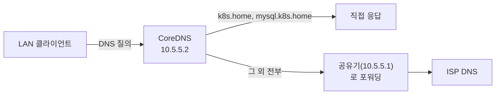

# 내부 도메인 DNS (CoreDNS)

LAN 안에서 서비스 VIP를 IP 대신 `k8s.home` 같은 이름으로 접속할 수 있게 하는 내부 전용 DNS 서버다. `internal-dns` 네임스페이스에 CoreDNS를 띄웠다.

## 목적

MySQL 등 k8s 밖 애플리케이션이 클러스터 서비스에 붙을 때 IP를 직접 하드코딩하고 있었다. VIP가 바뀔 때마다 그 애플리케이션들을 일일이 찾아 고쳐야 했다. 이름으로 접속하게 하면 실제 IP가 바뀌어도 DNS 레코드만 갱신하면 된다.

## 설계 결정

- **공유기(ipTIME) 자체 기능 대신 별도 DNS 서버를 띄웠다.** ipTIME 관리 화면에 내부 도메인 등록 메뉴가 있는 모델도 있지만, 이 공유기 펌웨어에는 없었다(로그인 화면에서 브랜드만 확인, 실제 로그인은 사용자가 직접 함).
- **dnsmasq 대신 CoreDNS를 썼다.** k8s 자체가 이미 내부적으로 CoreDNS를 쓰고 있어서 검증된 이미지고 버전도 그대로 재사용했다(`registry.k8s.io/coredns/coredns:v1.14.2`, 클러스터의 `kube-system` CoreDNS와 동일 버전).
- **모르는 도메인은 전부 공유기로 포워딩한다.** `k8s.home`, `mysql.k8s.home`처럼 등록된 이름만 직접 답하고, 나머지(구글/네이버 등 일반 인터넷 도메인)는 공유기(`10.5.5.1`)로 그대로 넘긴다. 이렇게 해야 LAN 클라이언트가 이 DNS를 주 DNS로 써도 인터넷 접속에 문제가 없다.
- **VIP는 인프라 대역(`.20` 이하)에 둔다.** 처음엔 애플리케이션 VIP 대역(`.50~.99`)에 뒀다가, "DNS는 다른 서비스들이 의존하는 기반 인프라"라는 이유로 인프라 대역으로 재분류했다(아래 "VIP 이력" 참고).
- **k8s 파드용 레코드는 여기 한 곳에만 둔다.** 파드는 기본적으로 `kube-system`의 클러스터 내부 CoreDNS를 쓰기 때문에 `k8s.home`을 그대로는 못 찾는다. 레코드를 `kube-system` CoreDNS에도 복사해 넣는 대신, `kube-system` CoreDNS가 `k8s.home` 도메인만 이 서버로 포워딩(위임)하게 만들었다 — 이게 Kubernetes 공식 문서에도 나오는 표준 패턴(stub domain)이다. 레코드가 한 곳에만 있으니 VIP가 바뀌어도 여기 하나만 고치면 된다.
- **단일장애점은 레코드 복제가 아니라 replica 수로 없앤다.** `internal-dns`가 죽으면 LAN 클라이언트도, 파드도 같이 못 찾게 되니까, replica를 1→2로 늘려서(서로 다른 노드에 분산) 파드 하나 죽어도 나머지가 계속 응답하게 했다.

## 아키텍처



### 등록된 내부 도메인

| 도메인 | IP | 용도 |
|---|---|---|
| `k8s.home` | `10.5.5.50` | ingress VIP — Host 헤더로 여러 웹 서비스 라우팅 |
| `mysql.k8s.home` | `10.5.5.51` | MySQL VIP — raw TCP라 포트(3306)로 직접 접속 |

새 이름을 추가하려면 `internal-dns-corefile` ConfigMap의 `hosts` 블록에 `<IP> <이름>` 한 줄을 추가하면 된다.

## 스크립트 목록

### CoreDNS 배포
- 설명: 네임스페이스, Corefile(설정) ConfigMap, Deployment, LoadBalancer Service를 한 번에 만든다.
- 스크립트: 별도 파일 없이 인터랙티브로 적용함(재현 시 아래 매니페스트 참고)
```yaml
apiVersion: v1
kind: ConfigMap
metadata:
  name: internal-dns-corefile
  namespace: internal-dns
data:
  Corefile: |
    . {
        hosts /etc/coredns/customhosts {
          10.5.5.50 k8s.home
          10.5.5.51 mysql.k8s.home
          fallthrough
        }
        forward . 10.5.5.1
        cache 30
        log
        errors
    }
```
```yaml
apiVersion: apps/v1
kind: Deployment
metadata:
  name: internal-dns
  namespace: internal-dns
spec:
  replicas: 2   # 서로 다른 노드에 분산 — 파드 하나 죽어도 나머지가 응답
  selector: {matchLabels: {app: internal-dns}}
  template:
    metadata: {labels: {app: internal-dns}}
    spec:
      containers:
        - name: coredns
          image: registry.k8s.io/coredns/coredns:v1.14.2
          args: ["-conf", "/etc/coredns/Corefile"]
          ports: [{containerPort: 53, protocol: UDP}, {containerPort: 53, protocol: TCP}]
          volumeMounts: [{name: config, mountPath: /etc/coredns}]
      volumes:
        - name: config
          configMap: {name: internal-dns-corefile}
---
apiVersion: v1
kind: Service
metadata: {name: internal-dns, namespace: internal-dns}
spec:
  type: LoadBalancer
  selector: {app: internal-dns}
  ports:
    - {name: dns-udp, port: 53, targetPort: 53, protocol: UDP}
    - {name: dns-tcp, port: 53, targetPort: 53, protocol: TCP}
```

### k8s 파드에서도 찾게 하기(stub domain 포워딩)
- 설명: `kube-system`의 클러스터 내부 CoreDNS에 `k8s.home` 전용 서버 블록을 추가해서, 이 도메인만 우리 `internal-dns`(`10.5.5.2`)로 포워딩한다. 나머지 도메인(클러스터 서비스명, 일반 인터넷 도메인)은 기존 경로 그대로다.
- 스크립트: 없음, `kube-system/coredns` ConfigMap에 아래 서버 블록을 기존 `.{ㅤ}` 블록 뒤에 추가
```
    k8s.home:53 {
        errors
        cache 30
        forward . 10.5.5.2
    }
```
```bash
kubectl -n kube-system rollout restart deployment coredns
kubectl -n kube-system rollout status deployment coredns --timeout=60s
```

### 새 도메인 추가 / 설정 변경 반영
- 설명: ConfigMap을 고친 뒤 파드를 재시작해야 반영된다(마운트된 ConfigMap은 자동 갱신에 최대 수십 초 걸릴 수 있어, 재시작으로 즉시 반영시켰다).
```bash
kubectl apply -f internal-dns-corefile.yaml
kubectl -n internal-dns rollout restart deployment internal-dns
kubectl -n internal-dns rollout status deployment internal-dns --timeout=60s
```

## 알려진 이슈

### k8s 파드 안에서는 기본적으로 이 도메인을 못 찾는다
파드는 `kube-system`의 클러스터 내부 CoreDNS(`10.96.0.10`)를 쓴다. 이 CoreDNS는 모르는 도메인을 노드 자신의 `/etc/resolv.conf`로 포워딩하는데, 노드의 OS DNS는 우리 `internal-dns`를 모른다 — 그래서 `nslookup mysql.k8s.home`이 `NXDOMAIN`으로 실패했다. 노드의 OS DNS 자체를 바꾸는 대신(패키지 설치·이미지 pull 등 노드의 모든 DNS가 걸려있어 위험이 큼), `kube-system` CoreDNS에 `k8s.home` 전용 stub domain 포워딩만 추가해서 해결했다(위 "k8s 파드에서도 찾게 하기" 참고) — 이게 필요한 도메인만 정확히 위임하는 표준 방식이다.

### VIP를 옮기면 dig 테스트가 재시작 도중 일시적으로 실패한다
`rollout restart` 직후 몇 초간은 파드가 교체되는 중이라 `dig`가 "connection refused"를 낼 수 있다. 실제 장애가 아니라 롤아웃 완료 대기가 안 된 것 — `rollout status`로 완료를 기다린 뒤 재시도하면 정상 응답한다.

### 고정 IP로 설정된 클라이언트는 공유기 DHCP 설정을 아무리 바꿔도 반영 안 된다
공유기의 "DHCP 주 DNS" 설정은 DHCP로 IP를 받는 클라이언트에만 적용된다. 고정 IP(수동 설정)를 쓰는 기기는 DHCP 요청 자체를 안 하므로 이 설정과 무관하다 — 그 기기에서 DNS 서버 주소를 직접(수동으로) 지정해야 한다. `scutil --dns`(macOS)나 `ipconfig getpacket <인터페이스>`로 실제 적용된 DNS를 확인할 수 있다.

### 공유기가 여전히 옛 DNS를 나눠주는지, 클라이언트가 캐싱한 것인지 구분하려면
`ipconfig getpacket en0`(macOS)로 최근 수신한 DHCP 패킷의 `domain_name_server` 필드를 직접 확인한다. 여기 나온 값이 공유기가 실제로 지금 응답한 값이다 — 이게 옛날 값이면 클라이언트 문제가 아니라 공유기 설정이 아직 저장/반영 안 된 것.

### MetalLB Service에 `metallb.io/loadBalancerIPs` annotation이 박혀 있으면 IPAddressPool만 바꿔도 소용없다
IPAddressPool의 주소 범위를 바꿔도, Service에 특정 IP를 못 박은 annotation이 남아있으면 MetalLB가 그 IP를 계속 요청하다가 `AllocationFailed`로 실패한다(`kubectl describe svc`의 Events에 표시됨). annotation도 같이 새 IP로 갱신해야 한다.

## VIP 이력

CoreDNS의 VIP는 여러 번 옮겨졌다 — `10.5.5.11` → `.53`(애플리케이션 대역, 임시) → `.4`(옛 MySQL 자리) → **`.2`**(옛 ingress 자리, 최종). 최종적으로 인프라 대역(`.20` 이하)에 정착했고, 애플리케이션 VIP(ingress `.50`, MySQL `.51`)는 `.50~.99` 대역으로 옮겨갔다 — 대역 정책은 [내부망 IP 정책은 비공개 문서에만 기록](../internal/ip-inventory.md) 참고(이 저장소 밖, gitignore 대상).

## 검증 명령

```bash
dig @10.5.5.2 k8s.home +short          # 등록된 이름 확인
dig @10.5.5.2 아무외부도메인.com +short   # 포워딩 확인(공유기 통해 정상 응답해야 함)
kubectl -n internal-dns get pods

# k8s 파드 안에서도 확인(stub domain 포워딩 검증)
kubectl run dns-test --rm -i --restart=Never --image=busybox:1.36 --command -- nslookup mysql.k8s.home
```
