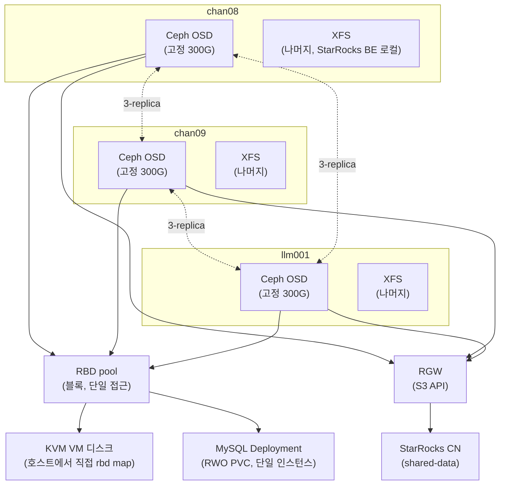

# Ceph 소개

> 이 문서는 초안이다. 검증까지 끝나면 `lessons/`로 옮겨 다듬는다.

StarRocks의 컴퓨팅/스토리지 분리(shared-data) 모드를 테스트해보기 전에, 그 전제가 되는 스토리지 레이어를 Ceph로 통일하기로 했다. 새 장비를 들이지 않고 기존 3노드(chan08/chan09/llm001)를 재구성하는 것만으로 진행했다.

## 목적

StarRocks의 shared-data 모드는 컴퓨트 노드가 로컬 디스크가 아니라 S3 호환 오브젝트 스토리지를 보게 만드는 구조다. 이 오브젝트 스토리지를 마련하는 김에, 같은 노드에서 이미 돌고 있는 KVM VM 디스크와 MySQL 데이터도 같은 스토리지 계층으로 옮겨서 노드 장애와 데이터를 분리시키는 것이 목표였다.

## 설계 결정

- **새 장비 없이 기존 3노드 재구성.** Ceph는 3-replica가 기본값인데 마침 물리 노드가 정확히 3대라 딱 맞는다.
- **RBD(블록)와 RGW(오브젝트)의 역할을 분리했다.** 처음엔 "Ceph 하나로 다 해결"이라고 뭉뚱그려 생각했는데, 실제 접근 패턴이 갈렸다: KVM VM 디스크와 MySQL 데이터는 항상 한 프로세스만 배타적으로 쓰는 블록 데이터(RBD), StarRocks는 S3 API로 접근하는 오브젝트(RGW). 이 둘은 Ceph 안에서 서로 다른 컴포넌트가 서빙한다.
- **CephFS(MDS)는 배제했다.** 여러 파드가 동시에 같은 파일을 읽고 써야 하는 워크로드(RWX)가 지금은 없다. MDS 데몬을 상시로 띄우는 비용을 32G/노드 예산에서 정당화할 근거가 없어서, RWX가 필요해지면 그때 NAS(NFS)로 커버하기로 하고 지금은 뺐다.
- **NAS를 OSD 백엔드로 쓰지 않는다.** 네트워크 스토리지(NAS) 위에 또 네트워크 스토리지(Ceph)를 얹으면 지연/장애 시나리오가 한 겹 더 지저분해진다. NAS의 역할은 백업 타깃과, 나중에 RWX가 필요해질 때의 NFS StorageClass로 좁혔다.
- **MySQL을 semi-sync 복제 대신 "shared-disk failover cluster" 패턴으로 재구성한다.** 단일 mysqld 인스턴스가 k8s Deployment(Recreate 전략) + Ceph RBD PVC(RWO) 위에서 돌고, 데이터 내구성은 애플리케이션 레벨 복제가 아니라 Ceph 3-replica가 담당한다. 노드가 죽으면 k8s가 다른 노드로 파드를 재스케줄하면서 RBD PVC가 그대로 따라간다. RBD의 exclusive-lock이 핵심 안전장치다 — 두 노드가 동시에 같은 datadir을 잡으려 해도 락에 막혀 안전하게 실패한다(split-brain 방지).
- **KVM도 같은 이유로 RBD 위에 둔다.** libvirt는 RBD를 네이티브 스토리지 풀로 지원한다(OpenStack Cinder/Nova가 쓰는 것과 같은 방식). 다만 이건 k8s가 대신 해주지 않는 수동 절차다 — libvirt 도메인 XML을 노드 간에 자동으로 동기화해주는 장치가 없기 때문.
- **hostNetwork는 필수다.** libvirt/QEMU는 k8s pod network 밖(호스트)에서 도는 프로세스라, Ceph mon/OSD가 pod IP에만 붙어 있으면 접근할 수 없다. CephCluster를 hostNetwork로 배포해서 노드 IP로 직접 붙게 한다.
- **기존 MySQL VIP(`10.5.5.4`)를 재사용한다.** 새 k8s Service를 MetalLB로 같은 IP에 노출하면 애플리케이션(stock-crawler-api 등)이 접속 주소를 바꾸지 않아도 된다.

## 아키텍처

디스크를 Ceph(고정 300G)와 XFS(나머지)로 나눈 이유와 각 노드의 실제 구성은 [설치](ceph-install.md)의 "디스크 재분할" 섹션 참고 — StarRocks shared-nothing(BE) 테스트를 위한 로컬 스토리지를 같은 디스크에서 확보하기 위함이다.

## 각 컴포넌트가 뭘 하는지

- **mon(모니터)**: 클러스터 맵(어느 OSD가 살아있는지, 데이터가 어디 있는지)의 합의를 관리. 과반수가 살아있어야 클러스터가 정상 동작 — 그래서 3개(홀수) 배포.
- **mgr(매니저)**: 대시보드, 메트릭, 일부 관리 API 제공.
- **OSD(Object Storage Daemon)**: 실제 디스크 하나당 하나씩 떠서 데이터를 저장하는 데몬. BlueStore 포맷으로 직접 디스크를 관리한다(파일시스템을 거치지 않음).
- **RBD(RADOS Block Device)**: OSD들 위에 블록 디바이스를 올려주는 계층. 한 번에 하나의 클라이언트만 배타적으로 쓰는(exclusive-lock) 용도에 맞다.
- **RGW(RADOS Gateway)**: OSD들 위에 S3/Swift 호환 오브젝트 스토리지 API를 올려주는 계층. 여러 클라이언트가 동시에 접근 가능.

설치 방법은 [설치](ceph-install.md), 성능 실측은 [BMT](ceph-bmt.md), 명령어 예시는 [사용 예시](ceph-query-examples.md), 실제 동작하는 클라이언트 코드는 [어플리케이션 샘플](ceph-app-sample.md) 참고.
