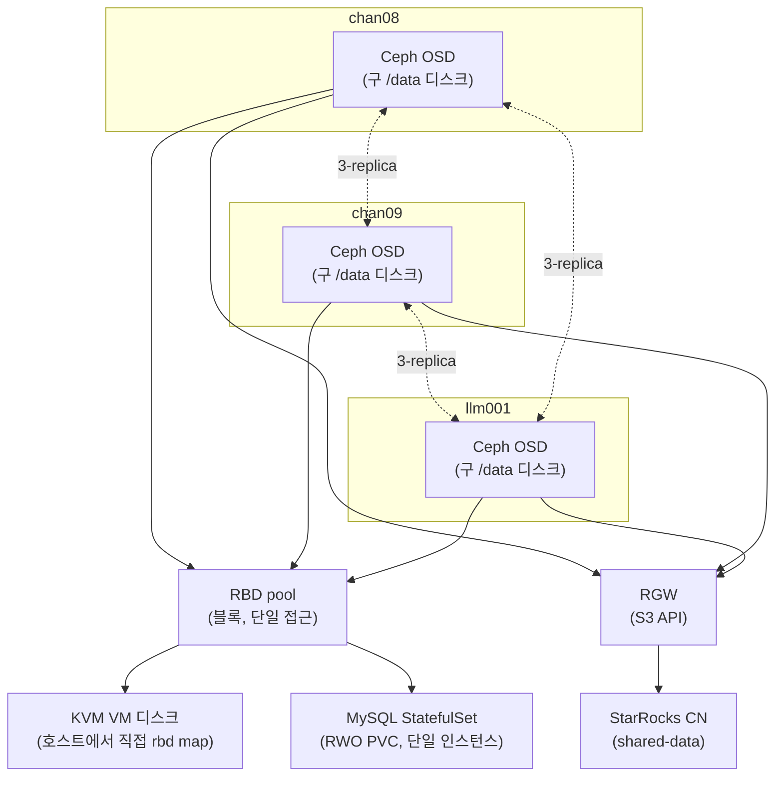

# Ceph 스토리지 레이어 도입 (설계 중, 실행 전)

> 이 문서는 초안이다. 아래 내용은 아직 실제 서버에 적용하지 않은 설계 단계이며, 실행·검증이 끝나면 `lessons/`로 옮겨 다듬는다.

StarRocks 컴퓨팅/스토리지 분리 구성을 테스트해보기 전에, 그 전제가 되는 스토리지 레이어를 Ceph로 통일하기로 했다. 새 장비를 들이지 않고 기존 3노드(chan08/chan09/llm001)를 재구성하는 것만으로 진행한다.

## 목적

StarRocks의 shared-data 모드(컴퓨팅/스토리지 분리)는 컴퓨트 노드가 로컬 디스크가 아니라 S3 호환 오브젝트 스토리지를 보게 만드는 구조다. 이 오브젝트 스토리지를 마련하는 김에, 같은 노드에서 이미 돌고 있는 KVM VM 디스크와 MySQL 데이터도 같은 스토리지 계층으로 옮겨서 노드 장애와 데이터를 분리시키는 것이 이번 작업의 목표다.

## 설계 결정

- **새 장비 없이 기존 3노드 재구성.** Ceph는 3-replica가 기본값인데 마침 물리 노드가 정확히 3대라 딱 맞는다.
- **RBD(블록)와 RGW(오브젝트)의 역할을 분리했다.** 처음엔 "Ceph 하나로 다 해결"이라고 뭉뚱그려 생각했는데, 실제 접근 패턴이 셋으로 갈렸다: KVM VM 디스크와 MySQL 데이터는 항상 한 프로세스만 배타적으로 쓰는 블록 데이터(RBD), StarRocks는 S3 API로 접근하는 오브젝트(RGW). 이 둘은 Ceph 안에서 서로 다른 컴포넌트가 서빙한다.
- **CephFS(MDS)는 배제했다.** 여러 파드가 동시에 같은 파일을 읽고 써야 하는 워크로드(RWX)가 지금은 없다. MDS 데몬을 상시로 띄우는 비용을 32G/노드 예산에서 정당화할 근거가 없어서, RWX가 필요해지면 그때 NAS(NFS)로 커버하기로 하고 지금은 뺐다.
- **NAS를 OSD 백엔드로 쓰지 않는다.** 네트워크 스토리지(NAS) 위에 또 네트워크 스토리지(Ceph)를 얹으면 지연/장애 시나리오가 한 겹 더 지저분해진다. NAS의 역할은 백업 타깃과, 나중에 RWX가 필요해질 때의 NFS StorageClass로 좁혔다.
- **MySQL을 semi-sync 복제 대신 "shared-disk failover cluster" 패턴으로 재구성한다.** 단일 mysqld 인스턴스가 k8s StatefulSet + Ceph RBD PVC(RWO) 위에서 돌고, 데이터 내구성은 애플리케이션 레벨 복제가 아니라 Ceph 3-replica가 담당한다. 노드가 죽으면 k8s가 다른 노드로 파드를 재스케줄하면서 RBD PVC가 그대로 따라간다. 이때 RBD의 exclusive-lock이 핵심 안전장치다 — 두 노드가 동시에 같은 datadir을 잡으려 해도 락에 막혀 안전하게 실패한다(split-brain 방지).
- **"MySQL은 컨테이너/k8s 미사용"이었던 Stage 1 결정을 뒤집었다.** k8s가 RWO PVC 재부착과 파드 재스케줄을 이미 구현해두고 있어서, 같은 결과(노드 장애 시 다른 곳에서 단일 인스턴스 재기동)를 호스트 레벨 스크립트(rbd map + mount + VIP 수동 전환)로 직접 짜는 것보다 훨씬 적은 노력으로 얻을 수 있다고 판단했다.
- **KVM도 같은 이유로 RBD 위에 둔다.** libvirt는 RBD를 네이티브 스토리지 풀로 지원한다(OpenStack Cinder/Nova가 쓰는 것과 같은 방식). VM 디스크를 로컬 qcow2 파일 대신 RBD 이미지로 두면, 노드 장애 시 다른 노드에서 같은 이미지를 가리키는 도메인을 재정의해 기동할 수 있다. 다만 이건 k8s가 대신 해주지 않는 수동 절차다 — libvirt 도메인 XML을 노드 간에 자동으로 동기화해주는 장치가 없기 때문.
- **hostNetwork는 필수다.** libvirt/QEMU는 k8s pod network 밖(호스트)에서 도는 프로세스라, Ceph mon/OSD가 pod IP에만 붙어 있으면 접근할 수 없다. CephCluster를 hostNetwork로 배포해서 노드 IP로 직접 붙게 한다.
- **기존 MySQL VIP(`10.5.5.4`)를 재사용한다.** 새 k8s Service를 MetalLB로 같은 IP에 노출하면 애플리케이션(stock-crawler-api 등)이 접속 주소를 바꾸지 않아도 된다.

## 아키텍처

## 진행 상태 — 실행 전, 아래 순서로 진행 예정

- [ ] MySQL 백업 (mysqldump/xtrabackup)
- [ ] chan09: 복제 중지 → `/data` wipe (레플리카라 별도 백업 불필요)
- [ ] chan08: 백업 확인 후 `/data` wipe
- [ ] llm001: `/data` wipe (데이터 없음, 바로 진행 가능)
- [x] Rook-Ceph 매니페스트 작성 (아래 스크립트 목록) — 실행은 위 디스크 정리 이후
- [ ] Rook-Ceph 배포 (hostNetwork, 3-replica)
- [ ] RBD pool + StorageClass, RGW(오브젝트 스토어) 생성
- [ ] MySQL StatefulSet 배포 + 데이터 복원 + VIP 컷오버
- [ ] libvirt storage pool을 rbd 타입으로 재정의
- [ ] StarRocks 배포 시 RGW 엔드포인트 연동

## 스크립트 목록 (작성 완료, 실행은 디스크 정리 이후)

- 방화벽: [`00-open-ceph-firewall-ports.sh`](../scripts/07-ceph-storage/00-open-ceph-firewall-ports.sh) — 3노드 모두에서 실행, hostNetwork용 mon/osd/mgr/RGW 포트 개방
- operator: [`01-install-rook-operator.sh`](../scripts/07-ceph-storage/01-install-rook-operator.sh) — Rook CRD/operator 설치 (v1.20.6)
- 클러스터: [`02-apply-cluster.sh`](../scripts/07-ceph-storage/02-apply-cluster.sh) + [`02-cluster.yaml`](../scripts/07-ceph-storage/02-cluster.yaml) — CephCluster 생성, 노드별 디바이스 명시(`chan08`/`chan09`=`sda1`, `llm001`=`nvme0n1p3`)
- 블록 스토리지: [`03-apply-storageclass.sh`](../scripts/07-ceph-storage/03-apply-storageclass.sh) + [`03-storageclass.yaml`](../scripts/07-ceph-storage/03-storageclass.yaml) — RBD 풀(3-replica) + StorageClass, exclusive-lock 포함
- 오브젝트 스토리지: [`04-apply-objectstore.sh`](../scripts/07-ceph-storage/04-apply-objectstore.sh) + [`04-objectstore.yaml`](../scripts/07-ceph-storage/04-objectstore.yaml) — RGW + MetalLB VIP 노출
