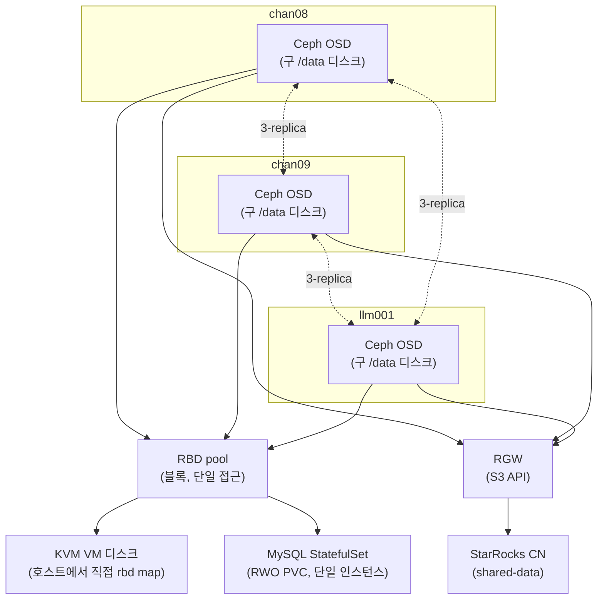

# Ceph 스토리지 레이어 도입 (진행 중)

> 이 문서는 초안이다. 검증까지 끝나면 `lessons/`로 옮겨 다듬는다. 2026-08-27 기준: MySQL 물리 이전, 3노드 `/data` wipe, Rook-Ceph 클러스터(mon/mgr/osd) + RBD StorageClass + RGW(S3, VIP 노출)까지 전부 완료.

StarRocks 컴퓨팅/스토리지 분리 구성을 테스트해보기 전에, 그 전제가 되는 스토리지 레이어를 Ceph로 통일하기로 했다. 새 장비를 들이지 않고 기존 3노드(chan08/chan09/llm001)를 재구성하는 것만으로 진행한다.

## 목적

StarRocks의 shared-data 모드(컴퓨팅/스토리지 분리)는 컴퓨트 노드가 로컬 디스크가 아니라 S3 호환 오브젝트 스토리지를 보게 만드는 구조다. 이 오브젝트 스토리지를 마련하는 김에, 같은 노드에서 이미 돌고 있는 KVM VM 디스크와 MySQL 데이터도 같은 스토리지 계층으로 옮겨서 노드 장애와 데이터를 분리시키는 것이 이번 작업의 목표다.

## 설계 결정

- **새 장비 없이 기존 3노드 재구성.** Ceph는 3-replica가 기본값인데 마침 물리 노드가 정확히 3대라 딱 맞는다.
- **RBD(블록)와 RGW(오브젝트)의 역할을 분리했다.** 처음엔 "Ceph 하나로 다 해결"이라고 뭉뚱그려 생각했는데, 실제 접근 패턴이 셋으로 갈렸다: KVM VM 디스크와 MySQL 데이터는 항상 한 프로세스만 배타적으로 쓰는 블록 데이터(RBD), StarRocks는 S3 API로 접근하는 오브젝트(RGW). 이 둘은 Ceph 안에서 서로 다른 컴포넌트가 서빙한다.
- **CephFS(MDS)는 배제했다.** 여러 파드가 동시에 같은 파일을 읽고 써야 하는 워크로드(RWX)가 지금은 없다. MDS 데몬을 상시로 띄우는 비용을 32G/노드 예산에서 정당화할 근거가 없어서, RWX가 필요해지면 그때 NAS(NFS)로 커버하기로 하고 지금은 뺐다.
- **NAS를 OSD 백엔드로 쓰지 않는다.** 네트워크 스토리지(NAS) 위에 또 네트워크 스토리지(Ceph)를 얹으면 지연/장애 시나리오가 한 겹 더 지저분해진다. NAS의 역할은 백업 타깃과, 나중에 RWX가 필요해질 때의 NFS StorageClass로 좁혔다.
- **MySQL을 semi-sync 복제 대신 "shared-disk failover cluster" 패턴으로 재구성한다.** 단일 mysqld 인스턴스가 k8s StatefulSet + Ceph RBD PVC(RWO) 위에서 돌고, 데이터 내구성은 애플리케이션 레벨 복제가 아니라 Ceph 3-replica가 담당한다. 노드가 죽으면 k8s가 다른 노드로 파드를 재스케줄하면서 RBD PVC가 그대로 따라간다. 이때 RBD의 exclusive-lock이 핵심 안전장치다 — 두 노드가 동시에 같은 datadir을 잡으려 해도 락에 막혀 안전하게 실패한다(split-brain 방지).
- **"MySQL은 컨테이너/k8s 미사용"이었던 Stage 1 결정을 뒤집었다.** k8s가 RWO PVC 재부착과 파드 재스케줄을 이미 구현해두고 있어서, 같은 결과(노드 장애 시 다른 곳에서 단일 인스턴스 재기동)를 호스트 레벨 스크립트(rbd map + mount + VIP 수동 전환)로 직접 짜는 것보다 훨씬 적은 노력으로 얻을 수 있다고 판단했다.
- **KVM도 같은 이유로 RBD 위에 둔다.** libvirt는 RBD를 네이티브 스토리지 풀로 지원한다(OpenStack Cinder/Nova가 쓰는 것과 같은 방식). VM 디스크를 로컬 qcow2 파일 대신 RBD 이미지로 두면, 노드 장애 시 다른 노드에서 같은 이미지를 가리키는 도메인을 재정의해 기동할 수 있다. 다만 이건 k8s가 대신 해주지 않는 수동 절차다 — libvirt 도메인 XML을 노드 간에 자동으로 동기화해주는 장치가 없기 때문.
- **hostNetwork는 필수다.** libvirt/QEMU는 k8s pod network 밖(호스트)에서 도는 프로세스라, Ceph mon/OSD가 pod IP에만 붙어 있으면 접근할 수 없다. CephCluster를 hostNetwork로 배포해서 노드 IP로 직접 붙게 한다.
- **기존 MySQL VIP(`10.5.5.4`)를 재사용한다.** 새 k8s Service를 MetalLB로 같은 IP에 노출하면 애플리케이션(stock-crawler-api 등)이 접속 주소를 바꾸지 않아도 된다.

## 아키텍처

## 실행 중 발견한 이슈

- **datadir을 옮겨도 binlog는 안 따라온다.** `datadir`을 `/data/mysql` → `/home/mysql`로 바꿨는데, `/data`가 계속 busy(umount 불가)였다. 원인은 별도 튜닝 설정 파일에 `log_bin = /data/mysql/mysql-bin`이 절대경로로 하드코딩되어 있던 것 — datadir 설정과 별개라 안 바뀌고 계속 옛 경로에 쓰고 있었다. `SHOW VARIABLES LIKE '%dir%'`류가 아니라 각 설정 파일에서 절대경로를 쓰는 항목(log_bin, innodb_undo_directory 등)을 따로 확인해야 한다.
- **AppArmor 로컬 오버라이드도 같이 옮겨야 한다.** Ubuntu MySQL 패키지는 `/etc/apparmor.d/local/usr.sbin.mysqld`에 datadir 경로를 화이트리스트로 걸어둔다. 새 경로를 추가하지 않으면 mysqld가 파일 접근을 거부당하며 죽는다.
- **되돌릴 수 없는 원격 명령은 Claude Code 자동 모드 분류기가 막는다.** `wipefs` 같은 명령은 세션 권한으로 승인해도 별도 분류기가 한 번 더 막아서, 프로젝트 로컬 설정(`.claude/settings.local.json`)에 해당 호스트로의 ssh/scp를 허용 규칙으로 추가해야 진행할 수 있었다.
- **Rook 1.20부터 CSI 드라이버가 별도 오퍼레이터로 분리됐다.** `crds.yaml` → `common.yaml` → `operator.yaml` 순서만 알고 있었는데, 실제로는 그 사이에 `csi-operator.yaml`(ceph-csi-operator의 `OperatorConfig`/`Driver` CRD)을 먼저 적용해야 한다. 빠뜨리면 "no matches for kind Driver/OperatorConfig" 에러가 난다. 공식 quickstart를 다시 확인하고서야 알았다.
- **operator reconcile이 에러 없이 멈추는 일이 반복됐다.** CephCluster CR을 두 번 apply했을 때(리소스 버전 충돌 `the object has been modified` 발생 이후 mon-a만 뜨고 멈춤), 그리고 CephBlockPool 생성 때도(로그에 "successfully configured" 이벤트까지 찍히는데 실제 풀은 안 생기고 그대로 멈춤) 똑같은 패턴이 나왔다 — 에러 로그 없이 조용히 진행이 끊긴다. 두 번 다 `kubectl rollout restart deployment/rook-ceph-operator`로 reconcile을 처음부터 다시 돌리니 정상 진행됐다. Rook 1.20 operator의 재현되는 특성으로 보이니, 진행이 몇 분 이상 안 보이면 우선 operator 재시작부터 시도할 것.
- **`kubectl wait`는 매칭되는 리소스가 하나도 없으면 기다리지 않고 즉시 에러를 낸다.** mon/osd 파드가 아직 생성되기 전에 `kubectl wait -l app=...`를 걸면 "no matching resources found"로 바로 실패한다 — 파드가 생기는 것부터 폴링한 뒤에 `wait`를 걸어야 한다.
- **RGW가 계속 멈춘 진짜 원인은 방화벽의 same-node hairpin 누락이었다.** k8s API 서버 때(`lessons/06-llm-gpu-node.md`)와 정확히 같은 유형의 버그를 Ceph 포트에서도 그대로 반복했다 — 같은 노드(llm001) 안에서 pod network 파드(toolbox 등)가 hostNetwork Ceph 데몬(osd.2)에 접근할 때 소스 IP가 `10.5.5.0/24`가 아니라 pod CIDR(`10.244.0.0/16`)이라 방화벽 규칙에 안 걸려 TCP 연결 자체가 막혔다. `rados`/`radosgw-admin` 명령이 에러 메시지 없이 그냥 멈춰서(수 분씩 응답 대기) 처음엔 Rook 자체 버그로 오인했다 — `ceph tell osd.<N> version`으로 개별 데몬 응답성을 하나씩 확인하면서 특정 OSD 하나만 응답이 없는 걸로 좁혀야 찾을 수 있었다. 방화벽 스크립트에 pod CIDR 소스 예외 규칙을 추가해서 해결(3노드 모두 재적용 필요).
- **CephObjectStore의 gateway.service는 Service `type`을 지정할 수 없다.** annotations/labels만 지원해서, Rook이 소유한 `rook-ceph-rgw-*` Service를 `kubectl patch`로 LoadBalancer로 바꿔도 operator가 reconcile할 때마다 ClusterIP로 도로 바뀐다(MetalLB가 VIP를 할당해도 몇 초 뒤 사라짐 — 처음엔 "MetalLB가 불안정하다"고 오인했는데, 실제로는 Service 자체가 계속 리셋되고 있었다). Rook 소유 Service는 그대로 두고, 같은 파드 라벨을 셀렉터로 쓰는 별도 Service를 만들어 그것만 LoadBalancer로 노출하는 방식으로 해결.
- **CephObjectStore 삭제가 자기 자신을 참조하는 순환으로 멈췄다.** 방화벽 문제로 실패했던 시도들이 `.rgw.root`에 realm/zonegroup/zone은 만들어졌지만 period가 없는 반쪽 상태를 남겼는데, 이 CR을 지우려 하면 finalizer가 "버킷이 있는지" 확인하려고 RGW 자신의 HTTP API를 호출한다 — 근데 그 RGW는 애초에 뜬 적이 없으니 연결 거부로 finalizer가 영원히 못 끝난다. 버킷이 존재한 적이 없다는 걸 확인한 뒤 finalizer를 강제로 비우고, 남은 rados 오브젝트/풀은 직접 정리한 뒤 처음부터 재생성했다.

## 중간 점검 (2026-08-27) — 현재 남아있는 리스크

지금까지 겪은 이슈는 대부분 원인을 찾아 해결했지만, 다음 것들은 아직 열려있는 채로 다음 단계(MySQL 이전)로 넘어간다.

- **MySQL이 지금 완전한 단일 장애점 상태다.** chan09 레플리카는 이미 폐기(mysqld 중지, `/data` wipe)했고, chan08의 새 StatefulSet은 아직 없다 — 그 사이 구간엔 chan08 하나가 죽으면 DB 전체가 그냥 다운되고 자동 복구 수단이 없다. 원래 있던 semi-sync 복제/자동 페일오버 안전망을 스스로 걷어낸 뒷단이라, 이 창을 최대한 빨리 닫는 게 다음 단계의 목표다.
- **Rook operator의 reconcile-stall이 세 번(mon, CephBlockPool, CephObjectStore) 재현됐는데 근본 원인은 못 찾았다.** 매번 "로그에 에러 없이 조용히 멈춤 → operator 재시작으로 해결"이었다. MySQL PVC를 새로 만들 때도 같은 증상이 또 나올 가능성이 있다 — 몇 분 이상 진행이 안 보이면 재시작부터 시도할 것.
- **Ceph usable 용량(821GiB)을 RBD와 RGW가 통째로 나눠 쓴다.** MySQL(17G)+KVM+StarRocks 테스트 데이터가 전부 여기 들어간다. StarRocks 데이터셋 규모에 따라 여유가 빠듯해질 수 있다.
- **RGW dataPool은 size=2/min_size=1로 의도적으로 낮췄다** — 연구용 데이터라 손실을 감수하기로 한 결정이지 버그는 아니지만, 다른 노드 장애와 겹치면 실제로 데이터가 날아갈 수 있다는 걸 계속 염두에 둘 것.
- **VIP(`10.5.5.6`, 그리고 다음 단계에서 재사용할 `10.5.5.4`)가 라우터 DHCP 임대 대역과 안 겹치는지 아직 미확인** — `internal/ip-inventory.md`에 이미 있던 TODO 항목이고 이번 작업으로 새로 생긴 문제는 아니다.
- HEALTH_WARN(insecure key type 경고)은 무해하지만 커널 6.8에서는 해소 불가(7.0+ 필요) — 낮은 우선순위로 그냥 둔다.

## 진행 상태

- [x] **MySQL/디스크 정리 완료 (2026-08-27)** — chan08은 mysqldump 안전 백업 후, datadir을 물리 복사(rsync)로 `/data`에서 `/home`으로 영구 이전(다운타임 최소화, VIP 영향 없음 확인). chan09(레플리카)는 폐기 전제로 mysqld만 중지. 3노드 `/data` 모두 wipefs로 raw 상태 전환 완료
- [x] **Rook-Ceph 클러스터 배포 완료 (2026-08-27)** — mon 3(quorum a,b,c) + mgr 1 + OSD 3(chan08/chan09/llm001, 총 2.5TiB) 모두 정상. `HEALTH_WARN`은 insecure key type 경고뿐(커널 6.8이라 legacy AES 키 사용 — 의도된 설정). 실사용 가능 용량은 `ceph df` 기준 약 821GiB(3-replica 반영, llm001 디스크가 작아 병목)
- [x] **RBD pool + StorageClass 생성 완료 (2026-08-27)** — `rbd-pool`(size=3/min_size=2), exclusive-lock 포함
- [x] **RGW(오브젝트 스토어) 생성 + VIP 노출 완료 (2026-08-27)** — dataPool은 연구용이라 용량 우선으로 size=2/min_size=1로 낮춤(metadataPool은 3 유지), VIP `10.5.5.6:7480`에서 정상 응답 확인
- [ ] MySQL StatefulSet 배포 + `/home` 데이터를 RBD PVC로 이전 + VIP 컷오버
- [ ] libvirt storage pool을 rbd 타입으로 재정의
- [ ] StarRocks 배포 시 RGW 엔드포인트 연동

## 스크립트 목록

- 방화벽: [`00-open-ceph-firewall-ports.sh`](../scripts/07-ceph-storage/00-open-ceph-firewall-ports.sh) — 3노드 모두에서 실행, hostNetwork용 mon/osd/mgr/RGW 포트 개방
- operator: [`01-install-rook-operator.sh`](../scripts/07-ceph-storage/01-install-rook-operator.sh) — Rook CRD/operator 설치 (v1.20.6)
- 클러스터: [`02-apply-cluster.sh`](../scripts/07-ceph-storage/02-apply-cluster.sh) + [`02-cluster.yaml`](../scripts/07-ceph-storage/02-cluster.yaml) — CephCluster 생성, 노드별 디바이스 명시(`chan08`/`chan09`=`sda1`, `llm001`=`nvme0n1p3`)
- 블록 스토리지: [`03-apply-storageclass.sh`](../scripts/07-ceph-storage/03-apply-storageclass.sh) + [`03-storageclass.yaml`](../scripts/07-ceph-storage/03-storageclass.yaml) — RBD 풀(3-replica) + StorageClass, exclusive-lock 포함
- 오브젝트 스토리지: [`04-apply-objectstore.sh`](../scripts/07-ceph-storage/04-apply-objectstore.sh) + [`04-objectstore.yaml`](../scripts/07-ceph-storage/04-objectstore.yaml) — RGW + MetalLB VIP 노출
- MySQL 백업: [`05-backup-mysql.sh`](../scripts/07-ceph-storage/05-backup-mysql.sh) — 전체 mysqldump (안전망)
- MySQL 이전: [`06-relocate-mysql-datadir.sh`](../scripts/07-ceph-storage/06-relocate-mysql-datadir.sh) — datadir을 `/data`→`/home`으로 물리 복사 이전 (AppArmor/log_bin 경로 수정 포함)
- 디스크 wipe: [`07-wipe-data-disk.sh`](../scripts/07-ceph-storage/07-wipe-data-disk.sh) — `/data`를 raw 상태로 전환
