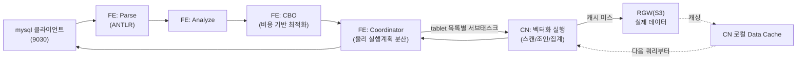

# StarRocks 아키텍처

> 이 문서는 초안이다. [StarRocks shared-data 배포](starrocks-shared-data.md)에서 실제로 구성한 FE 1 + CN 1 클러스터를 검증하는 기준선으로 쓴다. 검증 후 필요하면 `concepts/`로 옮겨 다듬는다.

## 한 줄 요약

MPP(대규모 병렬 처리) 방식의 컬럼형 OLAP 데이터베이스. FE(제어 평면)와 BE/CN(데이터 평면) 두 종류 노드로만 구성되는 게 특징 — Hive/Spark 같은 별도 메타스토어나 리소스 매니저 없이 그 자체로 완결된 클러스터다.

## 두 가지 배포 모드

| | shared-nothing | shared-data (우리가 쓰는 모드) |
|---|---|---|
| 노드 구성 | FE + BE | FE + CN |
| 데이터 저장 위치 | 각 BE의 로컬 디스크 | 오브젝트 스토리지(S3/GCS/HDFS 등) — 우리는 Ceph RGW |
| 컴퓨트 노드 상태 | stateful(자기 디스크에 데이터 보유) | **stateless** — 로컬엔 캐시만 |
| 노드 증감 | 데이터 리밸런싱 필요, 무거움 | 초 단위로 즉시 가능(어차피 로컬에 데이터 없음) |
| 콜드 쿼리 지연 | 로컬 디스크 직접 접근이라 항상 빠름 | 캐시 미스 시 오브젝트 스토리지 왕복 — 느려짐 |
| 웜 쿼리 지연 | 빠름 | 캐시 히트 시 shared-nothing과 비슷 |

우리가 shared-data를 택한 이유는 애초에 "컴퓨팅/스토리지 분리"를 테스트하는 게 목적이었기 때문 — Ceph를 도입한 동기 자체가 이 모드를 쓰기 위해서였다.

## FE (Frontend) — 제어 평면

- **메타데이터 관리**: 전체 카탈로그(DB/테이블/파티션/버킷 정의)를 메모리에 전체 복사본으로 들고 있고, 변경분은 **BDBJE**(Berkeley DB Java Edition, Paxos류 합의)로 다른 FE에 복제한다. 과반수 FE가 살아있으면 클러스터가 정상 동작.
- **Leader/Follower**: 오직 leader FE만 메타데이터 쓰기가 가능. follower는 쓰기 요청을 leader로 전달만 한다. 우리 구성(FE 1개)에선 그 유일한 FE가 항상 leader다.
- **SQL 처리 파이프라인**: Parser(ANTLR 기반) → Analyzer(의미 분석) → **CBO**(Cost-Based Optimizer — 통계 기반 조인 순서 재배치, subquery rewrite, 저카디널리티 문자열 컬럼의 dictionary 인코딩 등) → Coordinator(물리 실행계획을 CN들에 분산 스케줄링).
- **자체 로컬 스토리지 필요**: 메타데이터는 오브젝트 스토리지가 아니라 FE 자신의 로컬 디스크에 저장된다 — 우리 배포에서 FE에 RBD PVC(10Gi)를 붙인 이유가 이것.

## CN (Compute Node) — 데이터 평면 (shared-data 전용)

- BE와 실행 엔진 자체는 동일(벡터화 실행, 파이프라인 스케줄링) — 차이는 **로컬 영구 저장이 없다**는 것뿐.
- 쿼리 실행에 필요한 데이터를 오브젝트 스토리지에서 읽어와 **Data Cache**(로컬 디스크 캐시)에 저장 — 다음 쿼리부터는 캐시를 먼저 보고, 없으면 원격에서 가져와 캐싱하면서 응답. 우리가 실측한 "첫 쿼리는 느리고 이후는 30ms 미만"이 정확히 이 메커니즘이다.
- **Compaction도 CN이 실행한다.** FE가 스케줄러(어느 파티션의 어느 tablet들을 언제 압축할지 결정) 역할이고, 실제 압축 작업(작은 rowset들을 큰 rowset으로 병합)은 CN이 수행한다. 압축 결과 역시 오브젝트 스토리지에 새로 쓰이고, 오래된 버전은 별도 **vacuum** 작업으로 나중에 정리된다.

## 스토리지 모델

```
Table → Partition → Tablet → Rowset → Segment
```

- **Tablet**: 데이터 분산의 최소 단위. 버킷(Distribution) 하나가 tablet 하나에 대응.
- **Rowset**: 한 번의 쓰기(로드/커밋)로 생긴 데이터 묶음. 여러 rowset이 쌓이면 compaction이 이들을 더 적은 수의 큰 rowset으로 합친다.
- **Segment**: rowset 내부의 실제 컬럼형 파일(Parquet과 유사한 columnar 포맷) — 불변(immutable).
- shared-data 모드에선 이 파일들이 로컬 디스크가 아니라 RGW 버킷에 저장된다 — 우리 배포에서 `starrocks-storage` 버킷 안에 `db<ID>/<partition>/<tablet>/...` 형태 경로로 쌓이는 걸 실제로 확인했다.

## 테이블 타입 (데이터 모델)

| 타입 | 특징 | 용도 |
|---|---|---|
| Duplicate Key | 제약 없음, 중복 행 허용 | 로그처럼 그대로 쌓는 원본 데이터 |
| Aggregate | 로드 시점에 미리 집계 | 집계 쿼리가 잦은 경우 |
| Unique Key | 같은 키 재로드 시 마지막 값으로 덮어씀 | 실시간 갱신이 필요한 경우 |
| Primary Key | Unique Key + NOT NULL 제약, 부분 컬럼 업데이트 지원 | 실시간 갱신 + 조회 성능 둘 다 필요한 경우 |

우리가 BMT 테스트에 쓴 건 가장 단순한 **Duplicate Key**(`DUPLICATE KEY(id)`).

## 데이터 분산

`PARTITION BY`(주로 시간 기준, 파티션 단위로 데이터 관리/삭제)와 `DISTRIBUTED BY HASH(...) BUCKETS n`(파티션 내부를 다시 n개 tablet으로 해시 분산)의 조합. 우리 벤치 테이블(`BUCKETS 4~8`)이 이 버킷 수만큼 tablet으로 쪼개져 CN들에 병렬 분산되는 구조다 — 지금은 CN이 1개뿐이라 병렬성 이점은 체감 못 하지만, CN을 늘리면 그대로 수평 확장된다.

## 쿼리 실행 흐름 (전체 그림)



## 우리 배포와의 매핑

| 아키텍처 요소 | 우리 구성 | 비고 |
|---|---|---|
| FE 메타데이터 저장 | RBD PVC 10Gi | 오브젝트 스토리지가 아니라 별도 블록 스토리지 필요하다는 걸 여기서 처음 확인 |
| FE self-identity | headless Service + 고정 hostname(`fe-0.fe-hl...`) | 잘못 설정 시 클러스터 DNS로 자기 자신을 못 찾아 전체가 깨짐(실제로 겪음) |
| CN 데이터 저장 | RGW 버킷 `starrocks-storage` | `aws_s3_*` fe.conf 키로 CN에 전파(builtin_storage_volume 경유) |
| CN 로컬 캐시 | 파드 로컬 디스크(현재 emptyDir, 영구 아님) | 파드 재시작 시 캐시 소실 — 다음 쿼리들이 다시 콜드 스타트 겪는다는 뜻(추후 개선 여지) |
| Compaction 실행 주체 | CN | 지금은 CN 1개뿐이라 압축 작업도 그 CN에 집중됨 |
| CN 등록 | `ALTER SYSTEM ADD COMPUTE NODE` (headless Service FQDN) | IP로 등록하면 파드 재시작마다 깨짐(실제로 겪음) |

## 검증하고 싶은 것 (다음 단계 후보)

- [ ] Compaction이 실제로 도는 걸 관찰 — 작은 rowset을 여러 번 로드한 뒤 `SHOW TABLET`/compaction 관련 메트릭으로 확인
- [ ] CN을 2개로 늘려서 tablet이 실제로 분산되는지, 쿼리가 병렬화되는지 확인
- [ ] Vacuum이 오래된 버전을 실제로 지우는지 — RGW 버킷 오브젝트 수 변화로 확인
- [ ] Primary Key 테이블로 실시간 갱신 테스트 (지금은 Duplicate Key만 써봄)
