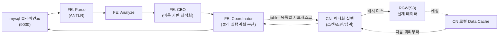

# StarRocks 소개

> 이 문서는 초안이다. 검증까지 끝나면 `lessons/`로 옮겨 다듬는다. 전제가 되는 스토리지 레이어는 [Ceph 소개](ceph-intro.md) 참고 — shared-data 모드는 S3 호환 오브젝트 스토리지(RGW)가 필요하다.

## 한 줄 요약

MPP(대규모 병렬 처리) 방식의 컬럼형 OLAP 데이터베이스. FE(제어 평면)와 BE/CN(데이터 평면) 두 종류 노드로만 구성되는 게 특징 — Hive/Spark 같은 별도 메타스토어나 리소스 매니저 없이 그 자체로 완결된 클러스터다.

## 두 가지 배포 모드

| | shared-nothing | shared-data |
|---|---|---|
| 노드 구성 | FE + BE | FE + CN |
| 데이터 저장 위치 | 각 BE의 로컬 디스크 | 오브젝트 스토리지(S3/GCS/HDFS 등) — 우리는 Ceph RGW |
| 컴퓨트 노드 상태 | stateful(자기 디스크에 데이터 보유) | **stateless** — 로컬엔 캐시만 |
| 노드 증감 | 데이터 리밸런싱 필요, 무거움 | 초 단위로 즉시 가능(어차피 로컬에 데이터 없음) |
| `run_mode` | 클러스터 생성 시 고정, 나중에 전환 불가 | 클러스터 생성 시 고정, 나중에 전환 불가 |

`run_mode`는 FE를 처음 띄울 때 결정되는 클러스터 전역 설정이고, 한 클러스터 안에서 나중에 바꿀 수 없다 — 두 모드를 동시에 비교해보려면 완전히 별도의 FE 클러스터가 필요하다(우리가 실제로 겪은 함정, 아래 참고).

StarRocks 컴퓨팅/스토리지 분리 구성을 테스트해보는 게 원래 목적이었기 때문에 shared-data를 먼저 배포했다 — Ceph 도입 자체가 이 모드를 쓰기 위해서였다.

## 핵심 구성요소

### FE (Frontend) — 제어 평면

- **메타데이터 관리**: 전체 카탈로그(DB/테이블/파티션/버킷 정의)를 메모리에 전체 복사본으로 들고 있고, 변경분은 **BDBJE**(Berkeley DB Java Edition, Paxos류 합의)로 다른 FE에 복제한다. 과반수 FE가 살아있으면 클러스터가 정상 동작.
- **Leader/Follower**: 오직 leader FE만 메타데이터 쓰기가 가능. follower는 쓰기 요청을 leader로 전달만 하지만, **읽기(SELECT)는 follower도 직접 처리할 수 있다** — 우리가 FE 3개(1 leader + 2 follower)로 커넥션을 분산시켜본 실험에서 실제로 확인했다(자세한 내용은 [BMT](starrocks-bmt.md) 참고).
- **SQL 처리 파이프라인 + Coordinator**: Parser(ANTLR 기반) → Analyzer(의미 분석) → **CBO**(Cost-Based Optimizer) → **Coordinator**(물리 실행계획을 BE/CN들에 분산 스케줄링하고 결과를 모으는 역할). 즉 매 쿼리의 조정자는 BE/CN이 아니라 FE 자신이다.
- **자체 로컬 스토리지 필요**: 메타데이터는 오브젝트 스토리지가 아니라 FE 자신의 로컬 디스크에 저장된다 — 우리 배포에서 FE에 RBD PVC(10Gi)를 붙인 이유가 이것.

### BE (Backend) — shared-nothing 데이터 평면

- 로컬 디스크에 테이블 데이터를 직접 저장(replication_num만큼 다른 BE로 복제).
- shared-data(`run_mode=shared_data`) 클러스터에도 `ALTER SYSTEM ADD BACKEND`로 BE를 등록하는 것 자체는 되지만, **그렇게 만든 테이블도 여전히 cloud-native(RGW 기반)로 만들어진다** — `run_mode`가 shared_data인 이상 테이블 속성(`replication_num` 등)과 무관하게 전부 cloud-native다. 진짜 로컬 저장을 쓰려면 `run_mode`를 지정하지 않은(기본값) 별도 FE가 필요하다. `SHOW CREATE TABLE`에 `storage_volume` 속성이 있는지로 구분한다 — 자세한 확인 방법은 [사용쿼리 예시](starrocks-query-examples.md) 참고.

### CN (Compute Node) — shared-data 데이터 평면

- BE와 실행 엔진 자체는 동일(벡터화 실행, 파이프라인 스케줄링) — 차이는 **로컬 영구 저장이 없다**는 것뿐.
- 쿼리 실행에 필요한 데이터를 오브젝트 스토리지에서 읽어와 **Data Cache**(로컬 디스크 캐시)에 저장 — 다음 쿼리부터는 캐시를 먼저 보고, 없으면 원격에서 가져와 캐싱하면서 응답. "첫 쿼리는 느리고 이후는 빠르다"는 게 이 메커니즘 때문.
- **Compaction도 CN이 실행한다.** FE가 스케줄러(어느 파티션의 어느 tablet들을 언제 압축할지 결정) 역할이고, 실제 압축 작업(작은 rowset들을 큰 rowset으로 병합)은 CN이 수행한다. 압축 결과 역시 오브젝트 스토리지에 새로 쓰이고, 오래된 버전은 별도 **vacuum** 작업으로 나중에 정리된다.

## 스토리지 모델

```
Table → Partition → Tablet → Rowset → Segment
```

- **Partition**: 보통 시간 범위(RANGE) 기준. `PARTITION BY RANGE(...) START/END/EVERY(...)`로 여러 개를 한 번에 만들 수 있고, 쿼리가 특정 시간대만 스캔하면 나머지 파티션은 아예 안 건드리는 **파티션 프루닝**이 적용된다.
- **Tablet**: 파티션 내부의 데이터 분산 최소 단위. `DISTRIBUTED BY HASH(...) BUCKETS n`의 버킷 하나가 tablet 하나에 대응 — 파티션 프루닝과 버킷 분산은 서로 독립적으로 동시에 작동한다(실측 확인, [BMT](starrocks-bmt.md) 참고).
- **Rowset**: 한 번의 쓰기(로드/커밋)로 생긴 데이터 묶음. 여러 rowset이 쌓이면 compaction이 이들을 더 적은 수의 큰 rowset으로 합친다.
- **Segment**: rowset 내부의 실제 컬럼형 파일(Parquet과 유사한 columnar 포맷) — 불변(immutable).
- shared-data 모드에선 이 파일들이 RGW 버킷 안에 `db<ID>/<partition>/<tablet>/...` 형태 경로로 쌓인다(실제로 확인).

## 테이블 타입 (데이터 모델)

| 타입 | 특징 | 용도 |
|---|---|---|
| Duplicate Key | 제약 없음, 중복 행 허용 | 로그처럼 그대로 쌓는 원본 데이터 |
| Aggregate | 로드 시점에 미리 집계 | 집계 쿼리가 잦은 경우 |
| Unique Key | 같은 키 재로드 시 마지막 값으로 덮어씀 | 실시간 갱신이 필요한 경우 |
| Primary Key | Unique Key + NOT NULL 제약, 부분 컬럼 업데이트 지원 | 실시간 갱신 + 조회 성능 둘 다 필요한 경우 |

## 쿼리 실행 흐름 (shared-data 기준)



FE가 곧 Coordinator라는 점이 중요하다 — 동시 쿼리가 몰리면 CN을 아무리 늘려도 FE 하나가 모든 쿼리의 플래닝/조정을 떠맡는다(다만 실측으로는 FE를 늘리는 것도 만능 해법은 아니었다, [BMT](starrocks-bmt.md) 참고).

## 우리 배포와의 매핑

| 아키텍처 요소 | 우리 구성 | 비고 |
|---|---|---|
| FE 메타데이터 저장 | RBD PVC 10Gi | 오브젝트 스토리지가 아니라 별도 블록 스토리지 필요 |
| FE self-identity | headless Service + 고정 hostname(`fe-0.fe-hl...`) | 잘못 설정 시 클러스터 DNS로 자기 자신을 못 찾아 전체가 깨짐(실제로 겪음) |
| CN 데이터 저장 | RGW 버킷 `starrocks-storage` | `aws_s3_*` fe.conf 키로 전파(builtin_storage_volume 경유) |
| CN 로컬 캐시 | 파드 로컬 디스크(현재 emptyDir, 영구 아님) | 파드 재시작 시 캐시 소실 |
| Compaction 실행 주체 | CN | — |
| CN/BE 등록 | `ALTER SYSTEM ADD COMPUTE NODE` / `ADD BACKEND` (headless Service FQDN) | IP로 등록하면 파드 재시작마다 깨짐(실제로 겪음) |
| 진짜 shared-nothing 검증용 | 별도 네임스페이스(`starrocks-sn`)에 별도 FE(`run_mode` 미지정) + BE 3개 | `run_mode`가 클러스터 생성 시 고정이라 완전히 별도 클러스터로 구성 |

설치 방법은 [설치](starrocks-install.md), 실측 벤치마크와 이번 검증에서 발견한 함정은 [BMT](starrocks-bmt.md), SQL 예시는 [사용쿼리 예시](starrocks-query-examples.md), 실제 동작하는 클라이언트 코드는 [어플리케이션 샘플](starrocks-app-sample.md) 참고.
