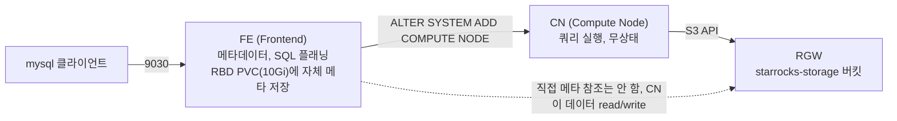

# StarRocks shared-data 배포 (완료)

> 이 문서는 초안이다. 검증까지 끝나면 `lessons/`로 옮겨 다듬는다. 전제가 되는 스토리지 레이어는 [Ceph 스토리지 레이어 도입](ceph-storage-layer.md) 참고 — RGW(오브젝트 스토리지)가 이미 배포되어 있어야 한다. 아키텍처 배경 지식은 [StarRocks 아키텍처](starrocks-architecture.md) 참고.

컴퓨팅/스토리지 분리 구성을 실제로 테스트해보기 위해, RGW 위에 StarRocks FE 1 + CN 1을 shared-data 모드로 배포했다. KVM을 RBD로 전환하는 작업보다 이걸 먼저 진행했다 — 애초에 Ceph 도입의 출발점이 StarRocks 테스트였기 때문이다.

## 아키텍처

FE는 메타데이터(DB/테이블 정의, 트랜잭션 로그)를 자체 로컬 스토리지(RBD PVC)에 저장하고, 실제 테이블 데이터는 CN이 직접 RGW에 S3 API로 읽고 쓴다 — FE는 이 데이터 경로에 끼지 않는다.

## 설계 결정

- **StatefulSet이 아니라 Deployment + headless Service.** 공식 StarRocks Kubernetes Operator는 StatefulSet 기반이지만, 단일 FE/단일 CN 규모(BMT 테스트)에서는 순번 관리 같은 StatefulSet의 이점이 필요 없다. 실제로 필요했던 건 딱 하나 — "클러스터 DNS로 항상 같은 이름으로 자기 자신을 찾을 수 있는 것"뿐이라, `clusterIP: None`인 headless Service + 파드의 `hostname`/`subdomain` 필드 조합만으로 충분했다.
- **RGW 자격증명은 git에 올리지 않는다.** fe.conf는 파일 형태라 k8s Secret을 네이티브로 참조할 수 없어서, 배포 스크립트가 Secret에서 값을 읽어 `sed`로 템플릿에 주입한 뒤 ConfigMap으로 적용하는 방식을 택했다. 저장소에는 `__ACCESS_KEY__`/`__SECRET_KEY__` 플레이스홀더가 든 템플릿만 남는다.
- **버킷 생성은 radosgw-admin이 아니라 수동 서명한 S3 PUT으로 한다.** radosgw-admin은 유저/정책 관리만 하고 버킷 자체는 S3 API로만 만들 수 있다. awscli 등 별도 도구를 설치하는 대신, bash+openssl로 AWS SigV2 서명을 직접 계산해서 처리했다(Ceph 스토리지 레이어 작업 때도 같은 방식을 썼다).

## 실행 중 발견한 이슈

- **이미지 기본 CMD가 k8s에서는 그냥 tini usage만 찍고 끝난다.** `docker run`으로는 되는 것 같은 기본 CMD가 k8s Deployment에서는 아무 프로그램도 못 찾은 채 tini가 usage 메시지만 출력하고 종료됐다. `command: ["/opt/starrocks/fe/bin/start_fe.sh"]`(CN은 `start_cn.sh`)를 명시적으로 지정해야 했다.
- **FE/CN이 자기 자신을 클러스터 DNS로 못 찾는 이름으로 등록해버렸다.** `--host_type FQDN`으로 기동했는데 headless Service 없이 일반 Deployment로 띄우니, FE/CN이 자기 identity를 파드의 무작위 호스트명(예: `fe-8648f9875-7wbh2`)으로 잡아버렸다 — 이건 클러스터 DNS에 등록된 이름이 아니라서 서로 통신이 끊겼다(`Could not resolve host for client socket`). CN을 FE의 이 잘못된 이름으로 접근하려던 시도도, CN을 IP로 등록했을 때 반대 방향으로 "Unmatched backend ip" 에러가 난 것도 같은 근본 원인이었다. headless Service(`clusterIP: None`) + 고정 `hostname`/`subdomain`으로 안정적인 FQDN을 부여하는 것으로 해결 — FE는 메타가 이미 잘못된 identity로 초기화돼있어서 PVC까지 밀고 재시작해야 했다(그 시점엔 실 데이터가 없어서 비용이 낮았다).
- **"영구히 멈춘 것처럼 보였지만 사실 그냥 느렸다."** 첫 테이블 생성 시도가 매번 타임아웃났고, CN 로그의 `task_count_in_queue`가 계속 늘어나기만 하고 줄지 않아서 "CN이 뭔가에 완전히 막혔다"고 오판했다. RGW 자체 로그를 직접 열어보고서야 실제로는 S3 요청이 낮은 지연시간(1ms 미만)으로 계속 성공하고 있다는 걸 확인했다 — 콜드 스타트 상태에서 첫 테이블 생성에 필요한 절대적인 단계 수가 많아 오래 걸렸을 뿐이었다. `tablet_create_timeout_second`를 300초로 임시로 늘려서 한 번 통과시키니, 이후 테이블 생성은 3초 내외로 정상화됐다. "에러 없이 안 끝난다"는 증상만 보고 성급하게 "멈췄다"고 결론 내리지 말고, 관련된 모든 컴포넌트(이 경우 RGW)의 로그를 직접 열어보는 게 중요했다.
- **`aws_s3_enable_path_style_access` 같은 fe.conf 키는 실제로 존재하지 않는다.** 검색으로 찾은 정보를 믿고 넣었는데, StarRocks 소스(`Config.java`)를 직접 확인하니 이 키 자체가 없었다. 다행히 커스텀 엔드포인트를 지정하면 path-style이 자동 적용되는 것으로 보였다(RGW 로그에서 실제 요청이 path-style로 오는 것 확인). 문서/검색 결과를 그대로 믿기보다 소스나 실제 동작(로그)으로 최종 확인하는 게 필요했다.

## 진행 상태

- [x] RGW에 `starrocks` 유저 + `starrocks-storage` 버킷 생성
- [x] FE(4.1.4) 배포, self-identity FQDN 정상 확인
- [x] CN(4.1.4) 배포 + FE 등록, Alive/OK 확인
- [x] end-to-end 검증 — `bmt_test.t1` 테이블 생성 + INSERT + SELECT 성공, RGW 버킷 오브젝트 수 증가(34→44) 확인
- [x] **하이브리드(BE+CN 동시) 검증 완료 (2026-08-28)** — 같은 FE에 BE(로컬 XFS)를 추가로 등록해 CN(RGW) 테이블과 BE(로컬) 테이블을 동시에 조회 성공. 상세는 [StarRocks 아키텍처](starrocks-architecture.md#하이브리드-be로컬와-cn공유을-같은-클러스터에서-동시에-2026-08-28-검증-완료) 참고
- [x] **BE·CN 둘 다 3노드 대칭 구성으로 확장 (2026-08-28)** — chan09/llm001에도 각각 BE·CN 추가 배포(`02-deploy-cn.sh`/`04-deploy-be-hybrid.sh`를 이름/노드만 바꿔 반복 실행하는 패턴, 별도 파라미터화된 스크립트는 아직 없음). 대용량+MPP 비교의 전제 조건
- [x] **대용량(1000만 행) 로드 + 3-way JOIN(MPP) 비교 완료 (2026-08-28)** — 상세는 [StarRocks 아키텍처](starrocks-architecture.md#대용량-로드--복잡한-조인mpp-비교-2026-08-28-검증-완료) 참고
- [x] **고카디널리티 데이터로 재검증 완료 (2026-08-28)** — 1000만 행에서 CN이 22% 느린 것 확인(1GbE 병목 최초 관측), 3000만 행에서는 데이터 생성 자체의 CPU 비용이 병목이 되며 차이가 다시 사라짐. 상세는 [StarRocks 아키텍처](starrocks-architecture.md#고카디널리티-데이터로-재검증-2026-08-28-검증-완료) 참고
- [x] **STREAM LOAD(사전 생성 파일)로 순수 I/O 비교 완료 (2026-08-28)** — CPU 비용을 완전히 분리하니 결과가 뒤집혀 CN이 17% 빠름. 상세는 [StarRocks 아키텍처](starrocks-architecture.md#stream-load사전-생성-파일로-순수-io-비교-2026-08-28-검증-완료) 참고
- [x] **⚠️ 정정: 위 "BE(로컬)" 비교가 전부 cloud-native끼리의 비교였다는 걸 발견, 진짜 shared-nothing 클러스터 신규 배포 후 재비교 완료 (2026-08-28)** — `run_mode=shared_data` FE에서는 replication_num을 지정해도 모든 테이블이 cloud-native(RGW)로 만들어진다는 걸 뒤늦게 확인. 별도 네임스페이스(`starrocks-sn`)에 진짜 shared-nothing FE+BE 3개를 새로 배포해 CRUD/대용량+MPP/STREAM LOAD를 전부 재실행했다. 상세는 [StarRocks 아키텍처](starrocks-architecture.md#️-중요한-정정-지금까지의-be로컬-vs-cn공유-비교는-전부-cloud-native끼리의-비교였다-2026-08-28) 참고

## 스크립트 목록

- [`00-create-rgw-user-and-bucket.sh`](../scripts/08-starrocks/00-create-rgw-user-and-bucket.sh) — RGW 유저/버킷 생성, k8s Secret 저장
- [`01-deploy-fe.sh`](../scripts/08-starrocks/01-deploy-fe.sh) + [`fe.conf.template`](../scripts/08-starrocks/fe.conf.template) — FE 배포(headless Service + 고정 hostname)
- [`02-deploy-cn.sh`](../scripts/08-starrocks/02-deploy-cn.sh) + [`cn.conf`](../scripts/08-starrocks/cn.conf) — CN 배포 + FE 등록. 3노드 전체에 CN을 두려면 Deployment/Service 이름(`cn`→`cn2`/`cn3`)과 `nodeSelector`만 바꿔 반복 적용(아직 파라미터화 안 됨)
- [`03-verify.sh`](../scripts/08-starrocks/03-verify.sh) — end-to-end 검증 (DB/테이블/INSERT/SELECT)
- [`04-deploy-be-hybrid.sh`](../scripts/08-starrocks/04-deploy-be-hybrid.sh) — 기존 FE에 BE(로컬 XFS) 추가 등록, 하이브리드 구성. `scripts/07-ceph-storage/12-resplit-osd-disk.sh`로 XFS 파티션 준비 필요. 여러 노드에 두려면 CN과 마찬가지로 이름/노드를 바꿔 반복 적용
- [`05-crud-benchmark.sh`](../scripts/08-starrocks/05-crud-benchmark.sh) — shared-nothing(BE) vs shared-data(CN) 소량 CRUD 성능 비교. 결과는 [StarRocks 아키텍처](starrocks-architecture.md#shared-nothing-vs-shared-data-crud-성능-비교-2026-08-28-검증-완료) 참고
- [`06-mpp-benchmark.sh`](../scripts/08-starrocks/06-mpp-benchmark.sh) — 대용량(1000만 행) 로드 + 스타 스키마 3-way JOIN(MPP) 비교. 결과는 [StarRocks 아키텍처](starrocks-architecture.md#대용량-로드--복잡한-조인mpp-비교-2026-08-28-검증-완료) 참고
- [`07-high-cardinality-benchmark.sh`](../scripts/08-starrocks/07-high-cardinality-benchmark.sh) — 저카디널리티 데이터의 압축 효율 문제를 우회하기 위해 행마다 ~256바이트 랜덤 payload를 추가한 버전. 결과는 [StarRocks 아키텍처](starrocks-architecture.md#고카디널리티-데이터로-재검증-2026-08-28-검증-완료) 참고
- [`08-stream-load-benchmark.sh`](../scripts/08-starrocks/08-stream-load-benchmark.sh) — 사전 생성 CSV 파일 + STREAM LOAD로 데이터 생성 CPU 비용을 완전히 분리한 순수 쓰기 I/O 비교. 결과는 [StarRocks 아키텍처](starrocks-architecture.md#stream-load사전-생성-파일로-순수-io-비교-2026-08-28-검증-완료) 참고
- [`09-deploy-sn-fe.sh`](../scripts/08-starrocks/09-deploy-sn-fe.sh) — 진짜 shared-nothing(run_mode 기본값) FE를 별도 네임스페이스(`starrocks-sn`)에 배포. RGW/S3 설정 전혀 없음
- [`10-deploy-sn-be.sh`](../scripts/08-starrocks/10-deploy-sn-be.sh) — `starrocks-sn` FE에 로컬 스토리지 BE 등록. 기존 XFS 파티션의 하위 디렉토리(`sn-data`)를 써서 기존 shared-data BE의 datacache와 분리. 노드별로 반복 실행(`<노드> <접미사>`)
- [`11-real-sn-vs-shared-data-benchmark.sh`](../scripts/08-starrocks/11-real-sn-vs-shared-data-benchmark.sh) — 진짜 shared-nothing vs 진짜 shared-data STREAM LOAD 재비교
- [`12-real-sn-vs-shared-data-crud.sh`](../scripts/08-starrocks/12-real-sn-vs-shared-data-crud.sh) — 진짜 shared-nothing vs 진짜 shared-data CRUD 재비교
- [`13-real-sn-vs-shared-data-mpp.sh`](../scripts/08-starrocks/13-real-sn-vs-shared-data-mpp.sh) — 진짜 shared-nothing vs 진짜 shared-data 대용량 로드 + MPP JOIN 재비교. 결과는 모두 [StarRocks 아키텍처](starrocks-architecture.md#️-중요한-정정-지금까지의-be로컬-vs-cn공유-비교는-전부-cloud-native끼리의-비교였다-2026-08-28) 참고
